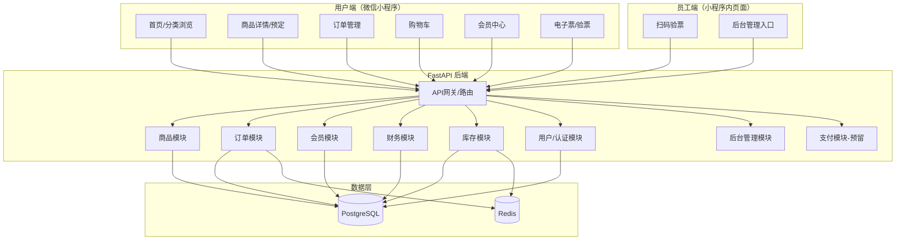

## 用户需求

基于 needs/yyyl_0311.xlsx 中的需求文档，开发一个名为"一月一露"的露营地微信小程序，并按照产品→架构→前端→后端→测试的流水线顺序，使用对应的 SubAgent 分阶段完成开发。

## 产品概述

"一月一露"是一个露营地综合管理微信小程序，面向露营爱好者和营地运营方，提供营位预定、装备租赁、活动报名、商品购买、会员管理等一站式服务。小程序包含用户端（C端）和管理后台（B端/员工端），支持微信支付（预留）、验票入营、库存管理、财务管理等功能。

## 核心功能

### 一、七大售卖品类

1. **日常露营票订票**：选择日期预定过夜/单日营位票，按位置或人数预定，支持动态定价（工作日/周末/节假日）、定时开票、连定优惠、退票规则、身份登记、免责声明签署
2. **活动露营票订票**：特殊活动（万圣节/圣诞节/帐友会）订票，不可选日期，支持秒杀倒计时、快速付款
3. **装备租赁**：帐篷/桌椅/灯空调/房车租赁，支持押金机制（押金一键退款）、分类筛选、免责声明
4. **日常活动预定**：皮划艇/钓场等日常活动，按场次时间段预定，可设置需先购买露营票才能购买
5. **特定活动预定**：万圣节/游戏活动等特殊活动，支持秒杀倒计时，可设置前置购票要求
6. **营地小商店售卖**：柴火/冷饮等现场自助购物，类似点单系统，支持购物车、库存管理、一键联系客服
7. **营地周边售卖**：衣服/帽子/天幕等电商模式，支持物流跟踪、快递地址管理、地址导出

### 二、会员系统

- **年卡会员**：付费购买，一年有效，指定营位无限次/限次免费预定，专属活动，预定频率限制（每天N份、连续5天后中断2天），验票显示会员身份+验证码
- **普通会员**：预定即注册，消费积分（1元=1积分），积分可兑换限时活动/商品折扣

### 三、收入管理

- 营位预定款项：待确认→入营后可提现
- 小商店销售：即时可提现
- 周边商品销售：到货确认后可提现

### 四、后台管理

- 管理模块：首页、页面编辑、商品管理、订单管理、会员管理、财务管理、数据统计、系统设置
- 权限管理：通过手机号或微信扫码设置员工权限，小程序内设员工页面

### 五、通用功能

- 用户身份信息管理（姓名、身份证、手机号，一次输入后可复用）
- 免责声明电子签署
- 验票系统（入营验证）
- 定时开票与库存批量管理
- 退票规则配置（提前N天/XX小时）

## 技术栈

- **前端框架**：微信原生小程序（TypeScript + SCSS），充分利用微信原生能力（支付、登录、扫码验票等），性能最优
- **后端框架**：Python FastAPI（异步高性能REST API框架）
- **数据库**：PostgreSQL（关系型数据，事务支持强，适合订单/财务场景）
- **缓存**：Redis（会话管理、库存缓存、秒杀场景）
- **ORM**：SQLAlchemy 2.0（异步模式）+ Alembic（数据库迁移）
- **微信支付**：预留接口，暂不接入商户号

## 实现方案

### 整体策略

采用前后端分离架构，小程序端通过RESTful API与后端通信。后端采用FastAPI分模块设计，按业务领域划分为商品、订单、会员、财务等模块。数据库按业务实体设计，利用PostgreSQL的事务能力保障订单和财务数据一致性。

### 关键技术决策

1. **选择原生小程序而非Taro/uni-app**：项目深度依赖微信生态（支付、扫码验票、登录、分享），原生开发对微信API支持最完整，无框架适配层开销，秒杀场景性能更优
2. **选择FastAPI而非Django**：异步支持好，适合秒杀/高并发场景；API-first设计，自动生成OpenAPI文档，前后端对接效率高
3. **统一商品模型设计**：7种售卖品类抽象为统一的Product模型 + ProductType枚举 + 各类型扩展属性（JSON字段），避免7套独立表结构，降低复杂度
4. **秒杀场景方案**：Redis预扣库存 + PostgreSQL事务最终确认，防超卖；前端倒计时+快速下单流程优化
5. **动态定价策略**：定价规则表（日期类型→价格映射），支持自定义日期分类（工作日/周末/节假日）

### 性能与可靠性

- 库存操作使用Redis原子操作（DECR）防止超卖
- 订单创建使用数据库事务保障一致性
- 秒杀场景使用请求限流 + 队列削峰
- 验票使用带过期时间的一次性Token

## 实现注意事项

- 微信支付模块仅定义接口和数据模型，不实现实际支付调用，使用模拟支付流程便于测试
- 免责声明签署需要记录签署时间、IP、用户标识，确保法律效力
- 身份证号等敏感信息需加密存储（AES-256）
- 所有API使用参数化查询，防止SQL注入
- 退票逻辑需要考虑并发退款场景的幂等性

## 系统架构



## 目录结构

```
/Users/nathan/Projects/yyyl/
├── prd/
│   └── yyyl_prd.md                    # [NEW] 产品需求文档（PRD），由产品Agent输出，包含完整的功能需求、用户故事、页面流程、优先级定义
├── docs/
│   └── architecture.md                # [NEW] 技术架构文档，由架构师Agent输出，包含系统架构图、数据模型设计、API设计规范、技术选型说明
│
├── miniprogram/                       # [NEW] 微信小程序前端项目根目录
│   ├── project.config.json            # [NEW] 小程序项目配置，AppID、编译配置
│   ├── app.ts                         # [NEW] 小程序入口文件，全局生命周期、登录逻辑
│   ├── app.json                       # [NEW] 全局配置，页面路由、tabBar、权限声明
│   ├── app.wxss                       # [NEW] 全局样式，主题变量、通用样式
│   ├── utils/
│   │   ├── request.ts                 # [NEW] 网络请求封装，统一错误处理、token刷新、请求拦截
│   │   ├── auth.ts                    # [NEW] 微信登录授权工具，code换token、用户信息获取
│   │   └── util.ts                    # [NEW] 通用工具函数，日期格式化、价格格式化等
│   ├── pages/
│   │   ├── index/                     # [NEW] 首页，展示分类入口、推荐商品、活动横幅
│   │   ├── category/                  # [NEW] 分类页，7大品类展示与筛选
│   │   ├── product-detail/            # [NEW] 商品详情页，商品介绍、日期选择、属性筛选、价格展示、预定下单
│   │   ├── order/                     # [NEW] 订单列表页，订单状态筛选、退票操作
│   │   ├── order-detail/              # [NEW] 订单详情页，订单信息、电子票、验票码
│   │   ├── cart/                      # [NEW] 购物车页，商品汇总、统一结算
│   │   ├── member/                    # [NEW] 会员中心页，会员信息、积分、年卡状态
│   │   ├── profile/                   # [NEW] 个人信息页，身份信息管理、地址管理
│   │   ├── ticket/                    # [NEW] 电子票/验票页，二维码展示、验证码显示
│   │   └── staff/                     # [NEW] 员工页面，扫码验票、快捷管理入口
│   └── components/
│       ├── product-card/              # [NEW] 商品卡片组件，通用商品展示
│       ├── date-picker/               # [NEW] 日期选择器组件，支持多日选择、价格标注
│       ├── countdown/                 # [NEW] 倒计时组件，开票倒计时、秒杀倒计时
│       ├── disclaimer/                # [NEW] 免责声明签署组件，展示协议文本、签署确认
│       ├── identity-form/             # [NEW] 身份信息表单组件，姓名/身份证/手机号输入与历史选择
│       └── tab-bar/                   # [NEW] 自定义底部导航栏组件
│
├── server/                            # [NEW] FastAPI后端项目根目录
│   ├── requirements.txt               # [NEW] Python依赖清单
│   ├── main.py                        # [NEW] FastAPI应用入口，CORS配置、路由注册、启动事件
│   ├── config.py                      # [NEW] 应用配置，数据库连接、Redis连接、微信配置、密钥管理
│   ├── database.py                    # [NEW] 数据库引擎与会话管理，SQLAlchemy异步引擎配置
│   ├── models/
│   │   ├── user.py                    # [NEW] 用户模型，微信用户信息、身份信息、地址信息
│   │   ├── product.py                 # [NEW] 商品模型，统一商品表 + 商品类型枚举 + 定价规则 + 库存
│   │   ├── order.py                   # [NEW] 订单模型，订单主表、订单项、订单状态流转
│   │   ├── member.py                  # [NEW] 会员模型，年卡会员、普通会员、积分记录
│   │   └── finance.py                 # [NEW] 财务模型，待确认账户、可提现账户、交易流水
│   ├── schemas/
│   │   ├── user.py                    # [NEW] 用户相关Pydantic模型
│   │   ├── product.py                 # [NEW] 商品相关Pydantic模型
│   │   ├── order.py                   # [NEW] 订单相关Pydantic模型
│   │   ├── member.py                  # [NEW] 会员相关Pydantic模型
│   │   └── finance.py                 # [NEW] 财务相关Pydantic模型
│   ├── routers/
│   │   ├── auth.py                    # [NEW] 认证路由，微信登录、token管理
│   │   ├── products.py                # [NEW] 商品路由，商品CRUD、分类查询、库存管理、定价管理
│   │   ├── orders.py                  # [NEW] 订单路由，下单、退票、订单查询、验票
│   │   ├── cart.py                    # [NEW] 购物车路由，添加/删除/结算
│   │   ├── members.py                 # [NEW] 会员路由，年卡购买、积分查询、会员权益
│   │   ├── finance.py                 # [NEW] 财务路由，收入确认、提现、流水查询
│   │   ├── admin.py                   # [NEW] 后台管理路由，数据统计、页面编辑、权限管理
│   │   └── payment.py                 # [NEW] 支付路由（预留），微信支付接口定义、模拟支付
│   ├── services/
│   │   ├── product_service.py         # [NEW] 商品业务逻辑，库存操作、定价计算、定时开票
│   │   ├── order_service.py           # [NEW] 订单业务逻辑，下单流程、退票逻辑、验票、连定优惠
│   │   ├── member_service.py          # [NEW] 会员业务逻辑，年卡权益校验、积分计算、预定限制
│   │   ├── finance_service.py         # [NEW] 财务业务逻辑，收入确认流转、提现逻辑
│   │   ├── inventory_service.py       # [NEW] 库存服务，Redis预扣库存、批量库存操作
│   │   └── wechat_service.py          # [NEW] 微信服务，登录解密、支付签名（预留）、消息推送
│   ├── middleware/
│   │   └── auth.py                    # [NEW] JWT认证中间件，请求鉴权、角色校验（用户/员工/管理员）
│   ├── migrations/                    # [NEW] Alembic数据库迁移目录
│   │   └── versions/                  # [NEW] 迁移版本文件
│   └── tests/
│       ├── test_products.py           # [NEW] 商品模块测试
│       ├── test_orders.py             # [NEW] 订单模块测试
│       ├── test_members.py            # [NEW] 会员模块测试
│       └── test_finance.py            # [NEW] 财务模块测试
│
└── needs/
    └── yyyl_0311.xlsx                 # [已有] 原始需求文件
```

## 关键数据模型

```python
# === 商品统一模型（核心抽象） ===
class ProductType(str, Enum):
    DAILY_CAMPING = "daily_camping"         # 日常露营票
    EVENT_CAMPING = "event_camping"         # 活动露营票
    EQUIPMENT_RENTAL = "equipment_rental"   # 装备租赁
    DAILY_ACTIVITY = "daily_activity"       # 日常活动
    SPECIAL_ACTIVITY = "special_activity"   # 特定活动
    ONSITE_SHOP = "onsite_shop"             # 营地小商店
    ONLINE_SHOP = "online_shop"            # 营地周边售卖

class BookingMode(str, Enum):
    BY_POSITION = "by_position"   # 按位置预定（孤品）
    BY_QUANTITY = "by_quantity"   # 按人数/数量预定（限定总数）

class Product(Base):
    id: int
    name: str
    product_type: ProductType
    booking_mode: BookingMode
    description: str
    images: list[str]                      # JSON
    attributes: dict                       # 扩展属性JSON（是否有电、是否有木平台等）
    category: str                          # 分类标签
    require_identity: bool                 # 是否需要身份信息
    require_disclaimer: bool               # 是否需要签署免责声明
    require_camping_ticket: bool           # 是否需要先购买露营票
    deposit_amount: Decimal                # 押金金额（装备租赁用）
    refund_rule: dict                      # 退票规则JSON（提前N天/N小时）
    release_config: dict                   # 开票配置JSON（定时开票时间）
    is_seckill: bool                       # 是否秒杀模式
    status: str                            # 上架/下架状态

class PricingRule(Base):
    product_id: int
    date_type: str                         # weekday/weekend/holiday/custom
    price: Decimal
    discount_rules: dict                   # 连定优惠规则JSON

class OrderStatus(str, Enum):
    PENDING_PAYMENT = "pending_payment"
    PAID = "paid"
    VERIFIED = "verified"                  # 已验票
    COMPLETED = "completed"
    REFUND_PENDING = "refund_pending"
    REFUNDED = "refunded"
    CANCELLED = "cancelled"
```

## 设计风格

采用户外露营自然风格，融合现代简约设计理念，营造清新、自然、温暖的视觉体验。整体以大地色系为基调，搭配绿色自然元素，体现露营文化的自由与亲近自然的氛围。

## 页面设计

### 1. 首页（index）

- **顶部区域**：品牌Logo"一月一露" + 搜索栏，背景使用露营场景渐变图片
- **轮播横幅**：活动露营票/特定活动的大图轮播卡片，带倒计时标签，圆角卡片设计
- **分类导航**：7个品类的图标网格入口（日常露营、活动露营、装备租赁、日常活动、特定活动、小商店、周边商品），使用圆形图标 + 文字标签
- **推荐商品列表**：双列瀑布流卡片布局，展示热门/即将开票商品，卡片带价格标签、状态标签（即将开票/热卖中）
- **底部导航栏**：首页、分类、购物车、订单、我的，共5个Tab

### 2. 分类页（category）

- **顶部Tab切换**：7大品类横向滑动Tab
- **筛选区域**：标签式筛选（是否有电/是否有木平台/过夜类/照明类等），支持多选
- **商品列表**：单列卡片列表，每个卡片展示商品图片、名称、价格区间、库存状态

### 3. 商品详情页（product-detail）

- **顶部图片轮播**：商品大图，支持全屏预览
- **商品信息卡片**：名称、价格（动态价格标注工作日/周末/节假日）、简介
- **日期选择区域**：日历组件，不同日期类型用颜色区分价格，支持多日连选
- **时间段选择**（活动类）：场次时间段列表，显示剩余名额
- **属性筛选标签**：商品特有属性的标签组（有电/无电、阳光/阴凉等）
- **免责声明入口**：展开式协议文本 + 签署确认按钮
- **底部操作栏**：固定底部，加入购物车 + 立即预定双按钮

### 4. 订单确认/下单页

- **身份信息区域**：姓名/身份证/手机号表单，支持从历史记录选择
- **订单摘要卡片**：商品名、日期、数量、单价、优惠（连定折扣）、总价
- **支付区域**：微信支付按钮（预留）

### 5. 会员中心页（member）

- **会员卡片**：顶部大卡片样式，区分年卡会员（金色）和普通会员（银色），显示有效期/积分
- **权益展示**：图标列表展示会员权益（免费预定次数、专属活动等）
- **积分明细**：积分收支流水列表
- **年卡购买入口**：突出的购买按钮

### 6. 电子票/验票页（ticket）

- **电子票卡片**：模拟实体票设计，展示商品名、日期、营位号等信息
- **二维码区域**：大尺寸二维码用于扫码验票
- **年卡会员标识**：验票时醒目展示年卡会员标识 + 动态验证码

## SubAgent

- **产品需求与项目总控**
- 用途：基于needs/yyyl_0311.xlsx原始需求，输出完整的PRD产品需求文档到prd/目录，明确功能范围、用户故事、页面流程、优先级排序
- 预期产出：prd/yyyl_prd.md，一份结构化的PRD文档

- **技术架构与方案设计**
- 用途：基于PRD文档，输出技术架构方案，确认数据模型设计、API接口规范、技术选型细节，与产品需求对齐
- 预期产出：docs/architecture.md，包含数据库ER图、API列表、架构图

- **小程序前端开发**
- 用途：基于PRD和架构文档，开发微信原生小程序前端，实现所有页面和组件
- 预期产出：miniprogram/目录下完整的小程序代码

- **后端开发与接口**
- 用途：基于架构文档，开发FastAPI后端服务，实现所有API接口和业务逻辑
- 预期产出：server/目录下完整的后端代码

- **测试、合规与上线运维**
- 用途：对前后端代码进行功能测试、接口测试，检查合规性（免责声明、隐私保护），输出测试报告
- 预期产出：测试用例、测试报告、合规检查清单

## Skill

- **xlsx**
- 用途：读取needs/yyyl_0311.xlsx需求文件，提取结构化需求内容供PRD编写使用
- 预期产出：需求文件内容的结构化文本

- **docx**
- 用途：（可选）将PRD输出为Word格式文档，便于分享和评审
- 预期产出：prd/yyyl_prd.docx