# 某露营地 — 露营地微信小程序 技术架构设计文档

> **版本**：v1.2  
> **日期**：2026-03-15  
> **作者**：技术架构师 Agent  
> **基线PRD**：v1.5（v1.4基线 + 5模块增量需求）  
> **状态**：v1.5 增量需求架构扩展

---

## 目录

1. [系统架构概览](#1-系统架构概览)
2. [数据模型设计](#2-数据模型设计)
3. [API接口设计](#3-api接口设计)
4. [业务流程设计](#4-业务流程设计)
5. [安全架构](#5-安全架构)
6. [缓存架构](#6-缓存架构)
7. [定时任务设计](#7-定时任务设计)
8. [消息通知架构](#8-消息通知架构)
9. [目录结构](#9-目录结构)
10. [非功能性设计](#10-非功能性设计)
11. [开发规范](#11-开发规范)

---

## 1. 系统架构概览

### 1.1 整体架构图

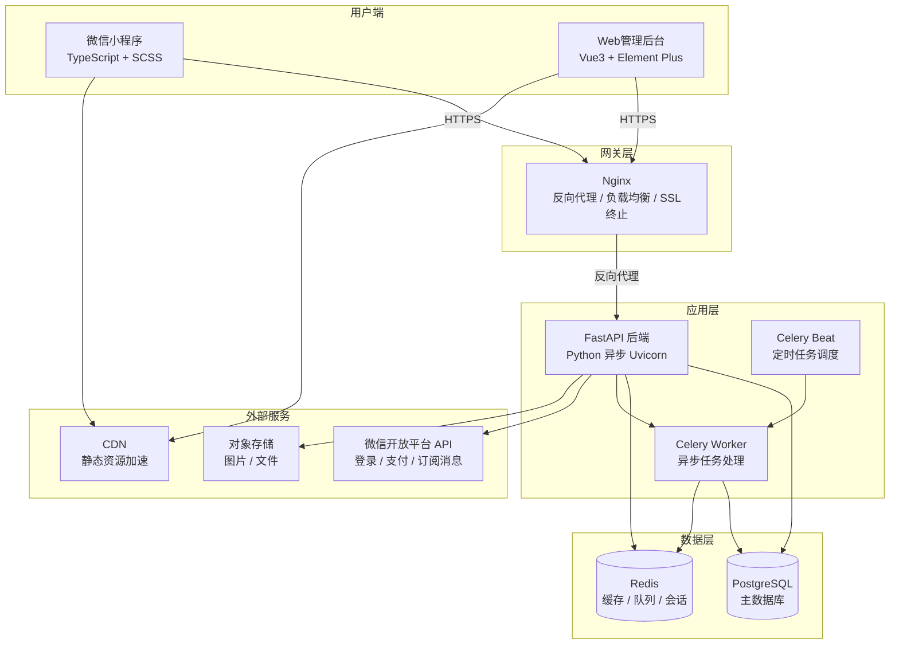

### 1.2 部署架构图

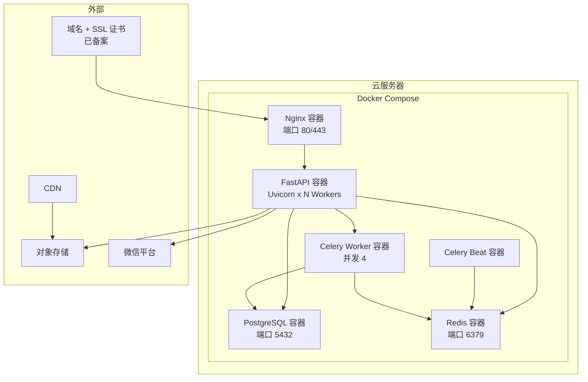

### 1.3 技术选型表

| 层次 | 技术选型 | 版本 | 选型理由 |
|------|---------|------|---------|
| **小程序前端** | 微信原生小程序 | — | 性能最优、API兼容性最佳、包体积可控 |
| **前端语言** | TypeScript + SCSS | TS 5.x | 类型安全、减少运行时错误 |
| **Web管理后台** | Vue 3 + Vite + Element Plus | Vue 3.4+ | Composition API 逻辑复用、Vite 热更新快 |
| **Web状态管理** | Pinia + Vue Router 4 | — | 官方推荐、TypeScript 友好 |
| **Web图表** | ECharts | 5.x | 支持热力图、折线图、饼图 |
| **后端框架** | FastAPI | 0.110+ | 异步高性能、自动OpenAPI文档、依赖注入 |
| **后端语言** | Python | 3.11+ | 异步生态成熟、开发效率高 |
| **ORM** | SQLAlchemy 2.0 (异步) | 2.0+ | 声明式模型、异步支持 |
| **数据库迁移** | Alembic | 1.13+ | SQLAlchemy 官方迁移工具 |
| **数据库** | PostgreSQL | 16+ | JSONB、高级索引、事务可靠 |
| **缓存/队列** | Redis | 7.x | 秒杀原子扣减(Lua)、会话存储 |
| **异步任务** | Celery | 5.3+ | 分布式任务队列、定时任务 |
| **ASGI服务器** | Uvicorn | 0.27+ | 异步高性能 |
| **反向代理** | Nginx | 1.25+ | SSL终止、限流、负载均衡 |
| **容器化** | Docker + Docker Compose | — | 环境一致性、快速部署 |
| **对象存储** | 阿里云OSS / 腾讯云COS | — | 图片CDN加速 |
| **数据校验** | Pydantic v2 | 2.x | FastAPI 原生集成 |

### 1.4 系统分层

```
┌───────────────────────────────────────────────┐
│          表现层 (Presentation Layer)            │
│  微信小程序 (TS)  │  Web管理后台 (Vue3)         │
├───────────────────────────────────────────────┤
│          接口层 (API Layer / Router)            │
│  FastAPI → 请求校验 → 权限验证 → 限流           │
├───────────────────────────────────────────────┤
│          业务层 (Service Layer)                 │
│  OrderService │ ProductService │ InventoryService │
│  MemberService│ PaymentService │ TicketService  │
├───────────────────────────────────────────────┤
│          数据访问层 (Repository / DAO)          │
│  SQLAlchemy Models + Async Session + Redis     │
├───────────────────────────────────────────────┤
│          基础设施层 (Infrastructure)            │
│  PostgreSQL │ Redis │ OSS │ 微信API │ Celery   │
└───────────────────────────────────────────────┘
```

---

## 2. 数据模型设计

### 2.1 ER关系图

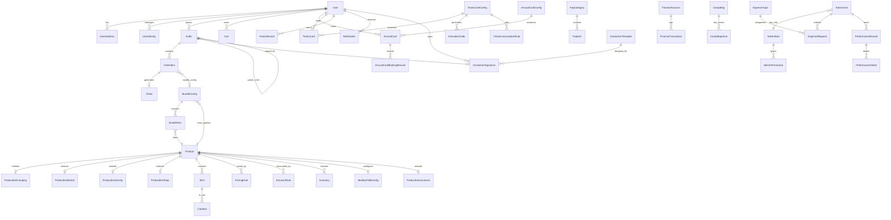

### 2.2 公共字段约定

所有数据表通过 SQLAlchemy Mixin 自动包含以下字段：

| 字段名 | 类型 | 约束 | 说明 |
|--------|------|------|------|
| `id` | `BIGINT` | `PK, AUTO_INCREMENT` | 主键 |
| `created_at` | `TIMESTAMPTZ` | `NOT NULL, DEFAULT NOW()` | 创建时间 |
| `updated_at` | `TIMESTAMPTZ` | `NOT NULL, DEFAULT NOW()` | 更新时间（自动更新） |
| `is_deleted` | `BOOLEAN` | `NOT NULL, DEFAULT FALSE` | 软删除标记 |

### 2.3 详细表结构

#### 2.3.1 User（用户表）

| 字段名 | 类型 | 约束 | 默认值 | 说明 |
|--------|------|------|--------|------|
| `id` | `BIGINT` | `PK` | — | 用户ID |
| `openid` | `VARCHAR(64)` | `UNIQUE NOT NULL` | — | 微信小程序OpenID |
| `unionid` | `VARCHAR(64)` | `UNIQUE NULL` | — | 微信UnionID（关联开放平台） |
| `nickname` | `VARCHAR(64)` | `NULL` | — | 微信昵称 |
| `avatar_url` | `VARCHAR(512)` | `NULL` | — | 头像URL |
| `phone` | `VARCHAR(20)` | `NULL` | — | 手机号 |
| `role` | `VARCHAR(20)` | `NOT NULL` | `'user'` | 角色: user/staff/admin |
| `is_member` | `BOOLEAN` | `NOT NULL` | `FALSE` | 是否普通会员 |
| `points_balance` | `INTEGER` | `NOT NULL` | `0` | 积分余额 |
| `site_id` | `BIGINT` | `NOT NULL` | `1` | 营地ID |
| `last_login_at` | `TIMESTAMPTZ` | `NULL` | — | 最后登录时间 |
| `member_level` | `VARCHAR(20)` | `NOT NULL` | `'normal'` | 会员等级: normal/silver/gold/platinum |
| `status` | `VARCHAR(20)` | `NOT NULL` | `'active'` | active/disabled/deleted |

**索引**：`idx_user_openid` UNIQUE(`openid`), `idx_user_unionid` UNIQUE(`unionid`), `idx_user_phone`(`phone`), `idx_user_site_role`(`site_id`,`role`), `idx_user_member_level`(`member_level`)

#### 2.3.2 UserAddress（收货地址表）

| 字段名 | 类型 | 约束 | 默认值 | 说明 |
|--------|------|------|--------|------|
| `id` | `BIGINT` | `PK` | — | |
| `user_id` | `BIGINT` | `FK→User NOT NULL` | — | 用户ID |
| `contact_name` | `VARCHAR(50)` | `NOT NULL` | — | 收货人 |
| `contact_phone` | `VARCHAR(20)` | `NOT NULL` | — | 手机号 |
| `province` | `VARCHAR(30)` | `NOT NULL` | — | 省 |
| `city` | `VARCHAR(30)` | `NOT NULL` | — | 市 |
| `district` | `VARCHAR(30)` | `NOT NULL` | — | 区 |
| `detail` | `VARCHAR(200)` | `NOT NULL` | — | 详细地址 |
| `is_default` | `BOOLEAN` | `NOT NULL` | `FALSE` | 默认地址 |

#### 2.3.3 UserIdentity（出行人身份信息表）

| 字段名 | 类型 | 约束 | 默认值 | 说明 |
|--------|------|------|--------|------|
| `id` | `BIGINT` | `PK` | — | |
| `user_id` | `BIGINT` | `FK→User NOT NULL` | — | 用户ID |
| `name` | `VARCHAR(50)` | `NULL` | — | 姓名 |
| `id_card_encrypted` | `VARCHAR(256)` | `NULL` | — | 身份证号（AES-256加密） |
| `id_card_hash` | `VARCHAR(64)` | `NULL` | — | 身份证号哈希（查询用） |
| `phone` | `VARCHAR(20)` | `NULL` | — | 手机号 |
| `custom_fields` | `JSONB` | `NULL` | — | 自定义字段 `[{field_id, field_name, value}]` |
| `is_self` | `BOOLEAN` | `NOT NULL` | `FALSE` | 是否本人 |

#### 2.3.4 IdentityFieldConfig（身份登记字段配置表）

| 字段名 | 类型 | 约束 | 默认值 | 说明 |
|--------|------|------|--------|------|
| `id` | `BIGINT` | `PK` | — | |
| `product_id` | `BIGINT` | `FK→Product NULL` | — | NULL=全局默认 |
| `registration_mode` | `VARCHAR(20)` | `NOT NULL` | `'required'` | required/optional/none |
| `builtin_fields` | `JSONB` | `NOT NULL` | `'{}'` | `{name:{enabled,required}, id_card:{...}, phone:{...}}` |
| `custom_fields` | `JSONB` | `NOT NULL` | `'[]'` | `[{field_name,field_type,required,options,sort_order}]` |
| `site_id` | `BIGINT` | `NOT NULL` | `1` | 营地ID |

#### 2.3.5 Product（商品基础表）

| 字段名 | 类型 | 约束 | 默认值 | 说明 |
|--------|------|------|--------|------|
| `id` | `BIGINT` | `PK` | — | |
| `name` | `VARCHAR(100)` | `NOT NULL` | — | 商品名称 |
| `type` | `VARCHAR(30)` | `NOT NULL` | — | daily_camping/event_camping/rental/daily_activity/special_activity/shop/merchandise/insurance |
| `booking_mode` | `VARCHAR(20)` | `NULL` | — | by_position(孤品)/by_quantity(通品) |
| `status` | `VARCHAR(20)` | `NOT NULL` | `'draft'` | draft/on_sale/off_sale |
| `base_price` | `DECIMAL(10,2)` | `NOT NULL` | `0` | 基础价格（兜底） |
| `images` | `JSONB` | `NOT NULL` | `'[]'` | `[{url, sort_order}]` |
| `description` | `TEXT` | `NULL` | — | 富文本描述 |
| `category` | `VARCHAR(50)` | `NULL` | — | 分类 |
| `sale_start_at` | `TIMESTAMPTZ` | `NULL` | — | 定时开票时间 |
| `sale_end_at` | `TIMESTAMPTZ` | `NULL` | — | 停售时间 |
| `refund_deadline_type` | `VARCHAR(10)` | `NOT NULL` | `'hours'` | days/hours |
| `refund_deadline_value` | `INTEGER` | `NOT NULL` | `24` | 提前N天/小时可退 |
| `require_disclaimer` | `BOOLEAN` | `NOT NULL` | `TRUE` | 需签免责声明 |
| `require_camping_ticket` | `BOOLEAN` | `NOT NULL` | `FALSE` | 需先购露营票 |
| `is_seckill` | `BOOLEAN` | `NOT NULL` | `FALSE` | 秒杀模式 |
| `seckill_payment_timeout` | `INTEGER` | `NOT NULL` | `300` | 秒杀支付超时(秒) |
| `seckill_warmup_hours` | `INTEGER` | `NOT NULL` | `24` | 秒杀预热时长(小时)，开票前N小时可预填资料 |
| `normal_payment_timeout` | `INTEGER` | `NOT NULL` | `1800` | 普通支付超时(秒) |
| `sort_order` | `INTEGER` | `NOT NULL` | `0` | 排序 |
| `site_id` | `BIGINT` | `NOT NULL` | `1` | 营地ID |

**索引**：`idx_product_type_status`(`type`,`status`), `idx_product_site`(`site_id`,`type`), `idx_product_sale_start`(`sale_start_at`)

#### 2.3.6 ProductExtCamping（露营票扩展表）

| 字段名 | 类型 | 约束 | 默认值 | 说明 |
|--------|------|------|--------|------|
| `id` | `BIGINT` | `PK` | — | |
| `product_id` | `BIGINT` | `FK UNIQUE NOT NULL` | — | |
| `has_electricity` | `BOOLEAN` | `NOT NULL` | `FALSE` | 有电 |
| `has_platform` | `BOOLEAN` | `NOT NULL` | `FALSE` | 有木平台 |
| `sun_exposure` | `VARCHAR(20)` | `NULL` | — | sunny/shaded/mixed |
| `position_name` | `VARCHAR(50)` | `NULL` | — | 营位编号 |
| `area` | `VARCHAR(50)` | `NULL` | — | 区域 |
| `max_persons` | `INTEGER` | `NULL` | — | 最大人数 |
| `event_start_date` | `DATE` | `NULL` | — | 活动起始日 |
| `event_end_date` | `DATE` | `NULL` | — | 活动结束日 |

#### 2.3.7 ProductExtRental（装备租赁扩展表）

| 字段名 | 类型 | 约束 | 默认值 | 说明 |
|--------|------|------|--------|------|
| `id` | `BIGINT` | `PK` | — | |
| `product_id` | `BIGINT` | `FK UNIQUE NOT NULL` | — | |
| `deposit_amount` | `DECIMAL(10,2)` | `NOT NULL` | `0` | 押金 |
| `rental_category` | `VARCHAR(30)` | `NOT NULL` | — | overnight/lighting/furniture/vehicle/other |
| `damage_config` | `JSONB` | `NOT NULL` | `'[]'` | `[{level,rate}]` |

#### 2.3.8 ProductExtActivity（活动扩展表）

| 字段名 | 类型 | 约束 | 默认值 | 说明 |
|--------|------|------|--------|------|
| `id` | `BIGINT` | `PK` | — | |
| `product_id` | `BIGINT` | `FK UNIQUE NOT NULL` | — | |
| `booking_unit` | `VARCHAR(20)` | `NOT NULL` | `'person'` | person/group |
| `time_slots` | `JSONB` | `NOT NULL` | `'[]'` | `[{start,end,capacity}]` |
| `event_date` | `DATE` | `NULL` | — | 特定活动日期 |

#### 2.3.9 ProductExtShop（商品售卖扩展表）

| 字段名 | 类型 | 约束 | 默认值 | 说明 |
|--------|------|------|--------|------|
| `id` | `BIGINT` | `PK` | — | |
| `product_id` | `BIGINT` | `FK UNIQUE NOT NULL` | — | |
| `has_sku` | `BOOLEAN` | `NOT NULL` | `FALSE` | 多规格 |
| `spec_definitions` | `JSONB` | `NULL` | — | `[{name:"颜色",values:["红","蓝"]}]` |
| `shipping_required` | `BOOLEAN` | `NOT NULL` | `FALSE` | 需邮寄 |
| `shop_type` | `VARCHAR(20)` | `NOT NULL` | `'onsite'` | onsite(小商店)/online(周边) |

#### 2.3.10 SKU（库存最小单位表——PRD遗留项补充）

> **设计说明**：对于票类商品（露营票/活动票/租赁），Product即SKU（1:1）。对于小商店/周边商品，一个Product可有多个SKU（按颜色/尺码组合）。

| 字段名 | 类型 | 约束 | 默认值 | 说明 |
|--------|------|------|--------|------|
| `id` | `BIGINT` | `PK` | — | |
| `product_id` | `BIGINT` | `FK→Product NOT NULL` | — | 所属商品 |
| `sku_code` | `VARCHAR(50)` | `UNIQUE NOT NULL` | — | SKU编码 |
| `spec_values` | `JSONB` | `NOT NULL` | `'{}'` | `{color:"红",size:"M"}` |
| `price` | `DECIMAL(10,2)` | `NOT NULL` | `0` | SKU价格 |
| `stock` | `INTEGER` | `NOT NULL` | `0` | 当前库存 |
| `status` | `VARCHAR(20)` | `NOT NULL` | `'active'` | active/inactive |
| `image_url` | `VARCHAR(512)` | `NULL` | — | SKU图片 |

**Product→SKU→Inventory关系**：

| 商品类型 | Product:SKU | Inventory维度 |
|---------|-------------|--------------|
| 日常露营票(孤品) | 1:1 | product_id + date (库存=1) |
| 日常露营票(通品) | 1:1 | product_id + date (人数上限) |
| 活动露营票 | 1:1 | product_id (总库存) |
| 装备租赁 | 1:1 | product_id + date |
| 活动类 | 1:1 | product_id + date + time_slot |
| 小商店(无规格) | 1:1 | sku_id |
| 商品(多规格) | 1:N | sku_id |

#### 2.3.11 PricingRule（定价规则表）

| 字段名 | 类型 | 约束 | 默认值 | 说明 |
|--------|------|------|--------|------|
| `id` | `BIGINT` | `PK` | — | |
| `product_id` | `BIGINT` | `FK NOT NULL` | — | |
| `rule_type` | `VARCHAR(20)` | `NOT NULL` | — | date_type / custom_date |
| `date_type` | `VARCHAR(20)` | `NULL` | — | weekday/weekend/holiday |
| `custom_date` | `DATE` | `NULL` | — | 特定日期 |
| `price` | `DECIMAL(10,2)` | `NOT NULL` | — | 价格 |

**定价优先级链**：特定日期特殊价 > 自定义日期类型价 > 系统日期类型价 > Product.base_price

#### 2.3.12 DateTypeConfig（日期类型配置表）

| 字段名 | 类型 | 约束 | 默认值 | 说明 |
|--------|------|------|--------|------|
| `id` | `BIGINT` | `PK` | — | |
| `date` | `DATE` | `NOT NULL` | — | 日期 |
| `date_type` | `VARCHAR(20)` | `NOT NULL` | — | weekday/weekend/holiday/custom |
| `label` | `VARCHAR(30)` | `NULL` | — | 标签(如"国庆节") |
| `site_id` | `BIGINT` | `NOT NULL` | `1` | |

**索引**：`idx_dtc_date_site` UNIQUE(`date`,`site_id`)

#### 2.3.13 DiscountRule（优惠规则表）

| 字段名 | 类型 | 约束 | 默认值 | 说明 |
|--------|------|------|--------|------|
| `id` | `BIGINT` | `PK` | — | |
| `product_id` | `BIGINT` | `FK NULL` | — | NULL=全局 |
| `rule_type` | `VARCHAR(20)` | `NOT NULL` | — | consecutive_days/multi_person/member_discount |
| `threshold` | `INTEGER` | `NOT NULL` | — | 阈值 |
| `discount_rate` | `DECIMAL(4,2)` | `NOT NULL` | — | 折扣率(0.80=8折) |
| `status` | `VARCHAR(20)` | `NOT NULL` | `'active'` | |
| `site_id` | `BIGINT` | `NOT NULL` | `1` | |

#### 2.3.14 Inventory（库存表）

| 字段名 | 类型 | 约束 | 默认值 | 说明 |
|--------|------|------|--------|------|
| `id` | `BIGINT` | `PK` | — | |
| `product_id` | `BIGINT` | `FK NOT NULL` | — | 商品ID |
| `sku_id` | `BIGINT` | `FK NULL` | — | SKU ID |
| `date` | `DATE` | `NULL` | — | 日期 |
| `time_slot` | `VARCHAR(20)` | `NULL` | — | 场次(14:00-15:00) |
| `total` | `INTEGER` | `NOT NULL` | `0` | 总库存 |
| `available` | `INTEGER` | `NOT NULL` | `0` | 可用 |
| `locked` | `INTEGER` | `NOT NULL` | `0` | 锁定中 |
| `sold` | `INTEGER` | `NOT NULL` | `0` | 已售 |
| `status` | `VARCHAR(20)` | `NOT NULL` | `'open'` | open/closed |
| `site_id` | `BIGINT` | `NOT NULL` | `1` | |

**索引**：`idx_inv_product_date`(`product_id`,`date`), `idx_inv_sku`(`sku_id`), `idx_inv_site_date`(`site_id`,`date`)

#### 2.3.15 InventoryLog（库存变动日志）

| 字段名 | 类型 | 约束 | 默认值 | 说明 |
|--------|------|------|--------|------|
| `id` | `BIGINT` | `PK` | — | |
| `inventory_id` | `BIGINT` | `FK NOT NULL` | — | |
| `change_type` | `VARCHAR(30)` | `NOT NULL` | — | lock/unlock/sell/refund/restock/manual_adjust |
| `quantity` | `INTEGER` | `NOT NULL` | — | 变动量(正增负减) |
| `order_id` | `BIGINT` | `NULL` | — | 关联订单 |
| `operator_id` | `BIGINT` | `NULL` | — | 操作人 |
| `remark` | `VARCHAR(200)` | `NULL` | — | |

#### 2.3.16 Order（订单表）

| 字段名 | 类型 | 约束 | 默认值 | 说明 |
|--------|------|------|--------|------|
| `id` | `BIGINT` | `PK` | — | |
| `order_no` | `VARCHAR(32)` | `UNIQUE NOT NULL` | — | 订单号 YL{yyyyMMddHHmmss}{6位随机} |
| `user_id` | `BIGINT` | `FK NOT NULL` | — | |
| `parent_order_id` | `BIGINT` | `FK NULL` | — | 父订单ID(购物车拆单) |
| `order_type` | `VARCHAR(30)` | `NOT NULL` | — | 同Product.type + annual_card + bundle_addon |
| `status` | `VARCHAR(30)` | `NOT NULL` | `'pending_payment'` | 见状态枚举 |
| `total_amount` | `DECIMAL(10,2)` | `NOT NULL` | `0` | 总金额 |
| `discount_amount` | `DECIMAL(10,2)` | `NOT NULL` | `0` | 优惠金额 |
| `actual_amount` | `DECIMAL(10,2)` | `NOT NULL` | `0` | 实付金额 |
| `refunded_amount` | `DECIMAL(10,2)` | `NOT NULL` | `0` | 已退款金额累计 |
| `deposit_amount` | `DECIMAL(10,2)` | `NOT NULL` | `0` | 押金(租赁) |
| `discount_type` | `VARCHAR(30)` | `NULL` | — | consecutive_days/multi_person/member/none |
| `discount_detail` | `JSONB` | `NULL` | — | 优惠明细 |
| `payment_method` | `VARCHAR(30)` | `NOT NULL` | `'mock_pay'` | wechat_pay/mock_pay/annual_card_free/times_card/points_exchange |
| `payment_status` | `VARCHAR(20)` | `NOT NULL` | `'unpaid'` | unpaid/paid/refunded/partial_refunded |
| `payment_time` | `TIMESTAMPTZ` | `NULL` | — | |
| `payment_no` | `VARCHAR(64)` | `NULL` | — | 支付流水号 |
| `times_card_id` | `BIGINT` | `NULL` | — | 使用的次数卡ID |
| `times_consumed` | `INTEGER` | `NULL` | — | 消耗次数 |
| `address_id` | `BIGINT` | `NULL` | — | 收货地址(周边商品) |
| `shipping_no` | `VARCHAR(64)` | `NULL` | — | 物流单号 |
| `shipping_status` | `VARCHAR(20)` | `NULL` | — | 物流状态 |
| `remark` | `VARCHAR(200)` | `NULL` | — | |
| `expire_at` | `TIMESTAMPTZ` | `NULL` | — | 支付截止时间 |
| `assigned_staff_id` | `BIGINT` | `FK NULL` | — | 指定处理员工ID |
| `site_id` | `BIGINT` | `NOT NULL` | `1` | |

**订单状态枚举**：`pending_payment`(待支付), `paid`(已支付/待使用), `verified`(已验票/使用中), `completed`(已完成), `cancelled`(已取消), `refund_pending`(退款中), `refunded`(已退款), `partial_refunded`(部分退款)

**次数卡订单说明**：`total_amount = 0`, `payment_method = 'times_card'`, 直接生成`paid`状态

**索引**：`idx_order_no` UNIQUE, `idx_order_user_status`(`user_id`,`status`), `idx_order_expire`(`expire_at`) WHERE `status='pending_payment'`

#### 2.3.17 OrderItem（订单项——多日票按天拆分）

| 字段名 | 类型 | 约束 | 默认值 | 说明 |
|--------|------|------|--------|------|
| `id` | `BIGINT` | `PK` | — | |
| `order_id` | `BIGINT` | `FK NOT NULL` | — | |
| `product_id` | `BIGINT` | `FK NOT NULL` | — | |
| `sku_id` | `BIGINT` | `FK NULL` | — | |
| `date` | `DATE` | `NULL` | — | 日期(多日票每天一条) |
| `time_slot` | `VARCHAR(20)` | `NULL` | — | 场次 |
| `quantity` | `INTEGER` | `NOT NULL` | `1` | |
| `unit_price` | `DECIMAL(10,2)` | `NOT NULL` | — | 该天原价 |
| `actual_price` | `DECIMAL(10,2)` | `NOT NULL` | — | 折后实付 |
| `identity_id` | `BIGINT` | `FK NULL` | — | 出行人 |
| `parent_item_id` | `BIGINT` | `FK NULL` | — | 加人票关联原票 |
| `bundle_group_id` | `VARCHAR(32)` | `NULL` | — | 搭配组标识（同一搭配下单共享） |
| `bundle_config_id` | `BIGINT` | `FK NULL` | — | 搭配配置ID（FK→BundleConfig） |
| `is_bundle_item` | `BOOLEAN` | `NOT NULL` | `FALSE` | 是否为搭配附属项 |
| `refund_status` | `VARCHAR(20)` | `NOT NULL` | `'none'` | none/refunded |

#### 2.3.18 Cart + CartItem（购物车）

**Cart**: `id`, `user_id`(FK UNIQUE)

**CartItem**:

| 字段名 | 类型 | 约束 | 默认值 | 说明 |
|--------|------|------|--------|------|
| `id` | `BIGINT` | `PK` | — | |
| `cart_id` | `BIGINT` | `FK NOT NULL` | — | |
| `product_id` | `BIGINT` | `FK NOT NULL` | — | |
| `sku_id` | `BIGINT` | `FK NULL` | — | |
| `quantity` | `INTEGER` | `NOT NULL` | `1` | |
| `checked` | `BOOLEAN` | `NOT NULL` | `TRUE` | 选中 |

#### 2.3.19 AnnualCardConfig（年卡配置表）

| 字段名 | 类型 | 约束 | 默认值 | 说明 |
|--------|------|------|--------|------|
| `id` | `BIGINT` | `PK` | — | |
| `card_name` | `VARCHAR(50)` | `NOT NULL` | — | |
| `price` | `DECIMAL(10,2)` | `NOT NULL` | — | |
| `duration_days` | `INTEGER` | `NOT NULL` | `365` | |
| `privileges` | `JSONB` | `NOT NULL` | `'{}'` | `{product_id: {free:true, limit:0/N}}` |
| `daily_limit_position` | `INTEGER` | `NOT NULL` | `1` | 按位置每日限额 |
| `daily_limit_quantity` | `INTEGER` | `NOT NULL` | `2` | 按人数每日限额 |
| `max_consecutive_days` | `INTEGER` | `NOT NULL` | `5` | 最大连续天数 |
| `gap_days` | `INTEGER` | `NOT NULL` | `2` | 中断天数 |
| `refund_days` | `INTEGER` | `NOT NULL` | `7` | 退款期 |
| `status` | `VARCHAR(20)` | `NOT NULL` | `'active'` | |
| `site_id` | `BIGINT` | `NOT NULL` | `1` | |

#### 2.3.20 AnnualCard（年卡实例表）

| 字段名 | 类型 | 约束 | 默认值 | 说明 |
|--------|------|------|--------|------|
| `id` | `BIGINT` | `PK` | — | |
| `user_id` | `BIGINT` | `FK NOT NULL` | — | |
| `config_id` | `BIGINT` | `FK NOT NULL` | — | |
| `order_id` | `BIGINT` | `FK NOT NULL` | — | 购买订单 |
| `start_date` | `DATE` | `NOT NULL` | — | |
| `end_date` | `DATE` | `NOT NULL` | — | |
| `id_card_encrypted` | `VARCHAR(256)` | `NOT NULL` | — | 身份证号(加密) |
| `id_card_hash` | `VARCHAR(64)` | `NOT NULL` | — | |
| `real_name` | `VARCHAR(50)` | `NOT NULL` | — | |
| `status` | `VARCHAR(20)` | `NOT NULL` | `'active'` | active/expired/refunded |
| `site_id` | `BIGINT` | `NOT NULL` | `1` | |

#### 2.3.21 AnnualCardBookingRecord（年卡预定记录——滑动窗口辅助表）

| 字段名 | 类型 | 约束 | 默认值 | 说明 |
|--------|------|------|--------|------|
| `id` | `BIGINT` | `PK` | — | |
| `annual_card_id` | `BIGINT` | `FK NOT NULL` | — | |
| `booking_date` | `DATE` | `NOT NULL` | — | 预定日期 |
| `order_id` | `BIGINT` | `FK NOT NULL` | — | |
| `product_id` | `BIGINT` | `FK NOT NULL` | — | |
| `status` | `VARCHAR(20)` | `NOT NULL` | `'active'` | active/cancelled |

**索引**：`idx_acbr_card_date`(`annual_card_id`,`booking_date`), `idx_acbr_card_status`(`annual_card_id`,`status`)

#### 2.3.22 TimesCardConfig（次数卡配置表）

| 字段名 | 类型 | 约束 | 默认值 | 说明 |
|--------|------|------|--------|------|
| `id` | `BIGINT` | `PK` | — | |
| `card_name` | `VARCHAR(50)` | `NOT NULL` | — | |
| `total_times` | `INTEGER` | `NOT NULL` | — | 总次数 |
| `validity_days` | `INTEGER` | `NOT NULL` | — | 有效天数(从激活日算) |
| `applicable_products` | `JSONB` | `NOT NULL` | `'[]'` | 白名单 `[product_id,...]` |
| `daily_limit` | `INTEGER` | `NULL` | `NULL` | 每日限额(NULL=无限) |
| `status` | `VARCHAR(20)` | `NOT NULL` | `'active'` | |
| `site_id` | `BIGINT` | `NOT NULL` | `1` | |

#### 2.3.23 TimesCard（次数卡实例表）

| 字段名 | 类型 | 约束 | 默认值 | 说明 |
|--------|------|------|--------|------|
| `id` | `BIGINT` | `PK` | — | |
| `user_id` | `BIGINT` | `FK NOT NULL` | — | |
| `config_id` | `BIGINT` | `FK NOT NULL` | — | |
| `activation_code_id` | `BIGINT` | `FK NOT NULL` | — | 激活码ID(规范化外键) |
| `total_times` | `INTEGER` | `NOT NULL` | — | |
| `remaining_times` | `INTEGER` | `NOT NULL` | — | |
| `start_date` | `DATE` | `NOT NULL` | — | = DATE(activated_at) |
| `end_date` | `DATE` | `NOT NULL` | — | = start_date + validity_days - 1 |
| `activated_at` | `TIMESTAMPTZ` | `NOT NULL` | — | |
| `status` | `VARCHAR(20)` | `NOT NULL` | `'active'` | active/expired/exhausted |
| `site_id` | `BIGINT` | `NOT NULL` | `1` | |

> **跨卡规则**：单次预定只能从单张次数卡扣减，不支持跨卡。

#### 2.3.24 ActivationCode（激活码表）

| 字段名 | 类型 | 约束 | 默认值 | 说明 |
|--------|------|------|--------|------|
| `id` | `BIGINT` | `PK` | — | |
| `code` | `VARCHAR(16)` | `UNIQUE NOT NULL` | — | 16位字母数字 |
| `config_id` | `BIGINT` | `FK NOT NULL` | — | |
| `status` | `VARCHAR(20)` | `NOT NULL` | `'unused'` | unused/used/expired |
| `used_by` | `BIGINT` | `FK NULL` | — | |
| `used_at` | `TIMESTAMPTZ` | `NULL` | — | |
| `batch_no` | `VARCHAR(32)` | `NOT NULL` | — | 批次号 |
| `expires_at` | `TIMESTAMPTZ` | `NULL` | — | 过期时间 |
| `site_id` | `BIGINT` | `NOT NULL` | `1` | |

#### 2.3.25 TimesConsumptionRule（次数消耗规则表）

| 字段名 | 类型 | 约束 | 默认值 | 说明 |
|--------|------|------|--------|------|
| `id` | `BIGINT` | `PK` | — | |
| `config_id` | `BIGINT` | `FK NOT NULL` | — | 次数卡配置 |
| `product_id` | `BIGINT` | `FK NOT NULL` | — | 商品(须在白名单内) |
| `consume_count` | `INTEGER` | `NOT NULL` | `1` | 每次消耗次数 |

> **默认规则**：白名单中未配置的商品默认消耗1次。

#### 2.3.26 PointsRecord（积分记录表）

| 字段名 | 类型 | 约束 | 默认值 | 说明 |
|--------|------|------|--------|------|
| `id` | `BIGINT` | `PK` | — | |
| `user_id` | `BIGINT` | `FK NOT NULL` | — | |
| `change_amount` | `INTEGER` | `NOT NULL` | — | 正增负减 |
| `balance_after` | `INTEGER` | `NOT NULL` | — | 变动后余额 |
| `change_type` | `VARCHAR(30)` | `NOT NULL` | — | earn/consume/refund_deduct/expire/manual_adjust |
| `reason` | `VARCHAR(200)` | `NULL` | — | |
| `order_id` | `BIGINT` | `NULL` | — | |
| `expires_at` | `TIMESTAMPTZ` | `NULL` | — | 积分过期时间(获取+12月) |

#### 2.3.27 PointsExchangeConfig（积分兑换配置表）

| 字段名 | 类型 | 约束 | 默认值 | 说明 |
|--------|------|------|--------|------|
| `id` | `BIGINT` | `PK` | — | |
| `name` | `VARCHAR(100)` | `NOT NULL` | — | 活动名称 |
| `exchange_type` | `VARCHAR(20)` | `NOT NULL` | — | free_booking/discount/product |
| `product_id` | `BIGINT` | `FK NULL` | — | |
| `points_required` | `INTEGER` | `NOT NULL` | — | 所需积分 |
| `stock` | `INTEGER` | `NOT NULL` | — | 库存 |
| `stock_used` | `INTEGER` | `NOT NULL` | `0` | 已兑换 |
| `start_at` | `TIMESTAMPTZ` | `NOT NULL` | — | |
| `end_at` | `TIMESTAMPTZ` | `NOT NULL` | — | |
| `status` | `VARCHAR(20)` | `NOT NULL` | `'active'` | |
| `site_id` | `BIGINT` | `NOT NULL` | `1` | |

#### 2.3.28 Ticket（电子票表）

| 字段名 | 类型 | 约束 | 默认值 | 说明 |
|--------|------|------|--------|------|
| `id` | `BIGINT` | `PK` | — | |
| `order_id` | `BIGINT` | `FK NOT NULL` | — | |
| `order_item_id` | `BIGINT` | `FK NULL` | — | |
| `user_id` | `BIGINT` | `FK NOT NULL` | — | |
| `ticket_no` | `VARCHAR(32)` | `UNIQUE NOT NULL` | — | |
| `ticket_type` | `VARCHAR(20)` | `NOT NULL` | — | camping/rental/activity |
| `qr_token` | `VARCHAR(128)` | `NOT NULL` | — | 二维码Token(30秒刷新) |
| `qr_token_expires_at` | `TIMESTAMPTZ` | `NOT NULL` | — | |
| `verify_date` | `DATE` | `NULL` | — | 待验日期 |
| `verified_at` | `TIMESTAMPTZ` | `NULL` | — | |
| `verified_by` | `BIGINT` | `NULL` | — | 验票员 |
| `verify_status` | `VARCHAR(20)` | `NOT NULL` | `'pending'` | pending/verified/expired |
| `total_verify_count` | `INTEGER` | `NOT NULL` | `0` | 多日票总验次数 |
| `current_verify_count` | `INTEGER` | `NOT NULL` | `0` | 已验次数 |

#### 2.3.29 FinanceAccount（资金账户表）

| 字段名 | 类型 | 约束 | 默认值 | 说明 |
|--------|------|------|--------|------|
| `id` | `BIGINT` | `PK` | — | |
| `pending_amount` | `DECIMAL(12,2)` | `NOT NULL` | `0` | 待确认 |
| `available_amount` | `DECIMAL(12,2)` | `NOT NULL` | `0` | 可提现 |
| `deposit_amount` | `DECIMAL(12,2)` | `NOT NULL` | `0` | 押金专户 |
| `maintenance_income` | `DECIMAL(12,2)` | `NOT NULL` | `0` | 设备维护收入 |
| `total_income` | `DECIMAL(12,2)` | `NOT NULL` | `0` | 累计总收入 |
| `site_id` | `BIGINT` | `UNIQUE NOT NULL` | `1` | |

#### 2.3.30 FinanceTransaction（交易流水表）

| 字段名 | 类型 | 约束 | 默认值 | 说明 |
|--------|------|------|--------|------|
| `id` | `BIGINT` | `PK` | — | |
| `transaction_no` | `VARCHAR(32)` | `UNIQUE NOT NULL` | — | |
| `order_id` | `BIGINT` | `FK NULL` | — | |
| `type` | `VARCHAR(30)` | `NOT NULL` | — | income/refund/deposit_in/deposit_out/deposit_deduct/withdraw |
| `amount` | `DECIMAL(10,2)` | `NOT NULL` | — | |
| `account_type` | `VARCHAR(30)` | `NOT NULL` | — | pending/available/deposit/maintenance |
| `from_account` | `VARCHAR(30)` | `NULL` | — | 转出方 |
| `to_account` | `VARCHAR(30)` | `NULL` | — | 转入方 |
| `status` | `VARCHAR(20)` | `NOT NULL` | `'completed'` | |
| `remark` | `VARCHAR(200)` | `NULL` | — | |
| `operator_id` | `BIGINT` | `NULL` | — | |
| `inventory_released` | `BOOLEAN` | `NOT NULL` | `TRUE` | 退款是否释放库存 |
| `custom_amount` | `BOOLEAN` | `NOT NULL` | `FALSE` | 是否自定义退款金额 |
| `system_amount` | `DECIMAL(10,2)` | `NULL` | — | 系统计算退款金额（当custom_amount=True时留痕） |
| `amount_deviation_rate` | `DECIMAL(5,2)` | `NULL` | — | 金额偏差率（%）= (amount-system_amount)/system_amount*100 |
| `site_id` | `BIGINT` | `NOT NULL` | `1` | |

#### 2.3.31 DepositRecord（押金记录表）

| 字段名 | 类型 | 约束 | 默认值 | 说明 |
|--------|------|------|--------|------|
| `id` | `BIGINT` | `PK` | — | |
| `order_id` | `BIGINT` | `FK NOT NULL` | — | |
| `order_item_id` | `BIGINT` | `FK NOT NULL` | — | |
| `deposit_amount` | `DECIMAL(10,2)` | `NOT NULL` | — | |
| `status` | `VARCHAR(20)` | `NOT NULL` | `'held'` | held/returned/deducted/partial_returned |
| `return_amount` | `DECIMAL(10,2)` | `NULL` | — | |
| `deduct_amount` | `DECIMAL(10,2)` | `NULL` | — | |
| `damage_level` | `VARCHAR(20)` | `NULL` | — | minor/moderate/severe/total_loss |
| `damage_photos` | `JSONB` | `NULL` | — | 照片URL列表 |
| `damage_remark` | `VARCHAR(500)` | `NULL` | — | |
| `processed_by` | `BIGINT` | `NULL` | — | |
| `processed_at` | `TIMESTAMPTZ` | `NULL` | — | |

#### 2.3.32 DisclaimerTemplate + DisclaimerSignature（免责声明）

**DisclaimerTemplate**: `id`, `title`, `content`(TEXT), `content_hash`(SHA-256), `version`, `status`, `site_id`

**DisclaimerSignature**: `id`, `user_id`(FK), `template_id`(FK), `order_id`(FK), `content_hash`, `signed_at`, `signer_openid`, `signer_ip`, `is_prefill`(Boolean default=False, 是否为秒杀预填签署)

#### 2.3.33 Notification（消息通知表）

| 字段名 | 类型 | 约束 | 默认值 | 说明 |
|--------|------|------|--------|------|
| `id` | `BIGINT` | `PK` | — | |
| `user_id` | `BIGINT` | `FK NOT NULL` | — | |
| `type` | `VARCHAR(30)` | `NOT NULL` | — | 13种类型 |
| `title` | `VARCHAR(100)` | `NOT NULL` | — | |
| `content` | `TEXT` | `NOT NULL` | — | |
| `channel` | `VARCHAR(20)` | `NOT NULL` | — | wechat_subscribe/in_app |
| `related_type` | `VARCHAR(30)` | `NULL` | — | order/ticket等 |
| `related_id` | `BIGINT` | `NULL` | — | |
| `is_read` | `BOOLEAN` | `NOT NULL` | `FALSE` | |
| `send_status` | `VARCHAR(20)` | `NOT NULL` | `'pending'` | pending/sent/failed |
| `send_at` | `TIMESTAMPTZ` | `NULL` | — | |

#### 2.3.34 AdminUser + AdminRole + AdminPermission（管理后台）

**AdminUser**: `id`, `user_id`(FK UNIQUE NULL), `username`(UNIQUE NULL), `password_hash`, `phone`, `real_name`, `role_id`(FK), `operation_password_hash`, `status`, `last_login_at`, `site_id`

**AdminRole**: `id`, `role_name`(UNIQUE), `role_code`(UNIQUE: super_admin/admin/staff), `description`, `site_id`

**AdminPermission**: `id`, `role_id`(FK), `resource`(product/order/member/finance/inventory/ticket/dashboard/system/faq/notification/times_card/page_config/operation_log), `action`(read/write/delete/export)

#### 2.3.35 OperationLog（操作日志表）

| 字段名 | 类型 | 约束 | 默认值 | 说明 |
|--------|------|------|--------|------|
| `id` | `BIGINT` | `PK` | — | |
| `operator_id` | `BIGINT` | `NOT NULL` | — | |
| `operator_name` | `VARCHAR(50)` | `NOT NULL` | — | |
| `action` | `VARCHAR(50)` | `NOT NULL` | — | |
| `target_type` | `VARCHAR(30)` | `NOT NULL` | — | |
| `target_id` | `BIGINT` | `NULL` | — | |
| `detail` | `JSONB` | `NULL` | — | 变更前后值 |
| `ip_address` | `VARCHAR(45)` | `NULL` | — | |
| `is_high_risk` | `BOOLEAN` | `NOT NULL` | `FALSE` | |
| `confirm_result` | `VARCHAR(20)` | `NULL` | — | passed/failed/locked |
| `site_id` | `BIGINT` | `NOT NULL` | `1` | |

#### 2.3.36 FaqCategory + FaqItem（FAQ客服）

**FaqCategory**: `id`, `name`, `code`(UNIQUE), `sort_order`, `site_id`

默认8个分类：booking/refund/campsite/traffic/rental/activity/member_card/other

**FaqItem**: `id`, `category_id`(FK), `question`, `answer`(TEXT), `keywords`(JSONB), `sort_order`, `click_count`, `status`, `site_id`

**索引**：GIN索引 on `keywords` 支持关键词搜索

#### 2.3.37 PageConfig（页面配置表）

`id`, `page_key`(home_banner/home_recommend/home_notice), `config_data`(JSONB), `status`, `site_id`

**索引**：UNIQUE(`page_key`,`site_id`)

#### 2.3.38 DailyReport（日报表）

| 字段名 | 类型 | 约束 | 默认值 | 说明 |
|--------|------|------|--------|------|
| `id` | `BIGINT` | `PK` | — | |
| `report_date` | `DATE` | `NOT NULL` | — | 报表日期 |
| `site_id` | `BIGINT` | `NOT NULL` | `1` | 营地ID |
| `total_orders` | `INTEGER` | `NOT NULL` | `0` | 当日总订单数 |
| `paid_orders` | `INTEGER` | `NOT NULL` | `0` | 已支付订单数 |
| `cancelled_orders` | `INTEGER` | `NOT NULL` | `0` | 取消订单数 |
| `refunded_orders` | `INTEGER` | `NOT NULL` | `0` | 退款订单数 |
| `total_revenue` | `NUMERIC(12,2)` | `NOT NULL` | `0.00` | 总收入（元） |
| `refund_amount` | `NUMERIC(12,2)` | `NOT NULL` | `0.00` | 退款金额（元） |
| `net_revenue` | `NUMERIC(12,2)` | `NOT NULL` | `0.00` | 净收入（total_revenue - refund_amount） |
| `new_users` | `INTEGER` | `NOT NULL` | `0` | 新增用户数 |
| `active_users` | `INTEGER` | `NOT NULL` | `0` | 活跃用户数（有登录行为） |
| `new_members` | `INTEGER` | `NOT NULL` | `0` | 新增年卡会员数 |
| `camping_occupancy_rate` | `NUMERIC(5,2)` | `NULL` | — | 营位入住率（%） |
| `avg_order_amount` | `NUMERIC(10,2)` | `NULL` | — | 平均客单价 |
| `category_breakdown` | `JSONB` | `NULL` | — | 各品类收入明细 `[{category, orders, revenue}]` |
| `payment_channel_stats` | `JSONB` | `NULL` | — | 支付渠道统计 `[{channel, count, amount}]` |
| `generated_at` | `TIMESTAMPTZ` | `NOT NULL` | — | 报表生成时间 |

**索引**：UNIQUE(`report_date`, `site_id`)

#### 2.3.39 WeeklyReport（周报表）

| 字段名 | 类型 | 约束 | 默认值 | 说明 |
|--------|------|------|--------|------|
| `id` | `BIGINT` | `PK` | — | |
| `week_start` | `DATE` | `NOT NULL` | — | 周起始日期（周一） |
| `week_end` | `DATE` | `NOT NULL` | — | 周结束日期（周日） |
| `site_id` | `BIGINT` | `NOT NULL` | `1` | 营地ID |
| `total_orders` | `INTEGER` | `NOT NULL` | `0` | 周总订单数 |
| `total_revenue` | `NUMERIC(12,2)` | `NOT NULL` | `0.00` | 周总收入 |
| `net_revenue` | `NUMERIC(12,2)` | `NOT NULL` | `0.00` | 周净收入 |
| `new_users` | `INTEGER` | `NOT NULL` | `0` | 周新增用户数 |
| `active_users` | `INTEGER` | `NOT NULL` | `0` | 周活跃用户数 |
| `avg_occupancy_rate` | `NUMERIC(5,2)` | `NULL` | — | 周平均入住率（%） |
| `top_products` | `JSONB` | `NULL` | — | TOP10热销商品 `[{product_id, name, orders, revenue}]` |
| `daily_trends` | `JSONB` | `NULL` | — | 每日趋势数据 `[{date, orders, revenue}]` |
| `wow_order_growth` | `NUMERIC(5,2)` | `NULL` | — | 订单周环比增长率（%） |
| `wow_revenue_growth` | `NUMERIC(5,2)` | `NULL` | — | 收入周环比增长率（%） |
| `generated_at` | `TIMESTAMPTZ` | `NOT NULL` | — | 报表生成时间 |

**索引**：UNIQUE(`week_start`, `site_id`)

#### 2.3.40 MonthlyReport（月报表）

| 字段名 | 类型 | 约束 | 默认值 | 说明 |
|--------|------|------|--------|------|
| `id` | `BIGINT` | `PK` | — | |
| `report_year` | `SMALLINT` | `NOT NULL` | — | 报表年份 |
| `report_month` | `SMALLINT` | `NOT NULL` | — | 报表月份（1-12） |
| `site_id` | `BIGINT` | `NOT NULL` | `1` | 营地ID |
| `total_orders` | `INTEGER` | `NOT NULL` | `0` | 月总订单数 |
| `total_revenue` | `NUMERIC(12,2)` | `NOT NULL` | `0.00` | 月总收入 |
| `net_revenue` | `NUMERIC(12,2)` | `NOT NULL` | `0.00` | 月净收入 |
| `refund_amount` | `NUMERIC(12,2)` | `NOT NULL` | `0.00` | 月退款总额 |
| `new_users` | `INTEGER` | `NOT NULL` | `0` | 月新增用户数 |
| `active_users` | `INTEGER` | `NOT NULL` | `0` | 月活跃用户数 |
| `total_members` | `INTEGER` | `NOT NULL` | `0` | 月末累计会员数 |
| `avg_occupancy_rate` | `NUMERIC(5,2)` | `NULL` | — | 月平均入住率（%） |
| `category_breakdown` | `JSONB` | `NULL` | — | 各品类月度收入明细 |
| `weekly_trends` | `JSONB` | `NULL` | — | 每周趋势数据 `[{week, orders, revenue}]` |
| `mom_order_growth` | `NUMERIC(5,2)` | `NULL` | — | 订单月环比增长率（%） |
| `mom_revenue_growth` | `NUMERIC(5,2)` | `NULL` | — | 收入月环比增长率（%） |
| `yoy_order_growth` | `NUMERIC(5,2)` | `NULL` | — | 订单同比增长率（%） |
| `yoy_revenue_growth` | `NUMERIC(5,2)` | `NULL` | — | 收入同比增长率（%） |
| `generated_at` | `TIMESTAMPTZ` | `NOT NULL` | — | 报表生成时间 |

**索引**：UNIQUE(`report_year`, `report_month`, `site_id`)

#### 2.3.46 ProductExtInsurance（保险扩展表）

| 字段名 | 类型 | 约束 | 默认值 | 说明 |
|--------|------|------|--------|------|
| `id` | `BIGINT` | `PK` | — | |
| `product_id` | `BIGINT` | `FK UNIQUE NOT NULL` | — | |
| `insurer_name` | `VARCHAR(100)` | `NOT NULL` | — | 保险公司名称 |
| `policy_type` | `VARCHAR(30)` | `NOT NULL` | — | accident/weather/equipment |
| `coverage_amount` | `DECIMAL(10,2)` | `NOT NULL` | `0` | 保额 |
| `coverage_desc` | `TEXT` | `NULL` | — | 保障说明 |
| `claim_guide` | `TEXT` | `NULL` | — | 理赔指引 |
| `effective_hours` | `INTEGER` | `NOT NULL` | `24` | 生效时长(小时) |

#### 2.3.47 BundleConfig（搭配组合配置表）

| 字段名 | 类型 | 约束 | 默认值 | 说明 |
|--------|------|------|--------|------|
| `id` | `BIGINT` | `PK` | — | |
| `name` | `VARCHAR(100)` | `NOT NULL` | — | 搭配方案名称 |
| `main_product_id` | `BIGINT` | `FK NOT NULL` | — | 主商品ID（营位/活动票） |
| `status` | `VARCHAR(20)` | `NOT NULL` | `'active'` | active/inactive |
| `description` | `VARCHAR(200)` | `NULL` | — | 搭配方案描述 |
| `sort_order` | `INTEGER` | `NOT NULL` | `0` | 排序 |
| `site_id` | `BIGINT` | `NOT NULL` | `1` | 营地ID |

**索引**：`idx_bundle_config_main`(`main_product_id`,`status`), `idx_bundle_config_site`(`site_id`)

#### 2.3.48 BundleItem（搭配商品项表）

| 字段名 | 类型 | 约束 | 默认值 | 说明 |
|--------|------|------|--------|------|
| `id` | `BIGINT` | `PK` | — | |
| `bundle_config_id` | `BIGINT` | `FK NOT NULL` | — | 所属搭配配置 |
| `product_id` | `BIGINT` | `FK NOT NULL` | — | 搭配商品ID |
| `sku_id` | `BIGINT` | `FK NULL` | — | 指定SKU（可选） |
| `bundle_price` | `DECIMAL(10,2)` | `NULL` | — | 搭配优惠价(NULL=原价) |
| `max_quantity` | `INTEGER` | `NOT NULL` | `1` | 最大可选数量 |
| `is_default_selected` | `BOOLEAN` | `NOT NULL` | `FALSE` | 是否默认勾选 |
| `sort_order` | `INTEGER` | `NOT NULL` | `0` | 排序 |

**索引**：`idx_bundle_item_config`(`bundle_config_id`,`sort_order`), UNIQUE(`bundle_config_id`,`product_id`,`sku_id`)

#### 2.3.49 CampMap（营地地图表）

| 字段名 | 类型 | 约束 | 默认值 | 说明 |
|--------|------|------|--------|------|
| `id` | `BIGINT` | `PK` | — | |
| `name` | `VARCHAR(100)` | `NOT NULL` | — | 地图名称 |
| `image_url` | `VARCHAR(500)` | `NOT NULL` | — | 地图底图URL |
| `width` | `INTEGER` | `NOT NULL` | — | 底图宽度(px) |
| `height` | `INTEGER` | `NOT NULL` | — | 底图高度(px) |
| `status` | `VARCHAR(20)` | `NOT NULL` | `'draft'` | draft/published |
| `description` | `VARCHAR(200)` | `NULL` | — | 地图说明 |
| `site_id` | `BIGINT` | `NOT NULL` | `1` | 营地ID |

**索引**：`idx_camp_map_site`(`site_id`,`status`)

#### 2.3.50 CampMapZone（地图区域表）

| 字段名 | 类型 | 约束 | 默认值 | 说明 |
|--------|------|------|--------|------|
| `id` | `BIGINT` | `PK` | — | |
| `map_id` | `BIGINT` | `FK NOT NULL` | — | 所属地图 |
| `zone_name` | `VARCHAR(50)` | `NOT NULL` | — | 区域名称 |
| `zone_type` | `VARCHAR(30)` | `NOT NULL` | — | camping/activity/facility/parking/scenery |
| `coordinates` | `JSONB` | `NOT NULL` | — | 区域坐标 `{x,y,width,height}` 或多边形点集 |
| `product_id` | `BIGINT` | `FK NULL` | — | 关联商品ID（可点击跳转商品详情） |
| `label` | `VARCHAR(100)` | `NULL` | — | 标注文字 |
| `icon` | `VARCHAR(200)` | `NULL` | — | 图标URL |
| `color` | `VARCHAR(20)` | `NULL` | — | 区域颜色 |
| `sort_order` | `INTEGER` | `NOT NULL` | `0` | 排序 |

**索引**：`idx_camp_map_zone_map`(`map_id`)

#### 2.3.51 MiniGame（H5小游戏配置表）

| 字段名 | 类型 | 约束 | 默认值 | 说明 |
|--------|------|------|--------|------|
| `id` | `BIGINT` | `PK` | — | |
| `name` | `VARCHAR(100)` | `NOT NULL` | — | 游戏名称 |
| `game_url` | `VARCHAR(500)` | `NOT NULL` | — | H5游戏URL |
| `cover_image` | `VARCHAR(500)` | `NULL` | — | 封面图URL |
| `description` | `VARCHAR(200)` | `NULL` | — | 游戏描述 |
| `status` | `VARCHAR(20)` | `NOT NULL` | `'draft'` | draft/published/offline |
| `require_login` | `BOOLEAN` | `NOT NULL` | `TRUE` | 是否需要登录 |
| `config` | `JSONB` | `NULL` | `'{}'` | 游戏自定义配置（积分奖励等） |
| `sort_order` | `INTEGER` | `NOT NULL` | `0` | 排序 |
| `site_id` | `BIGINT` | `NOT NULL` | `1` | 营地ID |

**索引**：`idx_mini_game_site`(`site_id`,`status`)

#### 2.3.52 ExpenseType（报销类型表）

| 字段名 | 类型 | 约束 | 默认值 | 说明 |
|--------|------|------|--------|------|
| `id` | `BIGINT` | `PK` | — | |
| `name` | `VARCHAR(50)` | `NOT NULL` | — | 类型名称（交通/餐饮/采购/维修/其他） |
| `max_amount` | `DECIMAL(10,2)` | `NULL` | — | 单次最高限额(NULL=不限) |
| `require_receipt` | `BOOLEAN` | `NOT NULL` | `TRUE` | 是否必须上传票据 |
| `status` | `VARCHAR(20)` | `NOT NULL` | `'active'` | active/inactive |
| `sort_order` | `INTEGER` | `NOT NULL` | `0` | 排序 |
| `site_id` | `BIGINT` | `NOT NULL` | `1` | 营地ID |

#### 2.3.53 ExpenseRequest（报销申请表）

| 字段名 | 类型 | 约束 | 默认值 | 说明 |
|--------|------|------|--------|------|
| `id` | `BIGINT` | `PK` | — | |
| `request_no` | `VARCHAR(32)` | `UNIQUE NOT NULL` | — | 报销单号 BX{yyyyMMddHHmmss}{4位随机} |
| `applicant_id` | `BIGINT` | `FK NOT NULL` | — | 申请人（FK→AdminUser） |
| `expense_type_id` | `BIGINT` | `FK NOT NULL` | — | 报销类型 |
| `amount` | `DECIMAL(10,2)` | `NOT NULL` | — | 报销金额 |
| `description` | `VARCHAR(500)` | `NOT NULL` | — | 报销说明 |
| `receipt_images` | `JSONB` | `NOT NULL` | `'[]'` | 票据图片URL列表 |
| `expense_date` | `DATE` | `NOT NULL` | — | 费用发生日期 |
| `status` | `VARCHAR(20)` | `NOT NULL` | `'pending'` | pending/approved/rejected/paid |
| `reviewer_id` | `BIGINT` | `FK NULL` | — | 审批人 |
| `reviewed_at` | `TIMESTAMPTZ` | `NULL` | — | 审批时间 |
| `review_remark` | `VARCHAR(200)` | `NULL` | — | 审批备注 |
| `site_id` | `BIGINT` | `NOT NULL` | `1` | 营地ID |

**索引**：`idx_expense_applicant`(`applicant_id`,`status`), `idx_expense_status`(`status`,`created_at`), `idx_expense_date`(`expense_date`)

#### 2.3.54 PerformanceConfig（绩效系数配置表）

| 字段名 | 类型 | 约束 | 默认值 | 说明 |
|--------|------|------|--------|------|
| `id` | `BIGINT` | `PK` | — | |
| `metric_key` | `VARCHAR(50)` | `NOT NULL` | — | 指标标识（order_amount/ticket_count/refund_rate/customer_rating等） |
| `metric_name` | `VARCHAR(50)` | `NOT NULL` | — | 指标名称 |
| `weight` | `DECIMAL(5,2)` | `NOT NULL` | `1.00` | 权重系数 |
| `unit` | `VARCHAR(20)` | `NULL` | — | 单位（元/笔/百分比） |
| `target_value` | `DECIMAL(10,2)` | `NULL` | — | 目标值(月度) |
| `calculation_formula` | `VARCHAR(200)` | `NULL` | — | 计算公式说明 |
| `status` | `VARCHAR(20)` | `NOT NULL` | `'active'` | active/inactive |
| `site_id` | `BIGINT` | `NOT NULL` | `1` | 营地ID |

**索引**：UNIQUE(`metric_key`,`site_id`)

#### 2.3.55 PerformanceRecord（绩效汇总记录表）

| 字段名 | 类型 | 约束 | 默认值 | 说明 |
|--------|------|------|--------|------|
| `id` | `BIGINT` | `PK` | — | |
| `staff_id` | `BIGINT` | `FK NOT NULL` | — | 员工ID（FK→AdminUser） |
| `period_type` | `VARCHAR(10)` | `NOT NULL` | — | daily/monthly |
| `period_date` | `DATE` | `NOT NULL` | — | 统计日期（日维度为当天，月维度为月首日） |
| `total_score` | `DECIMAL(10,2)` | `NOT NULL` | `0` | 综合绩效得分 |
| `rank_in_site` | `INTEGER` | `NULL` | — | 营地内排名 |
| `remark` | `VARCHAR(200)` | `NULL` | — | 备注 |
| `site_id` | `BIGINT` | `NOT NULL` | `1` | 营地ID |

**索引**：UNIQUE(`staff_id`,`period_type`,`period_date`), `idx_perf_record_period`(`period_type`,`period_date`,`site_id`)

#### 2.3.56 PerformanceDetail（绩效分项明细表）

| 字段名 | 类型 | 约束 | 默认值 | 说明 |
|--------|------|------|--------|------|
| `id` | `BIGINT` | `PK` | — | |
| `record_id` | `BIGINT` | `FK NOT NULL` | — | 所属绩效汇总 |
| `config_id` | `BIGINT` | `FK NOT NULL` | — | 绩效指标配置 |
| `metric_key` | `VARCHAR(50)` | `NOT NULL` | — | 指标标识（冗余，方便查询） |
| `raw_value` | `DECIMAL(10,2)` | `NOT NULL` | `0` | 原始值 |
| `weighted_score` | `DECIMAL(10,2)` | `NOT NULL` | `0` | 加权得分 |

**索引**：`idx_perf_detail_record`(`record_id`)

### 2.4 数据表汇总（56张表）

| # | 表名 | 模块 |
|---|------|------|
| 1-4 | user, user_address, user_identity, identity_field_config | 用户 |
| 5-9 | product, product_ext_camping/rental/activity/shop | 商品 |
| 10 | sku | 商品(SKU) |
| 11-13 | pricing_rule, date_type_config, discount_rule | 定价 |
| 14-15 | inventory, inventory_log | 库存 |
| 16-17 | order, order_item | 订单 |
| 18-19 | cart, cart_item | 购物车 |
| 20-22 | annual_card_config, annual_card, annual_card_booking_record | 年卡 |
| 23-26 | times_card_config, times_card, activation_code, times_consumption_rule | 次数卡 |
| 27-28 | points_record, points_exchange_config | 积分 |
| 29 | ticket | 验票 |
| 30-32 | finance_account, finance_transaction, deposit_record | 财务 |
| 33-34 | disclaimer_template, disclaimer_signature | 免责 |
| 35 | notification | 通知 |
| 36-38 | admin_user, admin_role, admin_permission | 管理 |
| 39 | operation_log | 日志 |
| 40-41 | faq_category, faq_item | 客服 |
| 42 | page_config | 配置 |
| 43-45 | daily_report, weekly_report, monthly_report | 报表 |
| 46 | product_ext_insurance | 商品(保险扩展) |
| 47-48 | bundle_config, bundle_item | 搭配售卖 |
| 49-50 | camp_map, camp_map_zone | 营地地图 |
| 51 | mini_game | H5游戏 |
| 52-53 | expense_type, expense_request | 报销 |
| 54 | performance_config | 绩效配置 |
| 55-56 | performance_record, performance_detail | 绩效 |

---

## 3. API接口设计

### 3.1 设计规范

#### 3.1.1 URL规范

- 基础路径：`/api/v1/`
- 资源命名采用 **小写复数名词**，使用连字符 `-` 分隔
- 嵌套资源最多两层：`/api/v1/orders/{order_id}/items`
- 示例：
  - `GET /api/v1/products` — 商品列表
  - `GET /api/v1/products/{product_id}` — 商品详情
  - `POST /api/v1/orders` — 创建订单
  - `PUT /api/v1/products/{product_id}` — 更新商品
  - `DELETE /api/v1/cart/items/{item_id}` — 删除购物车项

#### 3.1.2 统一响应格式

**成功响应**：

```json
{
  "code": 0,
  "message": "success",
  "data": { ... },
  "timestamp": 1710144000
}
```

**分页响应**：

```json
{
  "code": 0,
  "message": "success",
  "data": {
    "list": [ ... ],
    "pagination": {
      "page": 1,
      "page_size": 20,
      "total": 150,
      "total_pages": 8
    }
  },
  "timestamp": 1710144000
}
```

**错误响应**：

```json
{
  "code": 40001,
  "message": "参数校验失败",
  "errors": [
    { "field": "phone", "message": "手机号格式不正确" }
  ],
  "timestamp": 1710144000
}
```

#### 3.1.3 错误码体系

| 错误码范围 | 类别 | 说明 |
|-----------|------|------|
| `0` | 成功 | 请求成功 |
| `40001 ~ 40099` | 参数错误 | 参数缺失、格式错误、校验失败 |
| `40101 ~ 40199` | 认证错误 | Token过期、未登录、无权限 |
| `40301 ~ 40399` | 权限错误 | 角色权限不足、操作被拒绝 |
| `40401 ~ 40499` | 资源不存在 | 商品/订单/用户不存在 |
| `40901 ~ 40999` | 业务冲突 | 库存不足、订单状态不允许、重复操作 |
| `42901 ~ 42999` | 限流错误 | 请求频率超限、秒杀限流 |
| `50001 ~ 50099` | 服务器错误 | 内部异常、第三方服务异常 |

**常用错误码明细**：

| 错误码 | 含义 |
|--------|------|
| `40001` | 参数校验失败 |
| `40002` | 参数类型错误 |
| `40003` | 缺少必需参数 |
| `40101` | 未登录或Token过期 |
| `40102` | Token无效 |
| `40103` | refresh_token过期 |
| `40301` | 权限不足 |
| `40302` | 需要管理员权限 |
| `40303` | 二次确认失败（密码/确认码错误） |
| `40304` | 操作已锁定（错误次数过多） |
| `40401` | 商品不存在 |
| `40402` | 订单不存在 |
| `40403` | 用户不存在 |
| `40404` | 库存记录不存在 |
| `40901` | 库存不足 |
| `40902` | 订单状态不允许此操作 |
| `40903` | 超过退票截止时间 |
| `40904` | 支付超时 |
| `40905` | 开票时间未到 |
| `40906` | 年卡每日限额已满 |
| `40907` | 年卡连续预定超限（滑动窗口） |
| `40908` | 次数卡余额不足 |
| `40909` | 次数卡已过期 |
| `40910` | 激活码已使用 |
| `40911` | 激活码不存在或无效 |
| `40912` | 需先购买当日露营票 |
| `40913` | 商品不在次数卡适用范围 |
| `40914` | 年卡已过期 |
| `40915` | 免责声明未签署 |
| `40916` | 身份信息未填写（必填模式） |
| `40917` | 验证码错误 |
| `40918` | 验证码已过期 |
| `40919` | 重复预定（同天同商品） |
| `42901` | 请求频率超限 |
| `42902` | 秒杀限流，请稍后重试 |
| `50001` | 服务器内部错误 |
| `50002` | 微信API调用失败 |
| `50003` | 支付服务异常 |

#### 3.1.4 分页规范

- 分页参数：`page`（页码，从1开始）、`page_size`（每页数量，默认20，最大100）
- 排序参数：`sort_by`（排序字段）、`sort_order`（asc/desc）
- 排序字段白名单校验，防止SQL注入

#### 3.1.5 认证方式

- 请求头携带 Token：`Authorization: Bearer {access_token}`
- 权限标记说明：
  - 🌐 游客：无需登录
  - 👤 用户：需登录（任何已登录用户）
  - 🎫 员工：需员工角色（staff/admin）
  - 🔑 管理员：需管理员角色（admin）

#### 3.1.6 端标识

- 小程序端专用API路径：`/api/v1/mp/...`
- Web管理后台专用API路径：`/api/v1/admin/...`
- 共用API路径：`/api/v1/...`

---

### 3.2 完整API列表

#### 3.2.1 认证模块

| # | 方法 | 路径 | 功能说明 | 权限 | 端 |
|---|------|------|----------|------|-----|
| 1 | `POST` | `/api/v1/mp/auth/login` | 微信小程序登录（code换Token） | 🌐 | 小程序 |
| 2 | `POST` | `/api/v1/admin/auth/login` | Web管理后台账号密码登录 | 🌐 | Web |
| 3 | `POST` | `/api/v1/admin/auth/login/wechat` | Web管理后台微信扫码登录 | 🌐 | Web |
| 4 | `POST` | `/api/v1/auth/refresh` | 刷新access_token | 👤 | 共用 |
| 5 | `POST` | `/api/v1/auth/logout` | 退出登录（注销Token） | 👤 | 共用 |
| 6 | `GET` | `/api/v1/auth/me` | 获取当前用户信息 | 👤 | 共用 |

#### 3.2.2 商品模块

**C端（小程序用户）**：

| # | 方法 | 路径 | 功能说明 | 权限 | 端 |
|---|------|------|----------|------|-----|
| 7 | `GET` | `/api/v1/products` | 商品列表（分页+筛选：type/category/status/keyword） | 🌐 | 共用 |
| 8 | `GET` | `/api/v1/products/{product_id}` | 商品详情（含扩展表信息、定价规则、身份登记配置） | 🌐 | 共用 |
| 9 | `GET` | `/api/v1/products/search` | 商品搜索（关键词+多条件筛选） | 🌐 | 共用 |
| 10 | `GET` | `/api/v1/products/categories` | 获取商品分类列表 | 🌐 | 共用 |
| 11 | `GET` | `/api/v1/products/{product_id}/prices` | 获取商品日期价格日历（批量返回日期→价格映射） | 🌐 | 共用 |
| 12 | `GET` | `/api/v1/products/{product_id}/inventory` | 查询商品库存（按日期范围） | 🌐 | 共用 |
| 13 | `GET` | `/api/v1/products/{product_id}/identity-config` | 获取商品的身份登记配置 | 🌐 | 共用 |
| 14 | `GET` | `/api/v1/products/seckill` | 获取秒杀商品列表（含开票倒计时） | 🌐 | 小程序 |

**B端（管理后台）**：

| # | 方法 | 路径 | 功能说明 | 权限 | 端 |
|---|------|------|----------|------|-----|
| 15 | `POST` | `/api/v1/admin/products` | 创建商品（含扩展表） | 🔑 | Web |
| 16 | `PUT` | `/api/v1/admin/products/{product_id}` | 更新商品信息 | 🔑 | Web |
| 17 | `DELETE` | `/api/v1/admin/products/{product_id}` | 删除商品（二次确认） | 🔑 | Web |
| 18 | `PUT` | `/api/v1/admin/products/{product_id}/status` | 商品上架/下架 | 🔑 | Web |
| 19 | `POST` | `/api/v1/admin/products/batch-status` | 批量上架/下架（二次确认） | 🔑 | Web |
| 20 | `GET` | `/api/v1/admin/products/{product_id}/pricing-rules` | 获取商品定价规则列表 | 🔑 | Web |
| 21 | `POST` | `/api/v1/admin/products/{product_id}/pricing-rules` | 创建定价规则 | 🔑 | Web |
| 22 | `PUT` | `/api/v1/admin/products/{product_id}/pricing-rules/{rule_id}` | 更新定价规则 | 🔑 | Web |
| 23 | `DELETE` | `/api/v1/admin/products/{product_id}/pricing-rules/{rule_id}` | 删除定价规则 | 🔑 | Web |
| 24 | `POST` | `/api/v1/admin/products/batch-pricing` | 批量修改价格（二次确认） | 🔑 | Web |
| 25 | `GET` | `/api/v1/admin/products/{product_id}/discount-rules` | 获取优惠规则列表 | 🔑 | Web |
| 26 | `POST` | `/api/v1/admin/products/{product_id}/discount-rules` | 创建优惠规则 | 🔑 | Web |
| 27 | `PUT` | `/api/v1/admin/products/{product_id}/discount-rules/{rule_id}` | 更新优惠规则 | 🔑 | Web |
| 28 | `DELETE` | `/api/v1/admin/products/{product_id}/discount-rules/{rule_id}` | 删除优惠规则 | 🔑 | Web |
| 29 | `PUT` | `/api/v1/admin/products/{product_id}/identity-config` | 配置商品身份登记规则 | 🔑 | Web |
| 30 | `PUT` | `/api/v1/admin/identity-config/default` | 设置全局默认身份登记配置 | 🔑 | Web |

**库存管理（管理后台）**：

| # | 方法 | 路径 | 功能说明 | 权限 | 端 |
|---|------|------|----------|------|-----|
| 31 | `GET` | `/api/v1/admin/inventory` | 库存列表（按商品/日期范围筛选） | 🎫 | 共用 |
| 32 | `PUT` | `/api/v1/admin/inventory/{inventory_id}` | 更新库存（调整总量/状态） | 🔑 | Web |
| 33 | `POST` | `/api/v1/admin/inventory/batch-update` | 批量调整库存（二次确认） | 🔑 | Web |
| 34 | `POST` | `/api/v1/admin/inventory/batch-open` | 批量开启库存（按日期范围+商品） | 🔑 | Web |
| 35 | `POST` | `/api/v1/admin/inventory/batch-close` | 批量关闭库存 | 🔑 | Web |
| 36 | `GET` | `/api/v1/admin/inventory/logs` | 库存变动日志查询 | 🔑 | Web |
| 37 | `GET` | `/api/v1/admin/date-types` | 日期类型配置列表 | 🔑 | Web |
| 38 | `PUT` | `/api/v1/admin/date-types` | 批量设置日期类型 | 🔑 | Web |

#### 3.2.3 订单模块

**C端（小程序用户）**：

| # | 方法 | 路径 | 功能说明 | 权限 | 端 |
|---|------|------|----------|------|-----|
| 39 | `POST` | `/api/v1/orders` | 创建普通订单（选商品→选日期→填身份→签免责→锁库存）；支持加人票下单（请求体传入`parent_order_item_id`关联原订单项，必须满足PRD 3.1.1加人票6条规则校验：原订单已支付、同日期、加人票商品类型匹配、未超人数上限、在加人截止时间内、库存充足） | 👤 | 小程序 |
| 40 | `POST` | `/api/v1/orders/seckill` | 创建秒杀订单（Redis预扣库存，简化流程） | 👤 | 小程序 |
| 41 | `GET` | `/api/v1/orders` | 我的订单列表（分页+状态筛选） | 👤 | 小程序 |
| 42 | `GET` | `/api/v1/orders/{order_id}` | 订单详情（含OrderItem、身份信息、电子票） | 👤 | 共用 |
| 43 | `POST` | `/api/v1/orders/{order_id}/cancel` | 取消订单（待支付状态） | 👤 | 小程序 |
| 44 | `POST` | `/api/v1/orders/{order_id}/refund` | 申请退票（全额退票） | 👤 | 小程序 |
| 45 | `POST` | `/api/v1/orders/{order_id}/pay` | 发起支付（调起微信支付/模拟支付） | 👤 | 小程序 |
| 46 | `POST` | `/api/v1/orders/pay/callback` | 微信支付回调通知 | 🌐 | 共用 |
| 47 | `POST` | `/api/v1/orders/{order_id}/mock-pay` | 模拟支付（成功/失败） | 👤 | 小程序 |
| 48 | `POST` | `/api/v1/orders/{order_id}/confirm-receipt` | 确认收货（周边商品） | 👤 | 小程序 |
| 49 | `GET` | `/api/v1/orders/{order_id}/items` | 获取订单项列表（多日票每天一条） | 👤 | 共用 |

**B端（管理后台）**：

| # | 方法 | 路径 | 功能说明 | 权限 | 端 |
|---|------|------|----------|------|-----|
| 50 | `GET` | `/api/v1/admin/orders` | 订单管理列表（多条件筛选+分页） | 🎫 | 共用 |
| 51 | `GET` | `/api/v1/admin/orders/{order_id}` | 管理端订单详情（含完整信息） | 🎫 | 共用 |
| 52 | `POST` | `/api/v1/admin/orders/{order_id}/approve-refund` | 审批退款（通过/拒绝） | 🎫 | 共用 |
| 53 | `POST` | `/api/v1/admin/orders/{order_id}/partial-refund` | 手动部分退票（选择OrderItem退款，二次确认） | 🔑 | Web |
| 54 | `POST` | `/api/v1/admin/orders/batch-refund` | 批量退款（二次确认） | 🔑 | Web |
| 55 | `PUT` | `/api/v1/admin/orders/{order_id}/shipping` | 更新物流信息（填写物流单号） | 🎫 | Web |
| 56 | `POST` | `/api/v1/admin/orders/export` | 导出订单数据（含收货地址） | 🔑 | Web |
| 57 | `GET` | `/api/v1/admin/orders/refund-queue` | 退款审批队列 | 🎫 | 共用 |

#### 3.2.4 购物车模块

| # | 方法 | 路径 | 功能说明 | 权限 | 端 |
|---|------|------|----------|------|-----|
| 58 | `GET` | `/api/v1/cart` | 获取购物车列表（含商品最新价格和库存状态） | 👤 | 小程序 |
| 59 | `POST` | `/api/v1/cart/items` | 添加商品到购物车 | 👤 | 小程序 |
| 60 | `PUT` | `/api/v1/cart/items/{item_id}` | 更新购物车项（修改数量、选中状态） | 👤 | 小程序 |
| 61 | `DELETE` | `/api/v1/cart/items/{item_id}` | 删除购物车项 | 👤 | 小程序 |
| 62 | `DELETE` | `/api/v1/cart/items` | 清空购物车 | 👤 | 小程序 |
| 63 | `POST` | `/api/v1/cart/checkout` | 购物车结算（生成父订单+子订单） | 👤 | 小程序 |
| 64 | `PUT` | `/api/v1/cart/items/batch-check` | 批量选中/取消选中 | 👤 | 小程序 |

#### 3.2.5 会员模块

**年卡**：

| # | 方法 | 路径 | 功能说明 | 权限 | 端 |
|---|------|------|----------|------|-----|
| 65 | `GET` | `/api/v1/annual-cards/configs` | 获取年卡配置列表（价格、权益说明） | 🌐 | 小程序 |
| 66 | `POST` | `/api/v1/annual-cards/purchase` | 购买年卡（创建年卡订单） | 👤 | 小程序 |
| 67 | `GET` | `/api/v1/annual-cards/my` | 查询我的年卡信息（有效期、权益） | 👤 | 小程序 |
| 68 | `POST` | `/api/v1/annual-cards/check-privilege` | 校验年卡预定权益（每日限额+滑动窗口） | 👤 | 小程序 |
| 69 | `POST` | `/api/v1/annual-cards/book` | 年卡预定营位（免费下单） | 👤 | 小程序 |
| 70 | `GET` | `/api/v1/annual-cards/{card_id}/booking-records` | 查询年卡预定记录 | 👤 | 小程序 |

**次数卡**：

| # | 方法 | 路径 | 功能说明 | 权限 | 端 |
|---|------|------|----------|------|-----|
| 71 | `POST` | `/api/v1/times-cards/activate` | 输入激活码领取次数卡 | 👤 | 小程序 |
| 72 | `GET` | `/api/v1/times-cards/my` | 查询我的次数卡列表（有效/过期/用完） | 👤 | 小程序 |
| 73 | `GET` | `/api/v1/times-cards/{card_id}` | 次数卡详情（剩余次数、适用范围、消耗规则） | 👤 | 小程序 |
| 74 | `POST` | `/api/v1/times-cards/{card_id}/check` | 校验次数卡可用性（是否过期、次数够不够、商品在不在范围） | 👤 | 小程序 |
| 75 | `POST` | `/api/v1/times-cards/{card_id}/book` | 次数卡预定营位（扣减次数，免费下单） | 👤 | 小程序 |

**积分**：

| # | 方法 | 路径 | 功能说明 | 权限 | 端 |
|---|------|------|----------|------|-----|
| 76 | `GET` | `/api/v1/points/balance` | 查询积分余额 | 👤 | 小程序 |
| 77 | `GET` | `/api/v1/points/records` | 积分变动记录（分页） | 👤 | 小程序 |
| 78 | `GET` | `/api/v1/points/exchange-configs` | 积分兑换活动列表 | 👤 | 小程序 |
| 79 | `POST` | `/api/v1/points/exchange` | 积分兑换（扣积分+生成订单/发放权益） | 👤 | 小程序 |

#### 3.2.6 财务模块

| # | 方法 | 路径 | 功能说明 | 权限 | 端 |
|---|------|------|----------|------|-----|
| 80 | `GET` | `/api/v1/admin/finance/overview` | 财务概览（待确认/可提现/押金/维护收入） | 🔑 | Web |
| 81 | `GET` | `/api/v1/admin/finance/transactions` | 交易流水查询（分页+类型/时间范围筛选） | 🔑 | Web |
| 82 | `POST` | `/api/v1/admin/finance/withdraw` | 发起提现（从可提现账户） | 🔑 | Web |
| 83 | `GET` | `/api/v1/admin/finance/deposits` | 押金记录列表 | 🎫 | 共用 |
| 84 | `POST` | `/api/v1/admin/finance/deposits/{deposit_id}/return` | 退还押金（全额/部分扣除） | 🎫 | 共用 |
| 85 | `POST` | `/api/v1/admin/finance/deposits/{deposit_id}/deduct` | 押金扣除（选择损坏等级，上传照片） | 🎫 | 共用 |
| 86 | `GET` | `/api/v1/admin/finance/income-report` | 收入报表（按品类/日期/周/月汇总） | 🔑 | Web |
| 87 | `PUT` | `/api/v1/admin/finance/damage-config` | 配置损坏赔偿比例表 | 🔑 | Web |

#### 3.2.7 验票模块

| # | 方法 | 路径 | 功能说明 | 权限 | 端 |
|---|------|------|----------|------|-----|
| 88 | `POST` | `/api/v1/tickets/refresh-qr` | 刷新电子票二维码Token（30秒一次） | 👤 | 小程序 |
| 89 | `GET` | `/api/v1/tickets/my` | 获取我的电子票列表 | 👤 | 小程序 |
| 90 | `GET` | `/api/v1/tickets/{ticket_id}` | 电子票详情（含当前QR Token） | 👤 | 小程序 |
| 91 | `POST` | `/api/v1/mp/tickets/scan` | 员工扫码验票（解析QR Token，触发年卡验证码流程） | 🎫 | 小程序 |
| 92 | `POST` | `/api/v1/mp/tickets/verify-code` | 年卡验证码验证（用户输入验证码完成验票） | 👤 | 小程序 |
| 93 | `GET` | `/api/v1/mp/tickets/verify-status/{session_id}` | 用户端轮询验票状态（长轮询，获取验证码输入界面触发） | 👤 | 小程序 |
| 94 | `GET` | `/api/v1/mp/tickets/scan-status/{session_id}` | 员工端轮询验票结果（等待用户输入验证码） | 🎫 | 小程序 |
| 95 | `GET` | `/api/v1/admin/tickets/records` | 验票记录查询（分页+筛选） | 🎫 | 共用 |

#### 3.2.8 客服模块

| # | 方法 | 路径 | 功能说明 | 权限 | 端 |
|---|------|------|----------|------|-----|
| 96 | `GET` | `/api/v1/faq/categories` | FAQ分类列表 | 🌐 | 小程序 |
| 97 | `GET` | `/api/v1/faq/categories/{category_id}/items` | 分类下的FAQ列表 | 🌐 | 小程序 |
| 98 | `GET` | `/api/v1/faq/search` | FAQ关键词搜索 | 🌐 | 小程序 |
| 99 | `GET` | `/api/v1/faq/hot` | 热门FAQ列表（按点击量排序） | 🌐 | 小程序 |
| 100 | `POST` | `/api/v1/faq/{item_id}/click` | 记录FAQ点击（统计热度） | 🌐 | 小程序 |
| 101 | `GET` | `/api/v1/customer-service/info` | 获取客服信息（电话、微信号、工作时间） | 🌐 | 小程序 |

#### 3.2.9 用户模块

| # | 方法 | 路径 | 功能说明 | 权限 | 端 |
|---|------|------|----------|------|-----|
| 102 | `GET` | `/api/v1/users/profile` | 获取用户个人信息 | 👤 | 小程序 |
| 103 | `PUT` | `/api/v1/users/profile` | 更新用户信息（昵称、头像） | 👤 | 小程序 |
| 104 | `POST` | `/api/v1/users/phone` | 获取手机号（微信授权button组件） | 👤 | 小程序 |
| 105 | `GET` | `/api/v1/users/identities` | 出行人身份信息列表 | 👤 | 小程序 |
| 106 | `POST` | `/api/v1/users/identities` | 新增出行人身份信息 | 👤 | 小程序 |
| 107 | `PUT` | `/api/v1/users/identities/{identity_id}` | 更新出行人身份信息 | 👤 | 小程序 |
| 108 | `DELETE` | `/api/v1/users/identities/{identity_id}` | 删除出行人身份信息 | 👤 | 小程序 |
| 109 | `GET` | `/api/v1/users/addresses` | 收货地址列表 | 👤 | 小程序 |
| 110 | `POST` | `/api/v1/users/addresses` | 新增收货地址 | 👤 | 小程序 |
| 111 | `PUT` | `/api/v1/users/addresses/{address_id}` | 更新收货地址 | 👤 | 小程序 |
| 112 | `DELETE` | `/api/v1/users/addresses/{address_id}` | 删除收货地址 | 👤 | 小程序 |
| 113 | `POST` | `/api/v1/users/disclaimer/sign` | 签署免责声明 | 👤 | 小程序 |
| 114 | `GET` | `/api/v1/users/disclaimer/status` | 查询免责声明签署状态（按订单） | 👤 | 小程序 |
| 115 | `POST` | `/api/v1/users/account/delete` | 注销账号（PIPL合规） | 👤 | 小程序 |

#### 3.2.10 管理后台模块

**Dashboard**：

| # | 方法 | 路径 | 功能说明 | 权限 | 端 |
|---|------|------|----------|------|-----|
| 116 | `GET` | `/api/v1/admin/dashboard/realtime` | 实时数据卡片（今日订单、收入、在营人数、库存告警） | 🔑 | Web |
| 117 | `GET` | `/api/v1/admin/dashboard/trends` | 趋势图数据（近7/30天订单和收入趋势） | 🔑 | Web |
| 118 | `GET` | `/api/v1/admin/dashboard/sales-ranking` | 销售排行TOP10（按销量/销售额） | 🔑 | Web |
| 119 | `GET` | `/api/v1/admin/dashboard/member-stats` | 会员数据统计 | 🔑 | Web |
| 120 | `GET` | `/api/v1/admin/dashboard/heatmap` | 营位预定热力图数据 | 🔑 | Web |
| 121 | `GET` | `/api/v1/admin/dashboard/finance-summary` | 财务概览（待确认、可提现、押金、同比环比） | 🔑 | Web |
| 122 | `GET` | `/api/v1/admin/dashboard/category-revenue` | 各品类收入占比饼图数据 | 🔑 | Web |

**营地日历**：

| # | 方法 | 路径 | 功能说明 | 权限 | 端 |
|---|------|------|----------|------|-----|
| 176 | `GET` | `/api/v1/admin/calendar` | 营地日历聚合查询（按日期范围返回所有营位的库存/价格/预定情况矩阵，支持date_start、date_end、product_ids筛选） | 🎫 | Web |

**会员管理**：

| # | 方法 | 路径 | 功能说明 | 权限 | 端 |
|---|------|------|----------|------|-----|
| 123 | `GET` | `/api/v1/admin/members` | 会员列表（分页+搜索：手机号/昵称/年卡状态） | 🔑 | Web |
| 124 | `GET` | `/api/v1/admin/members/{user_id}` | 会员详情（含年卡/次数卡/积分） | 🔑 | Web |
| 125 | `POST` | `/api/v1/admin/members/{user_id}/points-adjust` | 手动调整积分（二次确认） | 🔑 | Web |
| 126 | `GET` | `/api/v1/admin/annual-card-configs` | 年卡配置列表 | 🔑 | Web |
| 127 | `POST` | `/api/v1/admin/annual-card-configs` | 创建年卡配置 | 🔑 | Web |
| 128 | `PUT` | `/api/v1/admin/annual-card-configs/{config_id}` | 更新年卡配置 | 🔑 | Web |
| 129 | `GET` | `/api/v1/admin/annual-cards` | 年卡实例列表（所有用户的年卡） | 🔑 | Web |
| 130 | `GET` | `/api/v1/admin/points-exchange-configs` | 积分兑换活动管理列表 | 🔑 | Web |
| 131 | `POST` | `/api/v1/admin/points-exchange-configs` | 创建积分兑换活动 | 🔑 | Web |
| 132 | `PUT` | `/api/v1/admin/points-exchange-configs/{config_id}` | 更新积分兑换活动 | 🔑 | Web |

**次数卡管理**：

| # | 方法 | 路径 | 功能说明 | 权限 | 端 |
|---|------|------|----------|------|-----|
| 133 | `GET` | `/api/v1/admin/times-card-configs` | 次数卡配置列表 | 🔑 | Web |
| 134 | `POST` | `/api/v1/admin/times-card-configs` | 创建次数卡配置 | 🔑 | Web |
| 135 | `PUT` | `/api/v1/admin/times-card-configs/{config_id}` | 更新次数卡配置 | 🔑 | Web |
| 136 | `GET` | `/api/v1/admin/times-card-configs/{config_id}/consumption-rules` | 获取次数消耗规则列表 | 🔑 | Web |
| 137 | `POST` | `/api/v1/admin/times-card-configs/{config_id}/consumption-rules` | 创建/更新次数消耗规则 | 🔑 | Web |
| 138 | `POST` | `/api/v1/admin/activation-codes/generate` | 批量生成激活码 | 🔑 | Web |
| 139 | `GET` | `/api/v1/admin/activation-codes` | 激活码列表（分页+批次号/状态筛选） | 🔑 | Web |
| 140 | `POST` | `/api/v1/admin/activation-codes/export` | 导出激活码（二次确认，极高风险） | 🔑 | Web |
| 141 | `GET` | `/api/v1/admin/times-cards` | 次数卡实例列表（所有用户） | 🔑 | Web |
| 142 | `PUT` | `/api/v1/admin/times-cards/{card_id}/adjust` | 手动调整次数卡剩余次数 | 🔑 | Web |

**FAQ管理**：

| # | 方法 | 路径 | 功能说明 | 权限 | 端 |
|---|------|------|----------|------|-----|
| 143 | `GET` | `/api/v1/admin/faq/categories` | FAQ分类管理列表 | 🔑 | Web |
| 144 | `POST` | `/api/v1/admin/faq/categories` | 创建FAQ分类 | 🔑 | Web |
| 145 | `PUT` | `/api/v1/admin/faq/categories/{category_id}` | 更新FAQ分类 | 🔑 | Web |
| 146 | `DELETE` | `/api/v1/admin/faq/categories/{category_id}` | 删除FAQ分类 | 🔑 | Web |
| 147 | `GET` | `/api/v1/admin/faq/items` | FAQ条目管理列表（分页） | 🔑 | Web |
| 148 | `POST` | `/api/v1/admin/faq/items` | 创建FAQ条目 | 🔑 | Web |
| 149 | `PUT` | `/api/v1/admin/faq/items/{item_id}` | 更新FAQ条目 | 🔑 | Web |
| 150 | `DELETE` | `/api/v1/admin/faq/items/{item_id}` | 删除FAQ条目 | 🔑 | Web |
| 151 | `PUT` | `/api/v1/admin/customer-service/config` | 更新客服信息配置（电话/微信号/工作时间） | 🔑 | Web |

**页面编辑**：

| # | 方法 | 路径 | 功能说明 | 权限 | 端 |
|---|------|------|----------|------|-----|
| 152 | `GET` | `/api/v1/admin/page-configs` | 获取页面配置列表 | 🔑 | Web |
| 153 | `GET` | `/api/v1/admin/page-configs/{page_key}` | 获取指定页面配置 | 🌐 | 共用 |
| 154 | `PUT` | `/api/v1/admin/page-configs/{page_key}` | 更新页面配置（轮播图/推荐商品/公告） | 🔑 | Web |

**系统设置**：

| # | 方法 | 路径 | 功能说明 | 权限 | 端 |
|---|------|------|----------|------|-----|
| 155 | `GET` | `/api/v1/admin/settings` | 获取系统设置 | 🔑 | Web |
| 156 | `PUT` | `/api/v1/admin/settings` | 更新系统设置（退票规则、支付模式切换等，二次确认） | 🔑 | Web |
| 157 | `GET` | `/api/v1/admin/disclaimer-templates` | 获取免责声明模板列表 | 🔑 | Web |
| 158 | `PUT` | `/api/v1/admin/disclaimer-templates/{template_id}` | 更新免责声明模板（二次确认） | 🔑 | Web |

**权限管理**：

| # | 方法 | 路径 | 功能说明 | 权限 | 端 |
|---|------|------|----------|------|-----|
| 159 | `GET` | `/api/v1/admin/roles` | 角色列表 | 🔑 | Web |
| 160 | `GET` | `/api/v1/admin/roles/{role_id}/permissions` | 角色权限详情 | 🔑 | Web |
| 161 | `PUT` | `/api/v1/admin/roles/{role_id}/permissions` | 更新角色权限（二次确认） | 🔑 | Web |
| 162 | `GET` | `/api/v1/admin/staff` | 员工列表 | 🔑 | Web |
| 163 | `POST` | `/api/v1/admin/staff` | 添加员工（手机号或微信授权） | 🔑 | Web |
| 164 | `PUT` | `/api/v1/admin/staff/{staff_id}` | 更新员工信息/角色（二次确认） | 🔑 | Web |
| 165 | `DELETE` | `/api/v1/admin/staff/{staff_id}` | 移除员工（二次确认） | 🔑 | Web |

**操作日志**：

| # | 方法 | 路径 | 功能说明 | 权限 | 端 |
|---|------|------|----------|------|-----|
| 166 | `GET` | `/api/v1/admin/operation-logs` | 操作日志查询（分页+操作人/时间/类型筛选） | 🔑 | Web |
| 167 | `GET` | `/api/v1/admin/operation-logs/{log_id}` | 操作日志详情（含变更前后值） | 🔑 | Web |

**数据统计报表**：

| # | 方法 | 路径 | 功能说明 | 权限 | 端 |
|---|------|------|----------|------|-----|
| 181 | `GET` | `/api/v1/admin/reports/sales` | 销售报表（支持按日/周/月粒度，按时间范围、品类筛选，返回订单数/收入/客单价/同比环比） | 🎫 | Web |
| 182 | `GET` | `/api/v1/admin/reports/users` | 用户分析（新增用户趋势、活跃度分析、会员转化率、用户来源分布） | 🎫 | Web |
| 183 | `GET` | `/api/v1/admin/reports/products` | 商品排行（按销量/销售额/入住率排序，支持品类和时间范围筛选） | 🎫 | Web |
| 184 | `POST` | `/api/v1/admin/reports/export` | 报表导出（异步生成Excel文件，支持导出销售/用户/商品报表，返回下载链接） | 🔑 | Web |

**二次确认通用**：

| # | 方法 | 路径 | 功能说明 | 权限 | 端 |
|---|------|------|----------|------|-----|
| 168 | `POST` | `/api/v1/admin/confirm/verify-code` | 验证操作确认码 | 🔑 | Web |
| 169 | `POST` | `/api/v1/admin/confirm/verify-password` | 验证管理员操作密码 | 🔑 | Web |

#### 3.2.11 通知模块

| # | 方法 | 路径 | 功能说明 | 权限 | 端 |
|---|------|------|----------|------|-----|
| 170 | `GET` | `/api/v1/notifications` | 通知列表（分页+类型筛选） | 👤 | 小程序 |
| 171 | `PUT` | `/api/v1/notifications/{notification_id}/read` | 标记单条通知已读 | 👤 | 小程序 |
| 172 | `PUT` | `/api/v1/notifications/read-all` | 全部标记已读 | 👤 | 小程序 |
| 173 | `GET` | `/api/v1/notifications/unread-count` | 未读通知计数 | 👤 | 小程序 |

**B端通知管理**：

| # | 方法 | 路径 | 功能说明 | 权限 | 端 |
|---|------|------|----------|------|-----|
| 177 | `GET` | `/api/v1/admin/notifications/templates` | 通知模板列表（查看所有微信订阅消息模板及站内通知模板配置） | 🎫 | Web |
| 178 | `PUT` | `/api/v1/admin/notifications/templates/{id}` | 更新通知模板（修改模板启用状态、默认发送渠道等配置） | 🔑 | Web |
| 179 | `GET` | `/api/v1/admin/notifications/records` | 通知发送记录查询（分页+用户/类型/状态/时间筛选，含发送成功/失败状态） | 🎫 | Web |
| 180 | `GET` | `/api/v1/admin/notifications/stats` | 订阅统计数据（各模板订阅人数、发送成功率、近7天发送趋势） | 🎫 | Web |

#### 3.2.12 文件上传

| # | 方法 | 路径 | 功能说明 | 权限 | 端 |
|---|------|------|----------|------|-----|
| 174 | `POST` | `/api/v1/upload/image` | 上传图片（商品图/损坏照片等） | 🎫 | 共用 |
| 175 | `POST` | `/api/v1/upload/images` | 批量上传图片 | 🎫 | 共用 |

#### 3.2.13 搭配售卖模块

**C端接口**：

| # | 方法 | 路径 | 功能说明 | 权限 | 端 |
|---|------|------|----------|------|-----|
| 176 | `GET` | `/api/v1/products/{product_id}/bundles` | 获取商品可搭配项列表（含搭配价格） | 🌐 | 小程序 |
| 177 | `POST` | `/api/v1/orders/{order_id}/addon` | 已下单追加搭配购买（生成子订单） | 👤 | 小程序 |

**B端管理接口**：

| # | 方法 | 路径 | 功能说明 | 权限 | 端 |
|---|------|------|----------|------|-----|
| 178 | `GET` | `/api/v1/admin/bundles` | 搭配配置列表（分页+筛选主商品） | 🎫 | Web |
| 179 | `POST` | `/api/v1/admin/bundles` | 创建搭配配置（含搭配项） | 🎫 | Web |
| 180 | `GET` | `/api/v1/admin/bundles/{bundle_id}` | 搭配配置详情 | 🎫 | Web |
| 181 | `PUT` | `/api/v1/admin/bundles/{bundle_id}` | 更新搭配配置 | 🎫 | Web |
| 182 | `DELETE` | `/api/v1/admin/bundles/{bundle_id}` | 删除搭配配置（软删除） | 🎫 | Web |
| 183 | `PUT` | `/api/v1/admin/bundles/{bundle_id}/status` | 搭配配置启用/停用 | 🎫 | Web |
| 184 | `GET` | `/api/v1/admin/bundles/stats` | 搭配售卖数据统计（搭配率/搭配收入占比） | 🔑 | Web |
| 185 | `POST` | `/api/v1/admin/orders/{order_id}/addon` | 后台为已有订单追加搭配 | 🎫 | Web |

**已有接口变更**：
- `POST /api/v1/orders`（#40 创建订单）：请求体新增 `bundle_items[]` 数组，包含 `{bundle_config_id, product_id, sku_id, quantity}`
- `GET /api/v1/orders/{order_id}`（#41 订单详情）：响应体 `items[]` 新增 `bundle_group_id`、`is_bundle_item`、`bundle_config_name` 字段

#### 3.2.14 秒杀完善模块

| # | 方法 | 路径 | 功能说明 | 权限 | 端 |
|---|------|------|----------|------|-----|
| 186 | `POST` | `/api/v1/seckill/{product_id}/prefill` | 秒杀预填资料提交（身份信息+免责签署+搭配选择） | 👤 | 小程序 |
| 187 | `GET` | `/api/v1/seckill/{product_id}/prefill` | 获取已预填资料 | 👤 | 小程序 |
| 188 | `GET` | `/api/v1/seckill/{product_id}/online-count` | 获取当前在线等待人数（HyperLogLog） | 🌐 | 小程序 |
| 189 | `GET` | `/api/v1/admin/seckill/monitor` | 秒杀实时监控面板（库存/成单/在线/TPS） | 🔑 | Web |
| 190 | `GET` | `/api/v1/admin/seckill/monitor/{product_id}` | 单商品秒杀监控详情 | 🔑 | Web |

**已有接口变更**：
- `POST /api/v1/orders/seckill`（秒杀下单）：支持 `prefill_token` 参数实现一键下单（自动绑定预填资料、免责签署、搭配项）

#### 3.2.15 前端增强模块

**天气系统**：

| # | 方法 | 路径 | 功能说明 | 权限 | 端 |
|---|------|------|----------|------|-----|
| 191 | `GET` | `/api/v1/weather/current` | 获取营地当前天气（缓存1小时） | 🌐 | 小程序 |
| 192 | `GET` | `/api/v1/weather/forecast` | 获取营地7天天气预报（缓存1小时） | 🌐 | 小程序 |

**营地地图管理（B端）**：

| # | 方法 | 路径 | 功能说明 | 权限 | 端 |
|---|------|------|----------|------|-----|
| 193 | `GET` | `/api/v1/camp-maps/active` | 获取当前发布的营地地图（C端） | 🌐 | 小程序 |
| 194 | `GET` | `/api/v1/admin/camp-maps` | 营地地图列表 | 🎫 | Web |
| 195 | `POST` | `/api/v1/admin/camp-maps` | 创建营地地图（上传底图+配置区域） | 🎫 | Web |
| 196 | `PUT` | `/api/v1/admin/camp-maps/{map_id}` | 更新营地地图 | 🎫 | Web |
| 197 | `DELETE` | `/api/v1/admin/camp-maps/{map_id}` | 删除营地地图 | 🎫 | Web |
| 198 | `PUT` | `/api/v1/admin/camp-maps/{map_id}/publish` | 发布/取消发布地图 | 🎫 | Web |

**H5小游戏管理（B端）**：

| # | 方法 | 路径 | 功能说明 | 权限 | 端 |
|---|------|------|----------|------|-----|
| 199 | `GET` | `/api/v1/games` | 获取已发布游戏列表（C端） | 🌐 | 小程序 |
| 200 | `POST` | `/api/v1/games/{game_id}/token` | 获取游戏签名Token（HMAC防篡改） | 👤 | 小程序 |
| 201 | `GET` | `/api/v1/admin/games` | 游戏配置列表 | 🎫 | Web |
| 202 | `POST` | `/api/v1/admin/games` | 创建游戏配置 | 🎫 | Web |
| 203 | `PUT` | `/api/v1/admin/games/{game_id}` | 更新游戏配置 | 🎫 | Web |
| 204 | `PUT` | `/api/v1/admin/games/{game_id}/status` | 游戏上线/下线 | 🎫 | Web |

#### 3.2.16 退款增强模块

**已有接口变更**（无新增，均为原有退款审批接口增强）：

- `POST /api/v1/admin/orders/{order_id}/approve-refund`（#54 审批退款）：
  - 请求体新增 `inventory_release`(Boolean, 默认true) 控制是否释放库存
  - 请求体新增 `custom_amount`(Decimal, 可选) 自定义退款金额
  - 当 `custom_amount` 与系统计算金额偏差 >10%，需二次确认
- `GET /api/v1/admin/orders`（#50 订单列表）：筛选条件新增 `has_refund_deviation`(Boolean) 支持筛选金额偏差订单
- `GET /api/v1/admin/orders/{order_id}`（#51 订单详情）：响应新增 `refunded_amount`、退款明细中新增 `inventory_released`、`custom_amount`、`system_amount`、`amount_deviation_rate`
- `GET /api/v1/admin/finance/transactions`（#82 交易流水）：筛选条件新增 `custom_amount_only`(Boolean) 支持筛选自定义金额退款

#### 3.2.17 工作系统模块

**报销管理**：

| # | 方法 | 路径 | 功能说明 | 权限 | 端 |
|---|------|------|----------|------|-----|
| 205 | `GET` | `/api/v1/admin/expenses/types` | 报销类型列表 | 🎫 | Web |
| 206 | `POST` | `/api/v1/admin/expenses/types` | 创建报销类型 | 🔑 | Web |
| 207 | `PUT` | `/api/v1/admin/expenses/types/{type_id}` | 更新报销类型 | 🔑 | Web |
| 208 | `GET` | `/api/v1/admin/expenses` | 报销申请列表（分页+状态筛选+时间范围） | 🎫 | Web |
| 209 | `POST` | `/api/v1/admin/expenses` | 提交报销申请 | 🎫 | Web |
| 210 | `GET` | `/api/v1/admin/expenses/{expense_id}` | 报销申请详情 | 🎫 | Web |
| 211 | `PUT` | `/api/v1/admin/expenses/{expense_id}/approve` | 审批报销（通过/驳回） | 🔑 | Web |
| 212 | `PUT` | `/api/v1/admin/expenses/{expense_id}/pay` | 标记报销已打款 | 🔑 | Web |
| 213 | `GET` | `/api/v1/admin/expenses/stats` | 报销统计（按类型/人员/月度汇总） | 🔑 | Web |

**绩效管理**：

| # | 方法 | 路径 | 功能说明 | 权限 | 端 |
|---|------|------|----------|------|-----|
| 214 | `GET` | `/api/v1/admin/performance/configs` | 绩效指标配置列表 | 🔑 | Web |
| 215 | `POST` | `/api/v1/admin/performance/configs` | 创建/更新绩效指标配置 | 🔑 | Web |
| 216 | `GET` | `/api/v1/admin/performance/records` | 绩效汇总列表（按员工+周期筛选） | 🔑 | Web |
| 217 | `GET` | `/api/v1/admin/performance/records/{record_id}` | 绩效详情（含各指标分项） | 🔑 | Web |
| 218 | `GET` | `/api/v1/admin/performance/ranking` | 绩效排行榜（按月/日+营地） | 🔑 | Web |
| 219 | `POST` | `/api/v1/admin/performance/calculate` | 手动触发绩效计算（指定日期范围） | 🔑 | Web |

### 3.3 API统计汇总

| 模块 | API数量 | 小程序专用 | Web专用 | 共用 |
|------|---------|----------|--------|------|
| 认证 | 6 | 1 | 2 | 3 |
| 商品（C端） | 8 | 1 | 0 | 7 |
| 商品（B端+库存） | 16 | 0 | 14 | 2 |
| 订单（C端） | 11 | 8 | 0 | 3 |
| 订单（B端） | 8 | 0 | 4 | 4 |
| 购物车 | 7 | 7 | 0 | 0 |
| 会员 | 15 | 11 | 0 | 4 |
| 财务 | 8 | 0 | 5 | 3 |
| 验票 | 8 | 6 | 0 | 2 |
| 客服 | 6 | 5 | 0 | 1 |
| 用户 | 14 | 14 | 0 | 0 |
| 管理后台 | 55 | 0 | 53 | 2 |
| 通知 | 4 | 4 | 0 | 0 |
| 文件上传 | 2 | 0 | 0 | 2 |
| 二次确认 | 2 | 0 | 2 | 0 |
| 搭配售卖 | 10 | 2 | 7 | 1 |
| 秒杀完善 | 5 | 3 | 2 | 0 |
| 前端增强（天气+地图+游戏） | 14 | 5 | 8 | 1 |
| 退款增强 | 0（4项变更） | — | — | — |
| 工作系统（报销+绩效） | 15 | 0 | 15 | 0 |
| **合计** | **219** | **67** | **112** | **34** |

---

## 4. 业务流程设计

### 4.1 普通下单流程

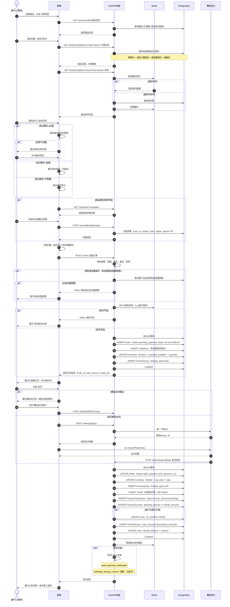

### 4.2 年卡预定流程

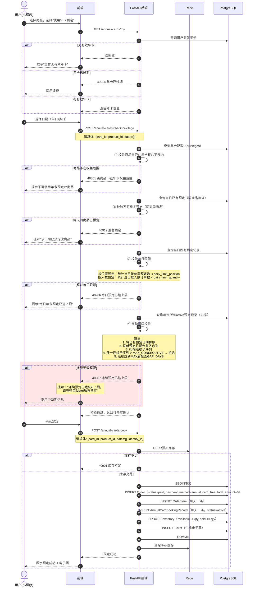

### 4.3 次数卡预定流程

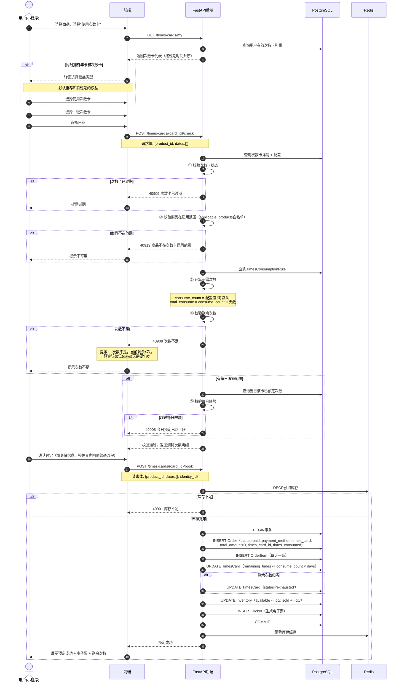

### 4.4 退票流程

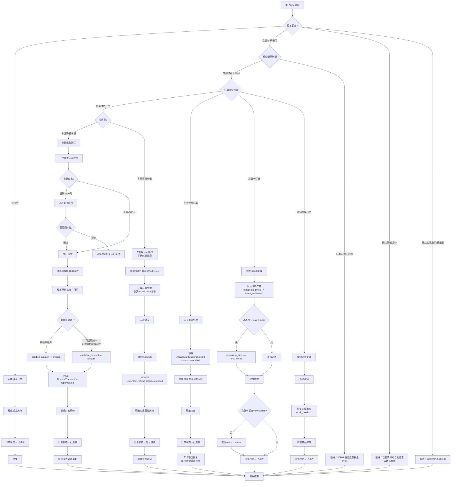

### 4.5 验票流程

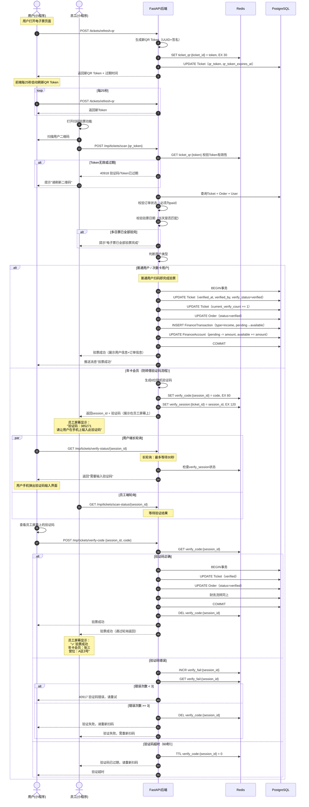

### 4.6 秒杀下单流程

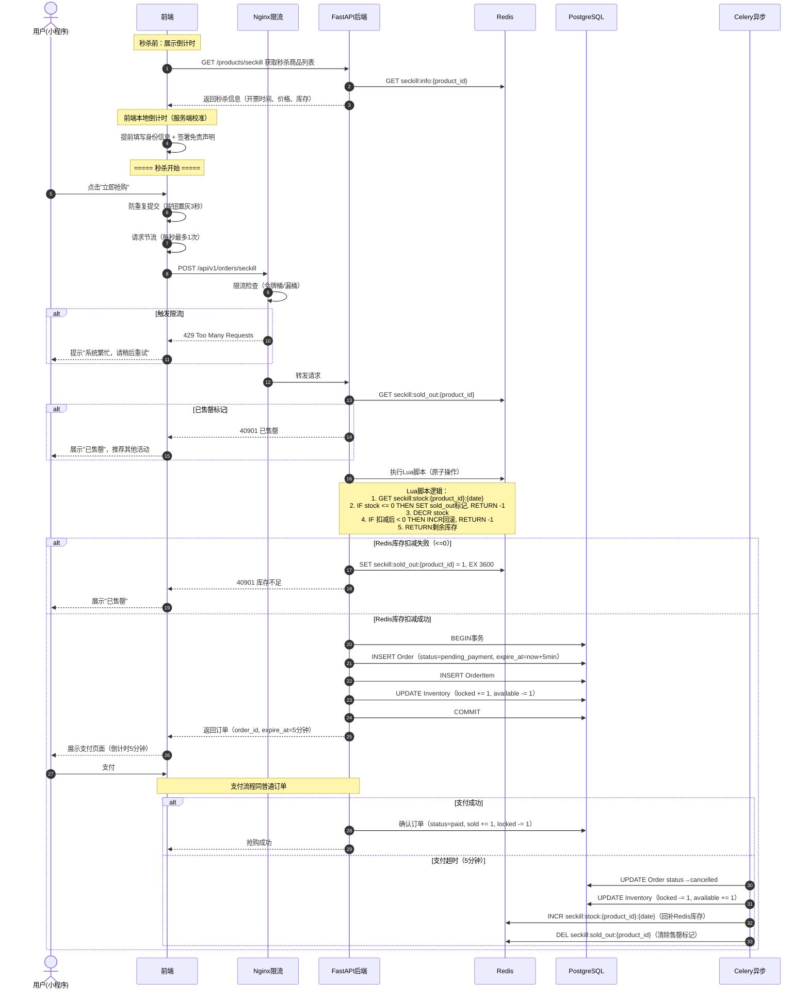

### 4.7 收入确认与提现流程

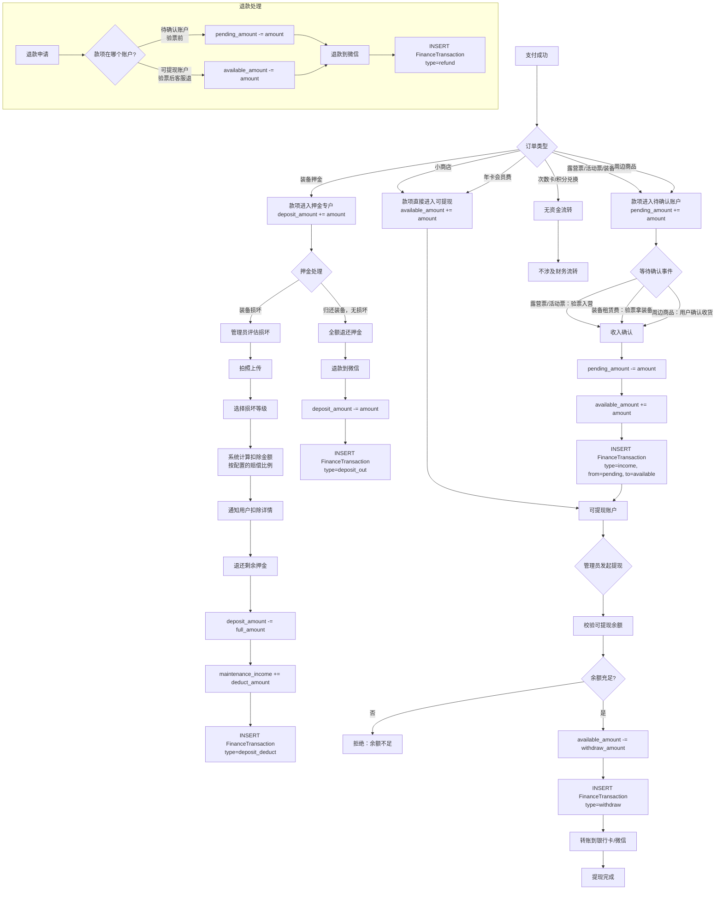

---

## 5. 安全架构

### 5.1 认证方案（JWT双Token）

#### 5.1.1 Token设计

| Token类型 | 有效期 | 存储位置 | 用途 |
|-----------|--------|---------|------|
| `access_token` | 2小时 | 小程序：内存/Storage<br/>Web：内存 | API请求认证 |
| `refresh_token` | 7天 | 小程序：wx.setStorageSync<br/>Web：httpOnly cookie | 刷新access_token |

#### 5.1.2 Token载荷（Payload）

```json
{
  "sub": "user_id",
  "role": "user|staff|admin",
  "site_id": 1,
  "token_type": "access|refresh",
  "iat": 1710144000,
  "exp": 1710151200
}
```

#### 5.1.3 认证流程

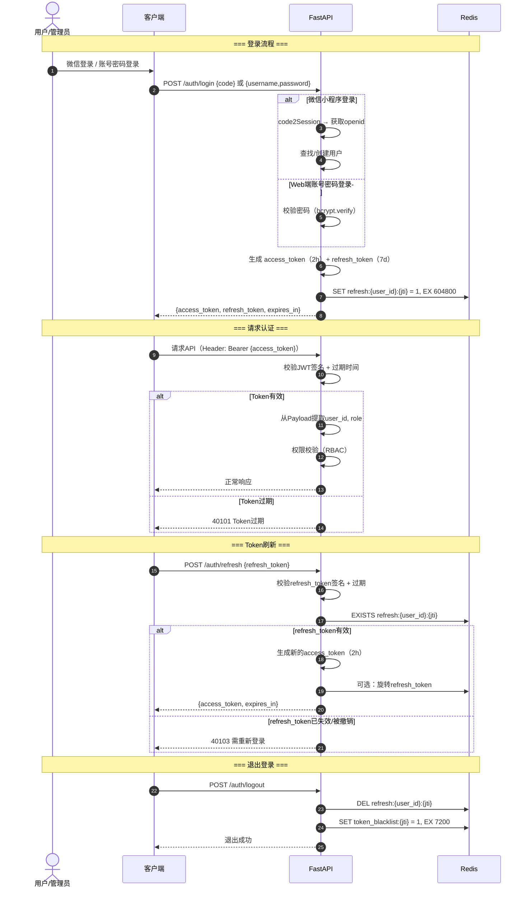

#### 5.1.4 Token安全措施

| 措施 | 说明 |
|------|------|
| 签名算法 | RS256（生产）/ HS256（开发环境） |
| 密钥管理 | 私钥通过环境变量注入，不入代码仓库 |
| Token黑名单 | 退出登录后access_token的jti加入Redis黑名单（TTL=token剩余有效期） |
| 刷新Token旋转 | 每次使用refresh_token后可选生成新的，旧的失效（防重放） |
| 并发设备 | 同一用户允许多设备同时登录，每个设备独立refresh_token |
| 强制下线 | 管理员可通过删除Redis中用户所有refresh记录强制该用户重新登录 |

### 5.2 权限模型（RBAC）

#### 5.2.1 角色定义

| 角色 | role_code | 说明 | 使用端 |
|------|-----------|------|--------|
| **超级管理员** | `super_admin` | 营地老板，拥有所有权限，可管理其他管理员 | Web + 小程序 |
| **管理员** | `admin` | 运营负责人，拥有绝大多数管理权限 | Web + 小程序 |
| **员工** | `staff` | 前台/验票员/仓管，拥有配置的操作权限 | 小程序 |
| **普通用户** | `user` | C端用户，访问用户侧功能 | 小程序 |
| **游客** | — | 未登录，仅可访问公开接口 | 小程序 |

#### 5.2.2 权限矩阵

| 资源(resource) | 操作(action) | super_admin | admin | staff | user | 游客 |
|---------------|-------------|:-----------:|:-----:|:-----:|:----:|:----:|
| `dashboard` | read | ✅ | ✅ | ❌ | ❌ | ❌ |
| `product` | read | ✅ | ✅ | ✅ | ✅ | ✅ |
| `product` | write | ✅ | ✅ | ❌ | ❌ | ❌ |
| `product` | delete | ✅ | ✅ | ❌ | ❌ | ❌ |
| `order` | read | ✅ | ✅ | ✅ | 自己 | ❌ |
| `order` | write | ✅ | ✅ | ✅ | 自己 | ❌ |
| `order` | export | ✅ | ✅ | ❌ | ❌ | ❌ |
| `inventory` | read | ✅ | ✅ | ✅ | ✅ | ✅ |
| `inventory` | write | ✅ | ✅ | ❌ | ❌ | ❌ |
| `member` | read | ✅ | ✅ | ✅ | 自己 | ❌ |
| `member` | write | ✅ | ✅ | ❌ | ❌ | ❌ |
| `finance` | read | ✅ | ✅ | ❌ | ❌ | ❌ |
| `finance` | write | ✅ | ✅ | ❌ | ❌ | ❌ |
| `ticket` | read | ✅ | ✅ | ✅ | 自己 | ❌ |
| `ticket` | write | ✅ | ✅ | ✅ | ❌ | ❌ |
| `faq` | read | ✅ | ✅ | ✅ | ✅ | ✅ |
| `faq` | write | ✅ | ✅ | ❌ | ❌ | ❌ |
| `notification` | read | ✅ | ✅ | ❌ | 自己 | ❌ |
| `times_card` | read | ✅ | ✅ | ❌ | 自己 | ❌ |
| `times_card` | write | ✅ | ✅ | ❌ | ❌ | ❌ |
| `page_config` | read | ✅ | ✅ | ❌ | ✅ | ✅ |
| `page_config` | write | ✅ | ✅ | ❌ | ❌ | ❌ |
| `system` | read | ✅ | ✅ | ❌ | ❌ | ❌ |
| `system` | write | ✅ | ❌ | ❌ | ❌ | ❌ |
| `operation_log` | read | ✅ | ✅ | ❌ | ❌ | ❌ |

> **说明**：`自己` 表示用户只能访问/操作自己的数据（通过 `user_id` 过滤）。`super_admin` 独占 `system.write` 权限（如权限管理、支付模式切换）。

#### 5.2.3 权限校验实现

```python
# FastAPI依赖注入示例
from fastapi import Depends, HTTPException

async def require_role(*allowed_roles: str):
    """角色校验依赖"""
    async def _check(current_user = Depends(get_current_user)):
        if current_user.role not in allowed_roles:
            raise HTTPException(status_code=403, detail="权限不足")
        return current_user
    return _check

async def require_permission(resource: str, action: str):
    """细粒度权限校验依赖"""
    async def _check(current_user = Depends(get_current_user)):
        has_perm = await check_permission(
            current_user.role_id, resource, action
        )
        if not has_perm:
            raise HTTPException(status_code=403, detail="权限不足")
        return current_user
    return _check

# 使用示例
@router.get("/admin/finance/overview")
async def get_finance_overview(
    user = Depends(require_permission("finance", "read"))
):
    ...
```

#### 5.2.4 数据隔离

| 隔离维度 | 实现方式 |
|---------|---------|
| 用户数据隔离 | 所有用户级查询自动注入 `WHERE user_id = :current_user_id` |
| 营地数据隔离 | 所有查询自动注入 `WHERE site_id = :current_site_id`（预留多营地） |
| 管理员数据权限 | 管理员可见当前营地所有数据，不可跨营地 |

### 5.3 敏感数据加密

#### 5.3.1 身份证号加密方案

| 项目 | 方案 |
|------|------|
| 加密算法 | AES-256-GCM（认证加密，防篡改） |
| 密钥长度 | 256位 |
| 密钥存储 | 环境变量 `ENCRYPTION_KEY`，不入代码仓库 |
| IV/Nonce | 每次加密随机生成12字节Nonce，与密文一起存储 |
| 存储格式 | `{base64(nonce)}:{base64(ciphertext)}:{base64(tag)}` |
| 查询支持 | 同时存储 `id_card_hash`（SHA-256摘要），用于等值查询 |
| 密钥轮转 | 预留密钥版本号字段，支持新旧密钥并存解密 |

```python
# 加密/解密示例
from cryptography.hazmat.primitives.ciphers.aead import AESGCM
import os, base64

class IDCardCrypto:
    def __init__(self, key: bytes):
        self.aead = AESGCM(key)  # 32 bytes key

    def encrypt(self, id_card: str) -> str:
        nonce = os.urandom(12)
        ct = self.aead.encrypt(nonce, id_card.encode(), None)
        return f"{base64.b64encode(nonce).decode()}:" \
               f"{base64.b64encode(ct).decode()}"

    def decrypt(self, encrypted: str) -> str:
        nonce_b64, ct_b64 = encrypted.split(":", 1)
        nonce = base64.b64decode(nonce_b64)
        ct = base64.b64decode(ct_b64)
        return self.aead.decrypt(nonce, ct, None).decode()

    @staticmethod
    def hash(id_card: str) -> str:
        import hashlib
        return hashlib.sha256(id_card.encode()).hexdigest()
```

#### 5.3.2 敏感数据脱敏展示

| 数据类型 | 脱敏规则 | 示例 |
|---------|---------|------|
| 身份证号 | 保留前3后4，中间用 `*` 替代 | `110***********1234` |
| 手机号 | 保留前3后4 | `138****5678` |
| 姓名 | 保留姓，名用 `*` 替代 | `张**` |
| 银行卡 | 保留后4位 | `************5678` |

#### 5.3.3 数据传输安全

| 措施 | 说明 |
|------|------|
| HTTPS强制 | Nginx配置强制HTTPS，HTTP请求301重定向 |
| HSTS | 响应头 `Strict-Transport-Security: max-age=31536000` |
| TLS版本 | 最低TLS 1.2，推荐TLS 1.3 |
| 证书管理 | Let's Encrypt自动续期，或使用云平台SSL证书 |

### 5.4 高危操作二次确认（技术实现）

#### 5.4.1 二次确认清单（引用PRD 3.4节14项）

| 序号 | 操作 | 风险等级 | 确认方式 | 后端校验 |
|------|------|---------|---------|---------|
| 1 | 批量下架商品（≥3个） | 高 | 确认码 | 校验确认码 + 记录日志 |
| 2 | 删除有未完成订单的商品 | 极高 | 操作密码 | 校验密码 + 二次查询确认 + 记录日志 |
| 3 | 批量调整库存（≥10个） | 高 | 确认码 | 校验确认码 + 记录变更明细 |
| 4 | 库存清零 | 极高 | 操作密码 | 校验密码 + 记录日志 |
| 5 | 单笔退款≥500元 | 高 | 确认码 | 校验确认码 + 金额核验 |
| 6 | 批量退款（≥3笔） | 极高 | 操作密码 | 校验密码 + 逐笔核验 |
| 7 | 手动部分退票 | 高 | 确认码 | 校验确认码 + 退款金额校验 |
| 8 | 新增/移除管理员角色 | 极高 | 操作密码 | 校验密码 + 不可自我降级 |
| 9 | 修改员工权限 | 高 | 确认码 | 校验确认码 |
| 10 | 批量修改价格（≥5个商品） | 高 | 确认码 | 校验确认码 + 记录变更前后值 |
| 11 | 手动调整积分（≥1000分） | 高 | 确认码 | 校验确认码 + 记录调整原因 |
| 12 | 修改退票规则/免责声明 | 高 | 确认码 | 校验确认码 + 记录版本 |
| 13 | 切换支付模式 | 极高 | 操作密码 | 校验密码 + 广播通知 |
| 14 | 批量导出激活码 | 极高 | 操作密码 | 校验密码 + 记录导出范围 |

#### 5.4.2 确认码/密码校验流程

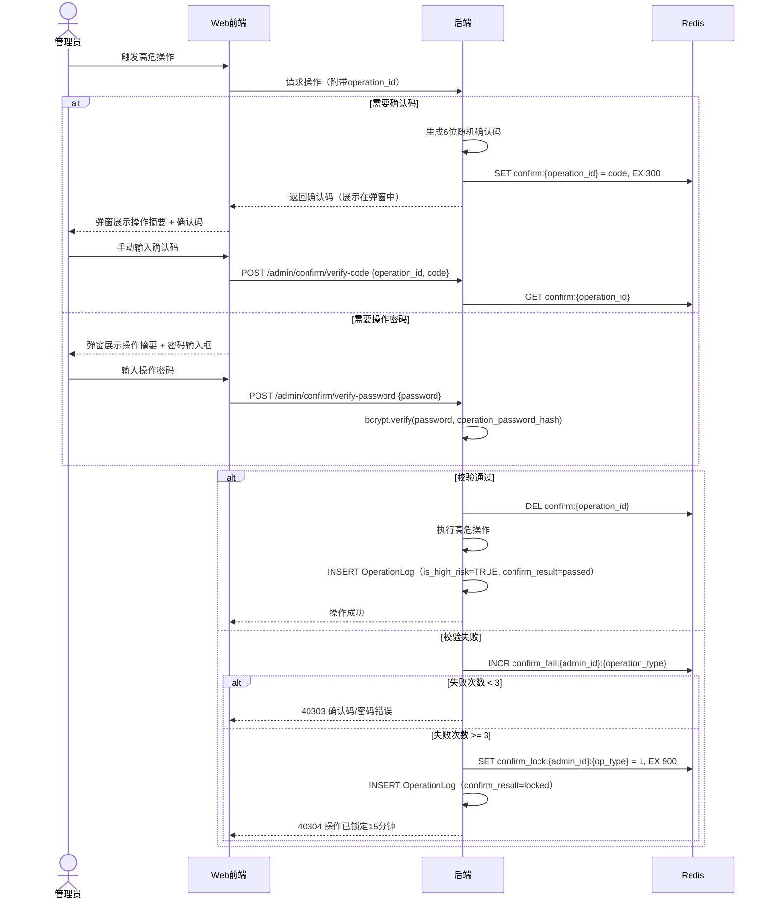

### 5.5 API限流策略

#### 5.5.1 Nginx层限流

```nginx
# nginx.conf 限流配置
# 全局限流区域定义
limit_req_zone $binary_remote_addr zone=global:10m rate=30r/s;
limit_req_zone $binary_remote_addr zone=api:10m rate=10r/s;
limit_req_zone $binary_remote_addr zone=seckill:10m rate=1r/s;
limit_req_zone $binary_remote_addr zone=auth:10m rate=5r/m;

server {
    # 普通API
    location /api/v1/ {
        limit_req zone=api burst=20 nodelay;
        proxy_pass http://fastapi_upstream;
    }

    # 秒杀API（严格限流）
    location /api/v1/orders/seckill {
        limit_req zone=seckill burst=5 nodelay;
        proxy_pass http://fastapi_upstream;
    }

    # 认证API（防暴力破解）
    location /api/v1/auth/ {
        limit_req zone=auth burst=3 nodelay;
        proxy_pass http://fastapi_upstream;
    }
}
```

#### 5.5.2 应用层限流（FastAPI + Redis）

| 接口类别 | 限流规则 | 维度 | 实现 |
|---------|---------|------|------|
| 普通API | 100次/分钟 | 用户ID | Redis滑动窗口 |
| 秒杀下单 | 1次/秒 | 用户ID | Redis令牌桶 |
| 登录接口 | 5次/分钟 | IP | Redis计数器 |
| 短信验证码 | 1次/60秒 | 手机号 | Redis计数器 |
| 文件上传 | 10次/分钟 | 用户ID | Redis滑动窗口 |
| 管理后台 | 200次/分钟 | 用户ID | Redis滑动窗口 |

```python
# Redis滑动窗口限流器
import time, redis

class RateLimiter:
    def __init__(self, redis_client: redis.Redis):
        self.redis = redis_client

    async def is_allowed(
        self, key: str, max_requests: int, window_seconds: int
    ) -> bool:
        now = time.time()
        pipe = self.redis.pipeline()
        pipe.zremrangebyscore(key, 0, now - window_seconds)
        pipe.zadd(key, {str(now): now})
        pipe.zcard(key)
        pipe.expire(key, window_seconds)
        results = pipe.execute()
        return results[2] <= max_requests
```

### 5.6 CORS配置

```python
# FastAPI CORS中间件配置
from fastapi.middleware.cors import CORSMiddleware

ALLOWED_ORIGINS = [
    "https://admin.yyyl.example.com",   # Web管理后台域名
    "https://yyyl.example.com",          # 主域名
]

# 开发环境追加
if settings.DEBUG:
    ALLOWED_ORIGINS.extend([
        "http://localhost:3000",
        "http://localhost:5173",          # Vite开发服务器
    ])

app.add_middleware(
    CORSMiddleware,
    allow_origins=ALLOWED_ORIGINS,       # 生产环境严格限定域名
    allow_credentials=True,
    allow_methods=["GET", "POST", "PUT", "DELETE", "OPTIONS"],
    allow_headers=["Authorization", "Content-Type", "X-Request-ID"],
    max_age=3600,                        # preflight缓存1小时
)
```

### 5.7 参数化查询防SQL注入

#### 5.7.1 强制规范

| 规范 | 说明 |
|------|------|
| ORM优先 | 100%使用SQLAlchemy ORM操作数据库，禁止原生SQL拼接 |
| 参数化绑定 | 必须使用参数绑定（`:param` 或 `?`），禁止字符串拼接 |
| 白名单校验 | 排序字段（`sort_by`）、分组字段（`group_by`）必须经过白名单校验 |
| 输入校验 | 所有用户输入通过Pydantic Model校验后才进入Service层 |
| Code Review | PR中包含SQL操作必须检查是否使用参数化查询 |

#### 5.7.2 排序字段白名单示例

```python
# 订单排序白名单
ALLOWED_ORDER_SORT_FIELDS = {
    "created_at", "updated_at", "total_amount",
    "actual_amount", "status", "order_no"
}
ALLOWED_SORT_DIRECTIONS = {"asc", "desc"}

def validate_sort_params(sort_by: str, sort_order: str):
    if sort_by not in ALLOWED_ORDER_SORT_FIELDS:
        raise ValueError(f"不支持的排序字段: {sort_by}")
    if sort_order.lower() not in ALLOWED_SORT_DIRECTIONS:
        raise ValueError(f"不支持的排序方向: {sort_order}")
    return sort_by, sort_order.lower()
```

### 5.8 安全架构总览

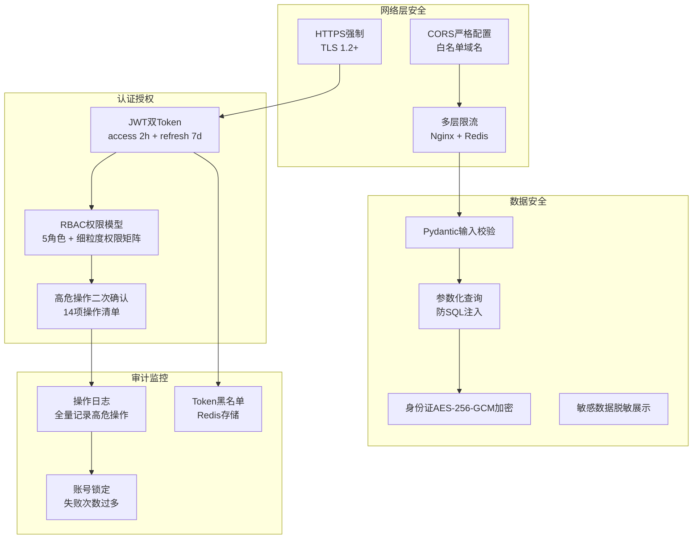

### 5.9 XSS防护方案

#### 5.9.1 后端防护（输出过滤）

| 防护层 | 方案 | 说明 |
|--------|------|------|
| 富文本字段过滤 | 使用 `bleach` 库白名单过滤 | FAQ回答、公告内容等允许HTML的字段，仅保留安全标签 |
| 普通文本转义 | FastAPI JSON序列化自动转义 | 非HTML字段返回时自动进行JSON转义 |
| 响应头安全 | `Content-Type: application/json` | API统一返回JSON，禁止浏览器嗅探 |

```python
import bleach

# 白名单配置
ALLOWED_TAGS = ["p", "br", "b", "i", "strong", "em", "ul", "ol", "li", "a", "span"]
ALLOWED_ATTRIBUTES = {"a": ["href", "title"], "span": ["class"]}

def sanitize_html(raw_html: str) -> str:
    """对富文本内容进行白名单过滤"""
    return bleach.clean(
        raw_html,
        tags=ALLOWED_TAGS,
        attributes=ALLOWED_ATTRIBUTES,
        strip=True,
    )
```

#### 5.9.2 前端防护

| 防护层 | 方案 | 说明 |
|--------|------|------|
| Web管理后台 | Vue3 模板默认转义 + `DOMPurify` | 动态渲染HTML内容前，使用 `DOMPurify.sanitize()` 过滤 |
| 小程序端 | `rich-text` 组件 | 微信小程序 `rich-text` 组件天然过滤危险标签，仅支持安全子集 |
| CSP响应头 | `Content-Security-Policy` | Web管理后台配置严格CSP，禁止内联脚本和外部资源加载 |

```javascript
// Web管理后台 DOMPurify 使用示例
import DOMPurify from 'dompurify';

// 渲染FAQ回答等富文本内容
const safeHtml = DOMPurify.sanitize(rawHtml, {
  ALLOWED_TAGS: ['p', 'br', 'b', 'i', 'strong', 'em', 'ul', 'ol', 'li', 'a', 'span'],
  ALLOWED_ATTR: ['href', 'title', 'class'],
});
```

### 5.10 CSRF防护方案

#### 5.10.1 防护策略

Web管理后台采用 **SameSite Cookie + 自定义请求头** 双重校验：

| 防护层 | 方案 | 说明 |
|--------|------|------|
| Cookie属性 | `SameSite=Strict` | 禁止跨站请求携带Cookie，阻断绝大部分CSRF攻击 |
| 自定义请求头 | `X-Request-Token` | 前端每次请求附带自定义Token头，后端中间件校验 |
| Referer/Origin校验 | 白名单校验 | 非API调用（如表单提交）额外校验Referer/Origin域名 |

#### 5.10.2 实现方案

```python
# CSRF防护中间件（Web管理后台）
from starlette.middleware.base import BaseHTTPMiddleware
from starlette.requests import Request
from starlette.responses import JSONResponse

class CSRFProtectionMiddleware(BaseHTTPMiddleware):
    """
    CSRF防护：SameSite=Strict + X-Request-Token 双重校验
    仅对Web管理后台的状态变更请求（POST/PUT/DELETE）生效
    """
    SAFE_METHODS = {"GET", "HEAD", "OPTIONS"}
    ADMIN_PATH_PREFIX = "/api/v1/admin/"

    async def dispatch(self, request: Request, call_next):
        # 仅对管理后台的非安全方法校验
        if (
            request.url.path.startswith(self.ADMIN_PATH_PREFIX)
            and request.method not in self.SAFE_METHODS
        ):
            # 校验自定义请求头
            x_request_token = request.headers.get("X-Request-Token")
            if not x_request_token:
                return JSONResponse(
                    status_code=403,
                    content={"code": 40305, "message": "缺少CSRF Token"},
                )
            # 校验Token有效性（从Redis获取用户session关联的token）
            if not await self._validate_csrf_token(request, x_request_token):
                return JSONResponse(
                    status_code=403,
                    content={"code": 40306, "message": "CSRF Token无效"},
                )
        return await call_next(request)
```

```javascript
// Web管理后台前端：Axios拦截器自动附带 X-Request-Token
import axios from 'axios';

axios.interceptors.request.use((config) => {
  // 从登录响应中获取的CSRF Token
  const csrfToken = localStorage.getItem('csrf_token');
  if (csrfToken) {
    config.headers['X-Request-Token'] = csrfToken;
  }
  return config;
});
```

> **小程序端说明**：微信小程序天然不受CSRF攻击影响（无Cookie机制，使用JWT Header认证），因此CSRF防护仅针对Web管理后台。

---

## 6. 缓存架构

### 6.1 Redis使用场景完整清单

```mermaid
graph LR
    subgraph Redis使用场景
        A[会话管理] --> A1[refresh_token存储]
        A --> A2[Token黑名单]
        A --> A3[验票session]

        B[缓存加速] --> B1[库存缓存]
        B --> B2[商品信息缓存]
        B --> B3[价格日历缓存]
        B --> B4[页面配置缓存]
        B --> B5[FAQ缓存]
        B --> B6[Dashboard统计缓存]

        C[秒杀系统] --> C1[秒杀库存预扣]
        C --> C2[售罄标记]
        C --> C3[秒杀信息缓存]

        D[业务计数] --> D1[限流计数器]
        D --> D2[二次确认码]
        D --> D3[验证码存储]
        D --> D4[确认失败计数]

        E[异步队列] --> E1[Celery消息broker]
        E --> E2[Celery结果backend]

        F[分布式锁] --> F1[订单创建幂等锁]
        F --> F2[库存操作锁]
        F --> F3[支付回调幂等锁]
    end
```

### 6.2 Key命名规范

#### 6.2.1 命名规则

- 格式：`{业务域}:{实体}:{标识}[:子标识]`
- 全部小写，使用冒号 `:` 分隔层级
- 标识使用实际ID值，不使用缩写
- 环境前缀（可选）：`{env}:{业务域}:...`（生产环境可省略）

#### 6.2.2 完整Key清单

**会话管理**：

| Key | 数据类型 | 过期时间 | 说明 |
|-----|---------|---------|------|
| `refresh:{user_id}:{jti}` | String: `1` | 7天 | refresh_token存活标记 |
| `token_blacklist:{jti}` | String: `1` | 2小时(=access_token剩余有效期) | 已失效的access_token |
| `session:{user_id}` | Hash | 7天 | 用户会话信息（可选） |

**库存缓存**：

| Key | 数据类型 | 过期时间 | 说明 |
|-----|---------|---------|------|
| `inventory:{product_id}:{date}` | Hash: `{total,available,locked,sold}` | 10分钟 | 日期维度库存缓存 |
| `inventory:sku:{sku_id}` | Hash: `{total,available,locked,sold}` | 10分钟 | SKU维度库存缓存（商品类） |
| `inventory:batch:{product_id}:{start}:{end}` | String: JSON | 5分钟 | 批量日期库存缓存 |

**秒杀系统**：

| Key | 数据类型 | 过期时间 | 说明 |
|-----|---------|---------|------|
| `seckill:stock:{product_id}:{date}` | String: 整数 | 活动结束后1小时 | 秒杀库存（Lua原子操作） |
| `seckill:sold_out:{product_id}` | String: `1` | 1小时 | 售罄标记（前置拦截） |
| `seckill:info:{product_id}` | Hash: `{name,price,start_time,stock}` | 活动结束后 | 秒杀商品信息缓存 |
| `seckill:queue:{product_id}` | List | 活动结束后 | 秒杀排队队列（扩展预留） |
| `seckill:user_ordered:{product_id}:{user_id}` | String: `1` | 活动结束后 | 用户已抢购标记（防重复） |
| `seckill:prefill:{product_id}:{user_id}` | Hash | 2小时 | 秒杀预填数据（身份信息+搭配选择+免责签署token） |
| `seckill:online:{product_id}` | HyperLogLog | 开票后1小时 | 在线等待人数（PFADD统计UV） |
| `seckill:monitor:{product_id}` | Hash | 开票后24小时 | 秒杀监控数据（成单数/TPS/库存变化时间线） |

**商品与价格缓存**：

| Key | 数据类型 | 过期时间 | 说明 |
|-----|---------|---------|------|
| `product:detail:{product_id}` | String: JSON | 30分钟 | 商品详情缓存 |
| `product:list:{type}:{page}:{page_size}` | String: JSON | 5分钟 | 商品列表缓存 |
| `product:categories` | String: JSON | 1小时 | 商品分类缓存 |
| `price:calendar:{product_id}:{month}` | String: JSON | 10分钟 | 价格日历缓存（按月） |
| `product:identity_config:{product_id}` | String: JSON | 30分钟 | 身份登记配置缓存 |

**页面与配置缓存**：

| Key | 数据类型 | 过期时间 | 说明 |
|-----|---------|---------|------|
| `page_config:{page_key}` | String: JSON | 1小时 | 首页轮播/推荐等配置 |
| `faq:categories` | String: JSON | 1小时 | FAQ分类缓存 |
| `faq:hot` | String: JSON | 30分钟 | 热门FAQ缓存 |
| `faq:category:{category_id}` | String: JSON | 30分钟 | 分类下FAQ列表缓存 |
| `customer_service:info` | String: JSON | 1小时 | 客服信息缓存 |
| `disclaimer:template:active` | String: JSON | 1小时 | 当前有效免责声明模板 |
| `system:settings` | String: JSON | 10分钟 | 系统配置缓存 |
| `weather:current:{site_id}` | String: JSON | 1小时 | 当前天气数据 |
| `weather:forecast:{site_id}` | String: JSON | 1小时 | 7天天气预报 |
| `game:token:{user_id}` | String: HMAC token | 30分钟 | H5游戏签名token |

**验票系统**：

| Key | 数据类型 | 过期时间 | 说明 |
|-----|---------|---------|------|
| `ticket_qr:{ticket_id}` | String: token | 30秒 | 电子票QR Token |
| `verify_code:{session_id}` | String: 6位验证码 | 60秒 | 年卡验票验证码 |
| `verify_session:{ticket_id}` | String: session_id | 120秒 | 验票会话关联 |
| `verify_fail:{session_id}` | String: 整数 | 120秒 | 验证码失败次数 |
| `verify_result:{session_id}` | String: JSON | 120秒 | 验票结果（供轮询） |

**限流与安全**：

| Key | 数据类型 | 过期时间 | 说明 |
|-----|---------|---------|------|
| `rate_limit:{user_id}:{endpoint}` | Sorted Set | 滑动窗口 | API限流计数 |
| `rate_limit:ip:{ip}:{endpoint}` | Sorted Set | 滑动窗口 | IP限流计数 |
| `confirm:{operation_id}` | String: 确认码 | 5分钟 | 二次确认验证码 |
| `confirm_fail:{admin_id}:{op_type}` | String: 整数 | 15分钟 | 确认失败计数 |
| `confirm_lock:{admin_id}:{op_type}` | String: `1` | 15分钟 | 操作锁定标记 |
| `login_fail:{ip}` | String: 整数 | 15分钟 | 登录失败计数（防暴力破解） |

**Dashboard统计缓存**：

| Key | 数据类型 | 过期时间 | 说明 |
|-----|---------|---------|------|
| `dashboard:realtime` | String: JSON | 30秒 | 实时数据卡片缓存 |
| `dashboard:trends:{range}` | String: JSON | 5分钟 | 趋势图数据缓存（7d/30d） |
| `dashboard:sales_ranking` | String: JSON | 5分钟 | 销售排行缓存 |
| `dashboard:member_stats` | String: JSON | 5分钟 | 会员统计缓存 |
| `dashboard:heatmap` | String: JSON | 1小时 | 营位热力图缓存 |
| `dashboard:finance` | String: JSON | 5分钟 | 财务概览缓存 |

**分布式锁**：

| Key | 数据类型 | 过期时间 | 说明 |
|-----|---------|---------|------|
| `lock:order_create:{user_id}:{idempotency_key}` | String: UUID | 30秒 | 创建订单幂等锁 |
| `lock:inventory:{inventory_id}` | String: UUID | 10秒 | 库存操作锁 |
| `lock:pay_callback:{order_no}` | String: UUID | 60秒 | 支付回调幂等锁 |
| `lock:refund:{order_id}` | String: UUID | 30秒 | 退款操作锁 |

**Celery**：

| Key | 数据类型 | 过期时间 | 说明 |
|-----|---------|---------|------|
| `celery` (作为broker) | List/Stream | — | Celery任务队列 |
| `celery-task-meta-{task_id}` | String | 24小时 | Celery任务结果 |

### 6.3 缓存过期时间汇总

| 时间级别 | 场景 | 原因 |
|---------|------|------|
| **30秒** | QR Token、Dashboard实时数据 | 安全性/实时性要求高 |
| **60秒** | 验票验证码 | 安全性要求 |
| **5分钟** | 商品列表、Dashboard趋势/排行 | 平衡实时性与性能 |
| **10分钟** | 库存缓存、价格日历、系统配置 | 允许短暂不一致，后台可主动清除 |
| **30分钟** | 商品详情、FAQ列表 | 变更频率低 |
| **1小时** | 商品分类、页面配置、客服信息、FAQ分类、Dashboard热力图 | 变更极少 |
| **2小时** | Token黑名单 | 与access_token有效期对齐 |
| **7天** | refresh_token | 与refresh_token有效期对齐 |

### 6.4 缓存预热策略

#### 6.4.1 启动预热

系统启动时（FastAPI `startup` 事件）预热以下缓存：

```python
@app.on_event("startup")
async def startup_cache_warmup():
    """系统启动时预热关键缓存"""
    # 1. 商品分类（变更极少）
    categories = await product_service.get_categories()
    await redis.set("product:categories", json.dumps(categories), ex=3600)

    # 2. 页面配置（首页轮播、推荐）
    for page_key in ["home_banner", "home_recommend", "home_notice"]:
        config = await page_config_service.get_config(page_key)
        await redis.set(f"page_config:{page_key}", json.dumps(config), ex=3600)

    # 3. 系统设置
    settings = await system_service.get_settings()
    await redis.set("system:settings", json.dumps(settings), ex=600)

    # 4. FAQ分类
    faq_cats = await faq_service.get_categories()
    await redis.set("faq:categories", json.dumps(faq_cats), ex=3600)

    # 5. 客服信息
    cs_info = await cs_service.get_info()
    await redis.set("customer_service:info", json.dumps(cs_info), ex=3600)

    # 6. 免责声明模板
    template = await disclaimer_service.get_active_template()
    await redis.set("disclaimer:template:active", json.dumps(template), ex=3600)

    logger.info("Cache warmup completed")
```

#### 6.4.2 定时预热

通过Celery Beat定时任务周期性预热：

| 预热任务 | 执行频率 | 预热内容 |
|---------|---------|---------|
| `warmup_inventory_cache` | 每10分钟 | 未来7天的热门商品库存 |
| `warmup_price_calendar` | 每小时 | 未来30天的价格日历 |
| `warmup_dashboard_cache` | 每5分钟 | Dashboard统计数据 |
| `warmup_heatmap_cache` | 每小时 | 营位热力图数据 |
| `warmup_seckill_cache` | 秒杀前5分钟 | 秒杀商品库存同步到Redis |

#### 6.4.3 秒杀库存预热（关键）

```python
async def warmup_seckill_stock(product_id: int):
    """秒杀开始前将库存从DB同步到Redis"""
    inventories = await inventory_repo.get_by_product(product_id)
    pipe = redis.pipeline()
    for inv in inventories:
        key = f"seckill:stock:{product_id}:{inv.date}"
        pipe.set(key, inv.available)
        pipe.expire(key, 86400)  # 24小时
    # 清除售罄标记
    pipe.delete(f"seckill:sold_out:{product_id}")
    await pipe.execute()
    logger.info(f"Seckill stock warmed up: product={product_id}")
```

### 6.5 缓存穿透/击穿/雪崩防护

#### 6.5.1 缓存穿透（查询不存在的数据）

| 问题 | 大量请求查询不存在的商品ID，每次都穿透到数据库 |
|------|------|
| **方案一：空值缓存** | 查询DB返回空时，缓存空值 `NULL`，过期时间缩短为2分钟 |
| **方案二：布隆过滤器**（扩展） | 在Redis中维护商品ID的布隆过滤器，请求进来先检查 |

```python
async def get_product_detail(product_id: int):
    # 1. 查缓存
    cache_key = f"product:detail:{product_id}"
    cached = await redis.get(cache_key)
    if cached is not None:
        if cached == "NULL":
            return None  # 空值缓存命中
        return json.loads(cached)

    # 2. 查DB
    product = await product_repo.get_by_id(product_id)
    if product is None:
        # 空值缓存（短过期）
        await redis.set(cache_key, "NULL", ex=120)
        return None

    # 3. 回填缓存
    await redis.set(cache_key, json.dumps(product.to_dict()), ex=1800)
    return product
```

#### 6.5.2 缓存击穿（热点Key过期瞬间大量请求）

| 问题 | 秒杀商品详情缓存过期瞬间，大量请求打到数据库 |
|------|------|
| **方案：分布式互斥锁** | 缓存未命中时，用Redis SETNX获取锁，只允许一个请求查DB并回填缓存 |

```python
async def get_product_with_lock(product_id: int):
    cache_key = f"product:detail:{product_id}"
    lock_key = f"lock:cache_rebuild:{product_id}"

    cached = await redis.get(cache_key)
    if cached and cached != "NULL":
        return json.loads(cached)

    # 尝试获取锁（SETNX）
    acquired = await redis.set(lock_key, "1", nx=True, ex=10)
    if acquired:
        try:
            # 获得锁，查DB并回填
            product = await product_repo.get_by_id(product_id)
            if product:
                await redis.set(
                    cache_key,
                    json.dumps(product.to_dict()),
                    ex=1800
                )
                return product
            else:
                await redis.set(cache_key, "NULL", ex=120)
                return None
        finally:
            await redis.delete(lock_key)
    else:
        # 未获得锁，等待50ms后重试读缓存
        await asyncio.sleep(0.05)
        cached = await redis.get(cache_key)
        if cached and cached != "NULL":
            return json.loads(cached)
        return None  # 兜底
```

#### 6.5.3 缓存雪崩（大量Key同时过期）

| 问题 | 大量缓存同时过期，瞬间全部打到数据库 |
|------|------|
| **方案一：随机过期偏移** | 在基础过期时间上增加随机偏移量（±20%） |
| **方案二：多级过期** | 不同类别的缓存使用不同过期时间 |
| **方案三：预热续期** | 定时任务在缓存过期前主动续期 |

```python
import random

def cache_ttl(base_ttl: int) -> int:
    """给缓存过期时间增加随机偏移，防雪崩"""
    offset = int(base_ttl * 0.2)
    return base_ttl + random.randint(-offset, offset)

# 使用示例
await redis.set(cache_key, data, ex=cache_ttl(1800))
# 实际过期时间为 1440~2160 秒之间
```

### 6.6 库存缓存与数据库一致性方案

#### 6.6.1 整体方案：Redis预扣 + DB事务确认

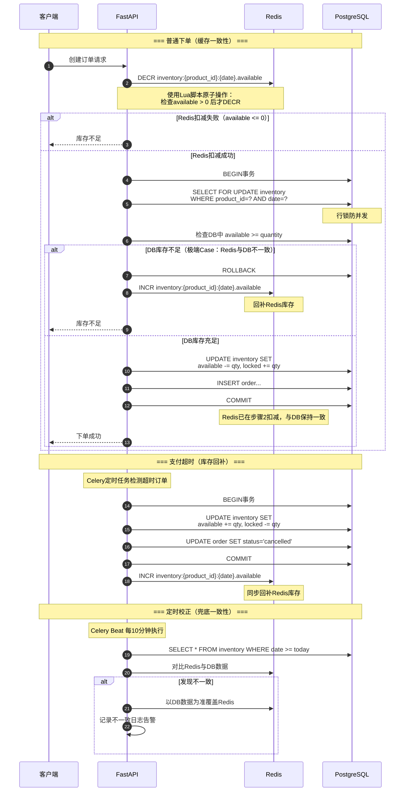

#### 6.6.2 秒杀场景库存一致性

```lua
-- Redis Lua脚本：秒杀库存原子扣减
-- KEYS[1] = seckill:stock:{product_id}:{date}
-- KEYS[2] = seckill:sold_out:{product_id}
-- ARGV[1] = 扣减数量

local stock = tonumber(redis.call('GET', KEYS[1]))
if stock == nil then
    return -2  -- 库存Key不存在
end

if stock <= 0 then
    redis.call('SET', KEYS[2], '1')
    redis.call('EXPIRE', KEYS[2], 3600)
    return -1  -- 已售罄
end

if stock < tonumber(ARGV[1]) then
    return -1  -- 库存不足
end

local remaining = redis.call('DECRBY', KEYS[1], ARGV[1])
if remaining < 0 then
    -- 竞态导致超扣，回滚
    redis.call('INCRBY', KEYS[1], ARGV[1])
    return -1
end

if remaining == 0 then
    redis.call('SET', KEYS[2], '1')
    redis.call('EXPIRE', KEYS[2], 3600)
end

return remaining  -- 返回剩余库存
```

#### 6.6.3 一致性保障层级

| 层级 | 机制 | 触发时机 | 说明 |
|------|------|---------|------|
| **L1 实时同步** | 业务代码中Redis和DB双写 | 每次库存变更 | 下单/取消/退款时同步更新 |
| **L2 延迟补偿** | 超时取消任务回补Redis | 支付超时后 | Celery任务处理 |
| **L3 定时校正** | 对比Redis和DB数据 | 每10分钟 | Celery Beat兜底任务 |
| **L4 缓存失效** | 缓存自动过期后从DB重建 | TTL到期 | 10分钟过期自然重建 |
| **L5 手动刷新** | 管理员手动调整库存时清除缓存 | 后台操作 | 管理端主动清缓存 |

#### 6.6.4 主动缓存清除触发点

| 操作 | 需清除的缓存Key |
|------|---------------|
| 创建/更新商品 | `product:detail:{id}`, `product:list:*`, `product:categories` |
| 修改定价规则 | `price:calendar:{product_id}:*` |
| 调整库存 | `inventory:{product_id}:{date}`, `inventory:batch:*` |
| 更新页面配置 | `page_config:{page_key}` |
| 更新FAQ | `faq:categories`, `faq:hot`, `faq:category:*` |
| 更新客服信息 | `customer_service:info` |
| 更新免责声明 | `disclaimer:template:active` |
| 更新系统设置 | `system:settings` |
| 修改身份登记配置 | `product:identity_config:{product_id}` |
| 下单/退款/取消 | `inventory:{product_id}:{date}`, `dashboard:*` |

### 6.7 Redis内存估算

| 数据类型 | Key数量估算 | 单Key大小 | 总内存 |
|---------|-----------|----------|--------|
| 库存缓存（50商品×30天） | 1,500 | 200B | ~300KB |
| 秒杀库存 | 100 | 50B | ~5KB |
| 商品详情缓存 | 200 | 5KB | ~1MB |
| 价格日历 | 200 | 2KB | ~400KB |
| 会话（Token/Session） | 5,000 | 200B | ~1MB |
| 限流计数器 | 10,000 | 100B | ~1MB |
| Dashboard缓存 | 10 | 50KB | ~500KB |
| FAQ/配置缓存 | 50 | 2KB | ~100KB |
| Celery队列 | 动态 | 变化 | ~10MB |
| **总计** | — | — | **~15MB** |

> 初期Redis内存需求极小（<50MB），建议分配256MB~512MB Redis实例，留有充足余量。

---

## 7. 定时任务设计

> **PRD评审遗留重要事项**：PRD中散落在多个章节的定时/自动化场景，需在架构文档中完整汇总，确保开发不遗漏。

### 7.1 技术选型

| 方案 | 选型 | 说明 |
|------|------|------|
| 定时任务调度 | **Celery Beat** | 与现有Celery Worker共用基础设施，无需额外引入组件 |
| 异步任务执行 | **Celery Worker** | 基于Redis作为Broker，支持任务重试、结果存储 |
| 任务序列化 | JSON | 所有任务参数使用JSON序列化，便于调试 |
| 调度配置 | `celery.conf.beat_schedule` | 集中声明所有定时任务，便于管理和版本控制 |
| 监控面板 | **Flower**（可选） | Celery任务监控Web UI，开发/测试阶段使用 |

### 7.2 定时任务总清单

#### 7.2.1 开票/库存类

| # | 任务名称 | Cron表达式 | 执行逻辑 | 失败处理 | 幂等性保障 |
|---|---------|-----------|---------|---------|-----------|
| 1 | `task_auto_release_tickets` | `*/1 * * * *`（每分钟） | 扫描 `Product` 表中 `sale_start_at ≤ now()` 且 `status = 'draft'` 的商品，自动更新为 `on_sale`，初始化对应日期范围的 `Inventory` 记录，清除Redis缓存 | 重试3次（指数退避10s/60s/300s），最终失败写 `task_error_log` 并告警 | 基于 `product_id + sale_start_at` 判断已处理跳过；Inventory使用 `INSERT ... ON CONFLICT DO NOTHING` |
| 2 | `task_inventory_auto_release` | `*/1 * * * *`（每分钟） | 扫描 `Order` 中 `status='pending_payment'` 且 `expire_at ≤ now()` 的订单，执行超时取消：更新Order状态为cancelled → 恢复Inventory available → 回补Redis → 记录InventoryLog | 逐单处理，单条失败不影响其他；失败单下轮重新扫到 | 仅处理 `pending_payment` 状态；使用 `WHERE status = 'pending_payment'` 乐观锁 |

#### 7.2.2 订单类

| # | 任务名称 | Cron表达式 | 执行逻辑 | 失败处理 | 幂等性保障 |
|---|---------|-----------|---------|---------|-----------|
| 3 | `task_cancel_expired_orders` | `*/1 * * * *` | 与任务2合并。普通订单超时30分钟，秒杀订单超时5分钟。超时后取消订单 → 释放库存 → 发送取消通知 | 同任务2 | 同任务2 |
| 4 | `task_auto_complete_orders` | `0 2 * * *`（每天凌晨2点） | 扫描 `status='verified'` 且服务日期已过N天（默认1天）的订单，流转为 `completed`，收入从待确认转可提现 | 重试3次，失败记录日志 | 基于 `order_id + status` 判断 |

#### 7.2.3 会员类

| # | 任务名称 | Cron表达式 | 执行逻辑 | 失败处理 | 幂等性保障 |
|---|---------|-----------|---------|---------|-----------|
| 5 | `task_annual_card_expire` | `0 0 * * *`（每天0点） | 扫描 `AnnualCard` 中 `end_date < today()` 且 `status='active'`，更新为 `expired` | 重试3次 | `WHERE status='active' AND end_date < today()` |
| 6 | `task_times_card_expire` | `0 0 * * *`（每天0点） | 扫描 `TimesCard` 中 `end_date < today()` 且 `status='active'`，更新为 `expired` | 同上 | 同上 |
| 7 | `task_annual_card_expire_remind` | `0 9 * * *`（每天9点） | 扫描年卡 `end_date` 在未来7天和1天内的记录，发送微信订阅消息提醒续费 | 发送失败记录日志不重试 | `Notification` 表去重 `(user_id, type, related_id)` |
| 8 | `task_times_card_expire_remind` | `0 9 * * *`（每天9点） | 扫描次数卡 `end_date` 在未来7天和1天内的记录，发送微信订阅消息提醒使用 | 同上 | 同上 |
| 9 | `task_points_expire` | `0 1 * * *`（每天1点） | 扫描 `PointsLog` 中 `expires_at < today()` 且未标记过期的记录，扣减 `points_balance`，记录变动日志 | 逐条处理 | 基于 `PointsLog.is_expired` 标记 |

#### 7.2.4 财务类

| # | 任务名称 | Cron表达式 | 执行逻辑 | 失败处理 | 幂等性保障 |
|---|---------|-----------|---------|---------|-----------|
| 10 | `task_income_confirm` | `0 3 * * *`（每天3点） | 已验票订单服务日期过N天后，`FinanceTransaction` 从 `pending` 转 `confirmed`，更新 `FinanceAccount` pending→available | 逐单事务 | `WHERE status='pending'` |
| 11 | `task_deposit_timeout_alert` | `0 10 * * *`（每天10点） | 装备租赁 `status='verified'` 且租赁日期过3天未归还，通知管理员 | 记录日志 | `Notification` 去重 |

#### 7.2.5 数据统计类

| # | 任务名称 | Cron表达式 | 执行逻辑 | 失败处理 | 幂等性保障 |
|---|---------|-----------|---------|---------|-----------|
| 12 | `task_dashboard_aggregate` | `*/5 * * * *`（每5分钟） | 聚合Dashboard数据（今日订单/收入/在营人数/趋势图），写入Redis缓存 TTL=10min | 失败不影响旧缓存 | 全量覆盖写入 |
| 13 | `task_heatmap_calculate` | `0 4 * * *`（每天4点） | 计算近30天各营位预定率热力图，写入Redis `dashboard:heatmap` TTL=25h | 重试3次 | 全量覆盖 |
| 14 | `task_daily_report` | `0 5 * * *`（每天5点） | 生成前一天日报存入 `DailyReport` 表 | 重试3次 | `INSERT ON CONFLICT(report_date, site_id) DO UPDATE` |
| 15 | `task_weekly_report` | `0 5 * * 1`（每周一5点） | 聚合上周周报 | 同上 | 同上 |
| 16 | `task_monthly_report` | `0 6 1 * *`（每月1日6点） | 聚合上月月报 | 同上 | 同上 |

#### 7.2.6 绩效计算类

| # | 任务名称 | Cron表达式 | 执行逻辑 | 失败处理 | 幂等性保障 |
|---|---------|-----------|---------|---------|-----------|
| 17 | `task_performance_daily` | `0 2 * * *`（每天2点） | 计算前一天所有员工日绩效：遍历 `PerformanceConfig`(active)，从订单/验票/退款等表聚合各指标原始值，乘以权重得出加权得分，写入 `PerformanceRecord`(daily) + `PerformanceDetail`，计算营地内排名 | 逐人事务，失败跳过并告警 | `INSERT ON CONFLICT(staff_id, period_type, period_date) DO UPDATE` |
| 18 | `task_performance_monthly` | `0 2 1 * *`（每月1日2点） | 聚合上月日绩效为月绩效：SUM 各指标原始值重新加权计算，写入 `PerformanceRecord`(monthly) + `PerformanceDetail`，计算月排名 | 同上 | 同上 |

#### 7.2.7 通知类

| # | 任务名称 | Cron表达式 | 执行逻辑 | 失败处理 | 幂等性保障 |
|---|---------|-----------|---------|---------|-----------|
| 19 | `task_trip_remind` | `0 18 * * *`（每天18点） | 扫描明天有预定的用户，发送入营提醒微信订阅消息 | 发送失败记录日志 | `Notification` 去重 |
| 20 | `task_activity_start_remind` | `*/1 * * * *`（每分钟） | 扫描即将在60分钟内和10分钟内开票的商品对应的已支付订单：60分钟档发送"活动即将开始"模板消息，10分钟档发送"活动马上开始"紧急提醒模板消息 | 同上 | 同上，额外以 `(user_id, template_type, product_id, activity_date)` 四元组去重，避免重复发送 |
| 21 | `task_refund_approval_timeout` | `0 */2 * * *`（每2小时） | 退款申请超24小时未处理，站内通知管理员 | 记录日志 | 同一订单每24小时最多提醒一次 |

#### 7.2.8 清理类

| # | 任务名称 | Cron表达式 | 执行逻辑 | 失败处理 | 幂等性保障 |
|---|---------|-----------|---------|---------|-----------|
| 22 | `task_cleanup_expired_tokens` | `0 3 * * *`（每天3点） | 清理Redis中残留的无TTL异常数据（`token_blacklist:*`, `verify_session:*`） | 记录日志 | 清理操作天然幂等 |
| 23 | `task_cleanup_expired_verify_codes` | `0 */6 * * *`（每6小时） | 清理过期Redis Key + `ActivationCode` 中过期未使用的标记为expired | 记录日志 | `WHERE status='unused' AND expires_at < now()` |
| 24 | `task_log_archive` | `0 4 1 * *`（每月1日4点） | 超过90天的 `OperationLog` 归档到 `OperationLogArchive` 表后删除原记录 | 重试3次并告警 | 基于归档日期判断 |
| 25 | `task_inventory_consistency_check` | `*/10 * * * *`（每10分钟） | 对比Redis库存与DB Inventory表，不一致以DB为准覆盖Redis并记录告警。对应6.6.3节L3层保障 | 下次自动覆盖 | 全量对比+覆盖 |

### 7.3 任务分类汇总

| 类别 | 任务数量 | 核心任务 |
|------|:-------:|---------|
| 开票/库存类 | 2 | 定时开票、库存超时释放 |
| 订单类 | 2 | 超时取消、自动完成 |
| 会员类 | 5 | 年卡/次数卡到期、到期提醒、积分过期 |
| 财务类 | 2 | 收入确认、押金超时提醒 |
| 数据统计类 | 5 | Dashboard聚合、热力图、日/周/月报表 |
| 绩效计算类 | 2 | 日绩效计算、月绩效汇总 |
| 通知类 | 3 | 行程提醒、活动提醒、退款审批超时 |
| 清理类 | 4 | Token清理、验证码清理、日志归档、库存一致性 |
| **合计** | **25** | — |

### 7.4 Celery Beat 配置示例

```python
# server/app/core/celery_config.py
from celery.schedules import crontab

beat_schedule = {
    # ===== 开票/库存类 =====
    "auto-release-tickets": {
        "task": "app.tasks.inventory.task_auto_release_tickets",
        "schedule": crontab(minute="*/1"),
        "options": {"queue": "inventory"},
    },
    "inventory-auto-release": {
        "task": "app.tasks.inventory.task_inventory_auto_release",
        "schedule": crontab(minute="*/1"),
        "options": {"queue": "inventory"},
    },
    # ===== 订单类 =====
    "cancel-expired-orders": {
        "task": "app.tasks.order.task_cancel_expired_orders",
        "schedule": crontab(minute="*/1"),
        "options": {"queue": "order"},
    },
    "auto-complete-orders": {
        "task": "app.tasks.order.task_auto_complete_orders",
        "schedule": crontab(hour=2, minute=0),
        "options": {"queue": "order"},
    },
    # ===== 会员类 =====
    "annual-card-expire": {
        "task": "app.tasks.member.task_annual_card_expire",
        "schedule": crontab(hour=0, minute=0),
        "options": {"queue": "member"},
    },
    "times-card-expire": {
        "task": "app.tasks.member.task_times_card_expire",
        "schedule": crontab(hour=0, minute=0),
        "options": {"queue": "member"},
    },
    "annual-card-expire-remind": {
        "task": "app.tasks.member.task_annual_card_expire_remind",
        "schedule": crontab(hour=9, minute=0),
        "options": {"queue": "notification"},
    },
    "times-card-expire-remind": {
        "task": "app.tasks.member.task_times_card_expire_remind",
        "schedule": crontab(hour=9, minute=0),
        "options": {"queue": "notification"},
    },
    "points-expire": {
        "task": "app.tasks.member.task_points_expire",
        "schedule": crontab(hour=1, minute=0),
        "options": {"queue": "member"},
    },
    # ===== 财务类 =====
    "income-confirm": {
        "task": "app.tasks.finance.task_income_confirm",
        "schedule": crontab(hour=3, minute=0),
        "options": {"queue": "finance"},
    },
    "deposit-timeout-alert": {
        "task": "app.tasks.finance.task_deposit_timeout_alert",
        "schedule": crontab(hour=10, minute=0),
        "options": {"queue": "notification"},
    },
    # ===== 数据统计类 =====
    "dashboard-aggregate": {
        "task": "app.tasks.stats.task_dashboard_aggregate",
        "schedule": crontab(minute="*/5"),
        "options": {"queue": "stats"},
    },
    "heatmap-calculate": {
        "task": "app.tasks.stats.task_heatmap_calculate",
        "schedule": crontab(hour=4, minute=0),
        "options": {"queue": "stats"},
    },
    "daily-report": {
        "task": "app.tasks.stats.task_daily_report",
        "schedule": crontab(hour=5, minute=0),
        "options": {"queue": "stats"},
    },
    "weekly-report": {
        "task": "app.tasks.stats.task_weekly_report",
        "schedule": crontab(hour=5, minute=0, day_of_week=1),
        "options": {"queue": "stats"},
    },
    "monthly-report": {
        "task": "app.tasks.stats.task_monthly_report",
        "schedule": crontab(hour=6, minute=0, day_of_month=1),
        "options": {"queue": "stats"},
    },
    # ===== 绩效计算类 =====
    "performance-daily": {
        "task": "app.tasks.performance.task_performance_daily",
        "schedule": crontab(hour=2, minute=0),
        "options": {"queue": "stats"},
    },
    "performance-monthly": {
        "task": "app.tasks.performance.task_performance_monthly",
        "schedule": crontab(hour=2, minute=0, day_of_month=1),
        "options": {"queue": "stats"},
    },
    # ===== 通知类 =====
    "trip-remind": {
        "task": "app.tasks.notification.task_trip_remind",
        "schedule": crontab(hour=18, minute=0),
        "options": {"queue": "notification"},
    },
    "activity-start-remind": {
        "task": "app.tasks.notification.task_activity_start_remind",
        "schedule": crontab(minute="*/1"),
        "options": {"queue": "notification"},
    },
    "refund-approval-timeout": {
        "task": "app.tasks.notification.task_refund_approval_timeout",
        "schedule": crontab(minute=0, hour="*/2"),
        "options": {"queue": "notification"},
    },
    # ===== 清理类 =====
    "cleanup-expired-tokens": {
        "task": "app.tasks.cleanup.task_cleanup_expired_tokens",
        "schedule": crontab(hour=3, minute=0),
        "options": {"queue": "cleanup"},
    },
    "cleanup-expired-verify-codes": {
        "task": "app.tasks.cleanup.task_cleanup_expired_verify_codes",
        "schedule": crontab(minute=0, hour="*/6"),
        "options": {"queue": "cleanup"},
    },
    "log-archive": {
        "task": "app.tasks.cleanup.task_log_archive",
        "schedule": crontab(hour=4, minute=0, day_of_month=1),
        "options": {"queue": "cleanup"},
    },
    "inventory-consistency-check": {
        "task": "app.tasks.inventory.task_inventory_consistency_check",
        "schedule": crontab(minute="*/10"),
        "options": {"queue": "inventory"},
    },
}
```

### 7.5 Celery队列规划

| 队列名称 | 用途 | 并发数 | 优先级 |
|---------|------|:------:|--------|
| `inventory` | 库存（开票/释放/一致性校验） | 4 | 高 |
| `order` | 订单（超时取消/自动完成） | 4 | 高 |
| `member` | 会员（到期处理/积分过期） | 2 | 中 |
| `finance` | 财务（收入确认） | 2 | 中 |
| `notification` | 通知（提醒/告警） | 2 | 低 |
| `stats` | 统计（Dashboard/报表） | 2 | 低 |
| `cleanup` | 清理（Token/日志） | 1 | 最低 |
| `default` | 业务触发的异步任务（支付通知等） | 4 | 中 |

### 7.6 任务监控与告警

| 监控项 | 实现方式 | 告警条件 |
|-------|---------|---------|
| 任务执行状态 | Celery事件 + 日志 | 任务连续失败3次 |
| 任务执行耗时 | 任务装饰器记录执行时间 | 单次执行超过5分钟 |
| 任务队列积压 | Redis队列长度监控 | 队列积压超过100条 |
| Beat心跳 | Celery Beat自带心跳 | Beat进程意外退出 |
| 库存不一致 | `task_inventory_consistency_check` | 发现不一致记录 |

```python
# 任务监控装饰器
import time, logging
from functools import wraps

logger = logging.getLogger("celery.tasks")

def task_monitor(task_func):
    @wraps(task_func)
    def wrapper(*args, **kwargs):
        task_name = task_func.__name__
        start = time.time()
        try:
            result = task_func(*args, **kwargs)
            elapsed = time.time() - start
            logger.info(f"[TASK_OK] {task_name} completed in {elapsed:.2f}s")
            if elapsed > 300:
                logger.warning(f"[TASK_SLOW] {task_name} took {elapsed:.2f}s")
            return result
        except Exception as e:
            logger.error(f"[TASK_FAIL] {task_name} failed: {e}", exc_info=True)
            raise
    return wrapper
```

---

## 8. 消息通知架构

### 8.1 通知渠道设计

| 渠道 | 触达方式 | 用户感知 | 前提条件 | 技术限制 |
|------|---------|---------|---------|---------|
| **微信订阅消息** | 微信服务通知（系统级推送） | 强感知 | 用户需主动点击订阅（一次授权一次推送） | 每次订阅仅获一次推送权限；模板需从微信后台申请；字段类型受限 |
| **小程序消息中心** | 站内信（打开小程序可见） | 弱感知 | 无需授权 | 无推送能力，仅存储展示；需红点引导查看 |

#### 通知场景×渠道映射

| # | 通知场景 | 触发时机 | 微信订阅 | 站内信 | 优先级 |
|---|---------|---------|:-------:|:-----:|--------|
| 1 | 订单支付成功 | 支付完成后 | ✅ | ✅ | P0 |
| 2 | 订单取消/超时 | 订单取消或支付超时 | ✅ | ✅ | P0 |
| 3 | 退款到账 | 退款处理完成后 | ✅ | ✅ | P0 |
| 4 | 退款审批结果 | 管理员审批后 | ✅ | ✅ | P0 |
| 5 | 验票成功 | 员工扫码验票后 | ❌ | ✅ | P1 |
| 6 | 活动开票提醒 | 开票前1小时 | ✅ | ✅ | P1 |
| 7 | 行程提醒 | 入营日前一天 | ✅ | ✅ | P1 |
| 8 | 押金退还 | 管理员操作退还后 | ✅ | ✅ | P1 |
| 9 | 次数卡领取成功 | 领取次数卡后 | ❌ | ✅ | P1 |
| 10 | 物流更新 | 更新物流状态后 | ✅ | ✅ | P2 |
| 11 | 年卡到期提醒 | 到期前7天/1天 | ✅ | ✅ | P2 |
| 12 | 次数卡即将过期 | 过期前7天/1天 | ✅ | ✅ | P2 |
| 13 | 次数消耗通知 | 次数卡预定成功后 | ❌ | ✅ | P2 |
| 14 | 活动上新 | 发布新活动后 | ❌ | ✅ | P2 |

### 8.2 微信订阅消息模板清单

> 以下模板需在微信小程序管理后台「功能 → 订阅消息」中从公共模板库选用。字段类型必须严格遵循微信规定：`thing`（≤20字符）、`character_string`（≤32字符）、`date`、`amount`、`phrase`（≤5字符）、`number` 等。

#### 模板1：订单支付成功通知

| 项目 | 内容 |
|------|------|
| 模板类目 | 旅游服务 / 在线预约 |
| 使用场景 | 用户支付成功后推送 |

| 字段名称 | 字段类型 | 示例值 |
|---------|---------|--------|
| 订单编号 | `character_string` | `YY20260315001` |
| 商品名称 | `thing` | `A区1号营位 过夜露营票` |
| 支付金额 | `amount` | `¥336.00` |
| 预定日期 | `date` | `2026年3月15日` |
| 温馨提示 | `thing` | `请准时到达，出示电子票验票` |

#### 模板2：订单取消通知

| 项目 | 内容 |
|------|------|
| 模板类目 | 旅游服务 / 在线预约 |
| 使用场景 | 订单超时取消或用户主动取消 |

| 字段名称 | 字段类型 | 示例值 |
|---------|---------|--------|
| 订单编号 | `character_string` | `YY20260315001` |
| 商品名称 | `thing` | `A区1号营位 过夜露营票` |
| 取消原因 | `thing` | `支付超时自动取消` |
| 取消时间 | `date` | `2026年3月15日 14:30` |

#### 模板3：退款到账通知（含押金退还复用）

| 项目 | 内容 |
|------|------|
| 模板类目 | 旅游服务 / 交易提醒 |
| 使用场景 | 退款/退押金完成后推送 |

| 字段名称 | 字段类型 | 示例值 |
|---------|---------|--------|
| 退款金额 | `amount` | `¥168.00` |
| 退款原因 | `thing` | `用户申请退票` |
| 订单编号 | `character_string` | `YY20260315001` |
| 退款状态 | `phrase` | `退款成功` |
| 退款时间 | `date` | `2026年3月15日` |

#### 模板4：活动开票提醒

| 项目 | 内容 |
|------|------|
| 模板类目 | 旅游服务 / 活动提醒 |
| 使用场景 | 活动开票前1小时推送 |

| 字段名称 | 字段类型 | 示例值 |
|---------|---------|--------|
| 活动名称 | `thing` | `万圣节帐友会露营票` |
| 开售时间 | `date` | `2026年4月1日 20:00` |
| 温馨提示 | `thing` | `即将开票，请准时抢购` |

#### 模板5：行程提醒

| 项目 | 内容 |
|------|------|
| 模板类目 | 旅游服务 / 出行提醒 |
| 使用场景 | 入营日前一天推送 |

| 字段名称 | 字段类型 | 示例值 |
|---------|---------|--------|
| 出行日期 | `date` | `2026年3月15日` |
| 目的地 | `thing` | `某露营地 A区1号` |
| 订单编号 | `character_string` | `YY20260315001` |
| 温馨提示 | `thing` | `请携带身份证，出示电子票` |

#### 模板6：物流状态更新通知

| 项目 | 内容 |
|------|------|
| 模板类目 | 购物 / 物流服务 |
| 使用场景 | 管理员更新物流信息后推送 |

| 字段名称 | 字段类型 | 示例值 |
|---------|---------|--------|
| 订单编号 | `character_string` | `YY20260315003` |
| 物流状态 | `phrase` | `已发货` |
| 快递公司 | `thing` | `顺丰速运` |
| 快递单号 | `character_string` | `SF1234567890` |

#### 模板7：会员到期提醒（年卡+次数卡共用）

| 项目 | 内容 |
|------|------|
| 模板类目 | 生活服务 / 会员服务 |
| 使用场景 | 年卡/次数卡到期前7天/1天推送 |

| 字段名称 | 字段类型 | 示例值 |
|---------|---------|--------|
| 会员类型 | `thing` | `某露营地年卡会员` |
| 到期日期 | `date` | `2026年4月15日` |
| 温馨提示 | `thing` | `年卡将于7天后到期，请续费` |

#### 模板8：退款审批结果通知

| 项目 | 内容 |
|------|------|
| 模板类目 | 旅游服务 / 交易提醒 |
| 使用场景 | 管理员审批退款申请后推送 |

| 字段名称 | 字段类型 | 示例值 |
|---------|---------|--------|
| 订单编号 | `character_string` | `YY20260315001` |
| 审批结果 | `phrase` | `审批通过` |
| 退款金额 | `amount` | `¥168.00` |
| 处理时间 | `date` | `2026年3月16日` |

### 8.3 模板汇总

| # | 模板用途 | 独立模板数 | 备注 |
|---|---------|:---------:|------|
| 1 | 订单支付成功 | 1 | |
| 2 | 订单取消 | 1 | |
| 3 | 退款到账 + 押金退还 | 1 | 共用同一模板 |
| 4 | 活动开票提醒 | 1 | |
| 5 | 行程提醒 | 1 | |
| 6 | 物流更新 | 1 | |
| 7 | 年卡/次数卡到期提醒 | 1 | 共用同一模板 |
| 8 | 退款审批结果 | 1 | |
| **合计** | | **8个模板** | |

### 8.4 消息发送服务设计

```python
class NotificationService:
    """统一通知服务"""

    async def send(
        self,
        user_id: int,
        notification_type: str,
        template_data: dict,
        channels: list[str] | None = None,
    ) -> None:
        # 1. 写入站内消息中心（始终写入）
        await self._save_in_app_notification(user_id, notification_type, template_data)

        # 2. 尝试发送微信订阅消息
        default_channels = self._get_default_channels(notification_type)
        if "wechat_subscribe" in (channels or default_channels):
            subscription = await self._check_subscription(user_id, notification_type)
            if subscription and subscription.remaining_count > 0:
                await self._send_wechat_subscribe(user_id, notification_type, template_data)
                await self._consume_subscription(subscription)

    async def _send_wechat_subscribe(
        self, user_id: int, notification_type: str, data: dict
    ) -> None:
        user = await self.user_repo.get(user_id)
        template_id = self.template_mapping[notification_type]
        wx_data = self._format_wx_template_data(notification_type, data)
        await self.wx_api.send_subscribe_message(
            openid=user.openid,
            template_id=template_id,
            data=wx_data,
            page=data.get("page", "pages/index/index"),
        )
```

### 8.5 订阅状态管理

#### UserSubscription 表

| 字段名 | 类型 | 说明 |
|--------|------|------|
| `id` | `BIGINT` | PK |
| `user_id` | `BIGINT` | FK→User |
| `template_type` | `VARCHAR(50)` | 模板类型（`order_paid`, `trip_remind`等） |
| `wx_template_id` | `VARCHAR(64)` | 微信模板ID |
| `remaining_count` | `INTEGER` | 剩余可推送次数（订阅+1，推送-1） |
| `last_subscribed_at` | `TIMESTAMPTZ` | 最近一次订阅时间 |
| `last_sent_at` | `TIMESTAMPTZ` | 最近一次推送时间 |

#### 订阅引导策略

| 引导位置 | 引导内容 | 可订阅模板 |
|---------|---------|-----------|
| 支付成功页 | "订阅消息，及时接收订单动态" | 支付成功、退款到账、行程提醒 |
| 订单详情页 | "开启通知，不错过重要提醒" | 行程提醒、退款审批结果 |
| 活动详情页（开票前） | "订阅开票提醒，抢票不错过" | 活动开票提醒 |
| 会员中心 | "订阅到期提醒，权益不浪费" | 年卡/次数卡到期提醒 |
| 周边商品下单成功 | "订阅物流通知" | 物流更新 |

> **技术说明**：小程序调用 `wx.requestSubscribeMessage` 弹出订阅弹窗。用户每次"允许"仅获一次推送权限（`remaining_count += 1`），需在关键节点反复引导。

---

## 9. 项目目录结构

### 9.1 后端项目目录（server/）

```
server/
├── app/
│   ├── __init__.py
│   ├── main.py                          # FastAPI应用入口，注册路由/中间件/事件
│   ├── core/                            # 核心配置与基础设施
│   │   ├── __init__.py
│   │   ├── config.py                    # 环境配置（Pydantic BaseSettings）
│   │   ├── database.py                  # SQLAlchemy异步引擎/Session工厂
│   │   ├── redis.py                     # Redis连接池（aioredis）
│   │   ├── security.py                  # JWT生成/校验、密码哈希
│   │   ├── celery_app.py                # Celery实例初始化
│   │   ├── celery_config.py             # Celery Beat定时任务配置
│   │   ├── constants.py                 # 全局常量/枚举
│   │   ├── exceptions.py               # 自定义异常类
│   │   └── logging_config.py            # 日志配置
│   ├── models/                          # SQLAlchemy ORM模型
│   │   ├── __init__.py
│   │   ├── base.py                      # 基类Mixin（id/created_at/updated_at/is_deleted）
│   │   ├── user.py                      # User、UserAddress、UserIdentity
│   │   ├── product.py                   # Product、各扩展表、SKU
│   │   ├── bundle.py                    # BundleConfig、BundleItem、ProductExtInsurance
│   │   ├── pricing.py                   # PricingRule、DateTypeConfig、DiscountRule
│   │   ├── inventory.py                 # Inventory、InventoryLog
│   │   ├── order.py                     # Order、OrderItem
│   │   ├── ticket.py                    # Ticket
│   │   ├── member.py                    # AnnualCard、PointsLog
│   │   ├── times_card.py               # TimesCard、TimesCardConfig、ActivationCode、TimesConsumptionRule
│   │   ├── finance.py                   # FinanceAccount、FinanceTransaction
│   │   ├── cart.py                      # Cart
│   │   ├── notification.py              # Notification、UserSubscription
│   │   ├── faq.py                       # FaqCategory、FaqItem
│   │   ├── disclaimer.py               # DisclaimerTemplate、DisclaimerSign
│   │   ├── identity_config.py           # IdentityFieldConfig
│   │   ├── staff.py                     # Staff
│   │   ├── page_config.py              # PageConfig
│   │   ├── system_setting.py            # SystemSetting
│   │   ├── operation_log.py             # OperationLog
│   │   ├── camp_map.py                  # CampMap、CampMapZone、MiniGame
│   │   ├── expense.py                   # ExpenseType、ExpenseRequest
│   │   ├── performance.py              # PerformanceConfig、PerformanceRecord、PerformanceDetail
│   │   └── stats.py                     # DailyReport、WeeklyReport、MonthlyReport
│   ├── schemas/                         # Pydantic请求/响应Schema
│   │   ├── __init__.py
│   │   ├── base.py                      # 分页/排序/通用响应
│   │   ├── auth.py                      # 登录/Token
│   │   ├── user.py                      # 用户/身份/地址
│   │   ├── product.py                   # 商品/定价/库存
│   │   ├── order.py                     # 订单/退款
│   │   ├── cart.py                      # 购物车
│   │   ├── member.py                    # 年卡/积分/次数卡
│   │   ├── ticket.py                    # 电子票/验票
│   │   ├── finance.py                   # 财务/押金
│   │   ├── notification.py              # 通知
│   │   ├── faq.py                       # FAQ/客服
│   │   ├── dashboard.py                 # Dashboard数据
│   │   ├── admin.py                     # 管理后台（员工/权限/设置）
│   │   ├── bundle.py                    # 搭配售卖
│   │   ├── camp_map.py                  # 营地地图/游戏
│   │   ├── expense.py                   # 报销
│   │   ├── performance.py              # 绩效
│   │   ├── weather.py                   # 天气
│   │   └── common.py                    # 文件上传/二次确认
│   ├── api/                             # FastAPI路由层（Router）
│   │   ├── __init__.py
│   │   ├── deps.py                      # 通用依赖注入（认证/权限）
│   │   └── v1/                          # v1版本API
│   │       ├── __init__.py
│   │       ├── router.py               # 总路由注册
│   │       ├── auth.py                  # 认证路由（#1-#6）
│   │       ├── products.py              # 商品C端路由（#7-#14）
│   │       ├── orders.py               # 订单C端路由（#40-#49）
│   │       ├── cart.py                  # 购物车路由（#58-#64）
│   │       ├── annual_cards.py          # 年卡路由（#65-#70）
│   │       ├── times_cards.py           # 次数卡路由（#71-#75）
│   │       ├── points.py               # 积分路由（#76-#79）
│   │       ├── tickets.py              # 验票路由（#88-#94）
│   │       ├── faq.py                   # FAQ路由（#96-#101）
│   │       ├── users.py                 # 用户路由（#102-#115）
│   │       ├── notifications.py         # 通知路由（#170-#173）
│   │       ├── weather.py               # 天气路由（#191-#192）
│   │       ├── upload.py               # 文件上传路由（#174-#175）
│   │       └── admin/                   # 管理后台路由
│   │           ├── __init__.py
│   │           ├── products.py          # 商品管理（#15-#30）
│   │           ├── inventory.py         # 库存管理（#31-#39）
│   │           ├── orders.py            # 订单管理（#50-#57）
│   │           ├── members.py           # 会员管理（#123-#132）
│   │           ├── times_cards.py       # 次数卡管理（#133-#142）
│   │           ├── finance.py           # 财务管理（#80-#87）
│   │           ├── tickets.py           # 验票管理（#91,#94,#95）
│   │           ├── dashboard.py         # Dashboard（#116-#122）
│   │           ├── faq.py               # FAQ管理（#143-#151）
│   │           ├── page_configs.py      # 页面编辑（#152-#154）
│   │           ├── settings.py          # 系统设置（#155-#158）
│   │           ├── staff.py             # 权限管理（#159-#165）
│   │           ├── operation_logs.py    # 操作日志（#166-#167）
│   │           ├── confirm.py           # 二次确认（#168-#169）
│   │           ├── bundles.py           # 搭配售卖管理（#178-#185）
│   │           ├── camp_maps.py         # 营地地图管理（#194-#198）
│   │           ├── games.py             # H5游戏管理（#201-#204）
│   │           ├── expenses.py          # 报销管理（#205-#213）
│   │           ├── performance.py       # 绩效管理（#214-#219）
│   │           └── seckill.py           # 秒杀监控（#189-#190）
│   ├── services/                        # 业务逻辑层（Service）
│   │   ├── __init__.py
│   │   ├── auth_service.py              # 认证/登录/Token管理
│   │   ├── user_service.py              # 用户/身份/地址
│   │   ├── product_service.py           # 商品CRUD/上下架
│   │   ├── pricing_service.py           # 定价优先级链/优惠计算
│   │   ├── inventory_service.py         # 库存管理/锁定/释放/Redis同步
│   │   ├── order_service.py             # 下单/取消/退款/状态流转
│   │   ├── payment_service.py           # 支付策略（模拟/微信支付）
│   │   ├── cart_service.py              # 购物车/结算/拆单
│   │   ├── annual_card_service.py       # 年卡/权益校验/滑动窗口
│   │   ├── times_card_service.py        # 次数卡激活/消耗/退还
│   │   ├── points_service.py            # 积分累计/消耗/过期
│   │   ├── ticket_service.py            # 电子票/二维码/验票/验证码
│   │   ├── finance_service.py           # 收入确认/押金/交易流水
│   │   ├── notification_service.py      # 统一通知分发
│   │   ├── wechat_service.py            # 微信API封装
│   │   ├── faq_service.py               # FAQ搜索/匹配/热门排序
│   │   ├── dashboard_service.py         # Dashboard数据聚合
│   │   ├── disclaimer_service.py        # 免责声明管理/签署
│   │   ├── operation_log_service.py     # 操作日志
│   │   ├── confirm_service.py           # 二次确认校验
│   │   ├── upload_service.py            # 文件上传
│   │   ├── bundle_service.py            # 搭配售卖逻辑
│   │   ├── camp_map_service.py          # 营地地图管理
│   │   ├── weather_service.py           # 天气数据获取/缓存
│   │   ├── expense_service.py           # 报销申请/审批
│   │   ├── performance_service.py       # 绩效计算/统计
│   │   ├── seckill_service.py           # 秒杀预填/监控
│   │   ├── game_service.py              # H5游戏/Token签名
│   │   └── stats_service.py             # 报表/统计
│   ├── repositories/                    # 数据访问层（Repository）
│   │   ├── __init__.py
│   │   ├── base.py                      # 基类Repository（通用CRUD/分页/软删除）
│   │   ├── user_repo.py
│   │   ├── product_repo.py
│   │   ├── pricing_repo.py
│   │   ├── inventory_repo.py
│   │   ├── order_repo.py
│   │   ├── ticket_repo.py
│   │   ├── member_repo.py
│   │   ├── times_card_repo.py
│   │   ├── finance_repo.py
│   │   ├── cart_repo.py
│   │   ├── notification_repo.py
│   │   ├── faq_repo.py
│   │   ├── stats_repo.py
│   │   ├── bundle_repo.py              # 搭配配置/搭配项
│   │   ├── camp_map_repo.py            # 营地地图/区域
│   │   ├── expense_repo.py             # 报销类型/申请
│   │   ├── performance_repo.py         # 绩效配置/记录/明细
│   │   └── operation_log_repo.py
│   ├── tasks/                           # Celery异步/定时任务
│   │   ├── __init__.py
│   │   ├── inventory.py                 # 开票/库存释放/一致性校验
│   │   ├── order.py                     # 超时取消/自动完成
│   │   ├── member.py                    # 年卡/次数卡到期/积分过期
│   │   ├── finance.py                   # 收入确认/押金超时
│   │   ├── notification.py              # 行程/活动/审批超时提醒
│   │   ├── stats.py                     # Dashboard/热力图/日周月报
│   │   ├── performance.py              # 日绩效/月绩效计算
│   │   └── cleanup.py                   # Token/验证码/日志清理
│   ├── middleware/                       # 自定义中间件
│   │   ├── __init__.py
│   │   ├── request_id.py               # X-Request-ID链路追踪
│   │   ├── access_log.py               # 访问日志
│   │   ├── error_handler.py            # 全局异常处理
│   │   └── rate_limiter.py             # 应用层限流
│   └── utils/                           # 工具函数
│       ├── __init__.py
│       ├── crypto.py                    # AES-256-GCM加解密
│       ├── desensitize.py              # 数据脱敏
│       ├── pagination.py               # 分页参数解析
│       ├── validators.py               # 通用校验器
│       ├── date_utils.py               # 日期工具
│       ├── order_no.py                 # 订单号生成器
│       └── qrcode.py                   # 二维码生成
├── migrations/                          # Alembic数据库迁移
│   ├── env.py
│   ├── alembic.ini
│   └── versions/
│       └── 001_initial.py
├── tests/                               # 测试用例
│   ├── conftest.py                      # Pytest fixtures
│   ├── test_auth.py
│   ├── test_products.py
│   ├── test_orders.py
│   ├── test_inventory.py
│   ├── test_seckill.py
│   ├── test_annual_card.py
│   ├── test_times_card.py
│   ├── test_payment.py
│   ├── test_finance.py
│   └── test_tasks.py
├── scripts/                             # 运维脚本
│   ├── init_db.py                       # 数据库初始化
│   ├── seed_data.py                     # 测试数据填充
│   └── health_check.py                 # 健康检查
├── Dockerfile
├── requirements.txt
├── pyproject.toml
└── .env.example
```

### 9.2 小程序项目目录（miniprogram/）

```
miniprogram/
├── app.ts                               # 小程序入口（App实例/全局初始化）
├── app.json                             # 全局配置（pages/tabBar/分包/权限）
├── app.scss                             # 全局样式（CSS变量/主题色）
├── sitemap.json                         # 微信搜索SEO
├── project.config.json                  # 项目配置
├── typings/                             # TypeScript类型定义
│   ├── index.d.ts                       # 全局类型
│   ├── api.d.ts                         # API响应类型
│   └── models.d.ts                      # 业务实体类型
├── utils/                               # 工具函数
│   ├── request.ts                       # 网络请求封装（Token注入/错误处理/刷新）
│   ├── auth.ts                          # 认证工具（登录/Token管理）
│   ├── storage.ts                       # 本地存储封装
│   ├── date.ts                          # 日期格式化/计算
│   ├── price.ts                         # 价格格式化/优惠计算
│   ├── validator.ts                     # 表单验证
│   ├── navigate.ts                      # 页面导航封装
│   ├── subscribe.ts                     # 订阅消息引导
│   ├── throttle.ts                      # 节流/防抖
│   └── constants.ts                     # 常量/枚举
├── services/                            # API服务层
│   ├── auth.service.ts                  # 认证API
│   ├── product.service.ts               # 商品API
│   ├── order.service.ts                 # 订单API
│   ├── cart.service.ts                  # 购物车API
│   ├── member.service.ts                # 会员/年卡/次数卡API
│   ├── points.service.ts                # 积分API
│   ├── ticket.service.ts               # 电子票/验票API
│   ├── user.service.ts                  # 用户/身份/地址API
│   ├── notification.service.ts          # 通知API
│   ├── faq.service.ts                   # FAQ/客服API
│   ├── bundle.service.ts                # 搭配售卖API
│   ├── weather.service.ts               # 天气API
│   ├── game.service.ts                  # H5游戏API
│   ├── seckill.service.ts              # 秒杀预填/在线人数API
│   └── upload.service.ts               # 文件上传API
├── store/                               # 全局状态管理
│   ├── index.ts                         # Store初始化
│   ├── user.store.ts                    # 用户状态
│   ├── cart.store.ts                    # 购物车状态/Badge
│   └── notification.store.ts           # 通知状态/未读数
├── components/                          # 公共组件
│   ├── navbar/                          # 自定义导航栏
│   ├── tab-bar/                         # 自定义TabBar
│   ├── product-card/                    # 商品卡片
│   ├── price-tag/                       # 价格标签（原价/折后价）
│   ├── countdown/                       # 倒计时（秒杀/开票）
│   ├── calendar-picker/                 # 日历选择器（多日选择/价格展示）
│   ├── identity-form/                   # 身份信息表单（动态字段渲染）
│   ├── disclaimer-modal/               # 免责声明弹窗
│   ├── order-status-tag/               # 订单状态标签
│   ├── empty-state/                     # 空状态占位
│   ├── loading/                         # 加载状态
│   ├── image-viewer/                    # 图片预览
│   ├── customer-service-btn/            # 客服悬浮按钮
│   ├── subscribe-guide/                 # 订阅消息引导弹窗
│   ├── weather-card/                    # 天气卡片组件
│   ├── bundle-picker/                   # 搭配商品选择器
│   └── seckill-prefill/                 # 秒杀预填资料组件
├── pages/                               # 主包页面（TabBar + 高频页面）
│   ├── index/                           # 首页（轮播/推荐/快捷入口）
│   ├── category/                        # 分类页（7大品类入口/筛选）
│   ├── cart/                            # 购物车页（分组结算）
│   ├── order-list/                      # 订单列表页（Tab状态切换）
│   └── profile/                         # 我的页面（用户/会员/设置入口）
├── packageProduct/                      # 商品分包
│   ├── pages/
│   │   ├── product-list/                # 商品列表页（筛选/排序）
│   │   ├── product-detail/              # 商品详情页（轮播/日历/预定）
│   │   ├── seckill/                     # 秒杀页面（倒计时/快速下单）
│   │   ├── camp-map/                    # 营地分区地图页（可交互区域/关联商品跳转）
│   │   └── games/                       # H5小游戏列表/详情页（web-view嵌入）
│   └── components/
│       ├── attribute-filter/            # 营位属性筛选
│       └── price-calendar/              # 价格日历
├── packageOrder/                        # 订单分包
│   └── pages/
│       ├── order-confirm/               # 订单确认页（摘要/优惠/支付）
│       ├── order-detail/                # 订单详情页
│       ├── payment/                     # 支付页面（模拟/微信）
│       ├── payment-result/              # 支付结果页（+订阅引导）
│       ├── refund-apply/                # 退票申请页
│       └── logistics/                   # 物流查看页
├── packageTicket/                       # 验票分包
│   └── pages/
│       ├── ticket-detail/               # 电子票详情（二维码/30秒刷新）
│       ├── ticket-verify-input/         # 年卡验证码输入页（用户端）
│       └── ticket-list/                 # 我的电子票列表
├── packageMember/                       # 会员分包
│   └── pages/
│       ├── member-center/               # 会员中心（年卡/积分/次数卡入口）
│       ├── annual-card/                 # 年卡详情/购买页
│       ├── points/                      # 积分页面（余额/明细/兑换）
│       ├── times-card/                  # 次数卡页面（列表/余额）
│       └── times-card-activate/         # 次数卡激活页（输入秘钥）
├── packageUser/                         # 用户分包
│   └── pages/
│       ├── identity-manage/             # 出行人身份管理
│       ├── identity-edit/               # 身份信息编辑/新增
│       ├── address-manage/              # 收货地址管理
│       ├── address-edit/                # 地址编辑/新增
│       ├── notification-list/           # 消息中心
│       ├── settings/                    # 设置页（账号注销等）
│       └── customer-service/            # 客服页面（FAQ/搜索/转人工）
└── packageStaff/                        # 员工分包（仅员工/管理员可见）
    └── pages/
        ├── staff-home/                  # 员工首页（今日数据/快捷入口）
        ├── scan-verify/                 # 扫码验票页
        ├── verify-result/               # 验票结果页（等待验证码）
        ├── order-manage/                # 员工端订单查看
        └── inventory-view/              # 员工端库存查看
```

### 9.3 Web管理后台项目目录（admin/）

> **技术栈**：Vue 3 (Composition API) + Vite + Element Plus + Vue Router 4 + Pinia + TypeScript + SCSS

```
admin/
├── public/
│   ├── favicon.ico
│   └── logo.svg
├── src/
│   ├── main.ts                          # 应用入口
│   ├── App.vue                          # 根组件
│   ├── env.d.ts                         # 环境变量类型
│   ├── api/                             # API请求层（axios封装）
│   │   ├── index.ts                     # axios实例（拦截器/Token/错误处理）
│   │   ├── auth.ts                      # 认证API
│   │   ├── dashboard.ts                 # Dashboard API
│   │   ├── product.ts                   # 商品管理API
│   │   ├── inventory.ts                 # 库存管理API
│   │   ├── order.ts                     # 订单管理API
│   │   ├── member.ts                    # 会员管理API
│   │   ├── times-card.ts               # 次数卡管理API
│   │   ├── finance.ts                   # 财务管理API
│   │   ├── faq.ts                       # FAQ管理API
│   │   ├── page-config.ts              # 页面编辑API
│   │   ├── settings.ts                  # 系统设置API
│   │   ├── staff.ts                     # 员工/权限API
│   │   ├── operation-log.ts            # 操作日志API
│   │   ├── confirm.ts                   # 二次确认API
│   │   ├── bundle.ts                    # 搭配售卖API
│   │   ├── camp-map.ts                  # 营地地图API
│   │   ├── game.ts                      # H5游戏API
│   │   ├── expense.ts                   # 报销API
│   │   ├── performance.ts              # 绩效API
│   │   ├── seckill.ts                   # 秒杀监控API
│   │   ├── weather.ts                   # 天气API
│   │   └── upload.ts                    # 文件上传API
│   ├── types/                           # TypeScript类型
│   │   ├── api.ts                       # 请求/响应类型
│   │   ├── models.ts                    # 业务实体类型
│   │   ├── enums.ts                     # 枚举（OrderStatus/ProductType等）
│   │   └── router.ts                    # 路由元信息类型
│   ├── router/                          # Vue Router 4
│   │   ├── index.ts                     # 路由实例（权限守卫/登录拦截）
│   │   └── routes.ts                    # 路由表（嵌套路由/懒加载）
│   ├── stores/                          # Pinia状态管理
│   │   ├── index.ts                     # Pinia实例
│   │   ├── user.ts                      # 用户状态（登录/角色/权限）
│   │   ├── app.ts                       # 应用状态（侧边栏/主题/面包屑）
│   │   └── permission.ts               # 权限状态（动态路由/按钮权限）
│   ├── layout/                          # 布局组件
│   │   ├── AdminLayout.vue              # 主布局（侧边栏+顶栏+内容区）
│   │   └── components/
│   │       ├── Sidebar.vue              # 左侧菜单
│   │       ├── Topbar.vue               # 顶部导航（用户信息/退出）
│   │       ├── Breadcrumb.vue           # 面包屑
│   │       ├── TagsView.vue             # 标签页
│   │       └── AppMain.vue              # 内容区（router-view）
│   ├── views/                           # 页面视图
│   │   ├── login/
│   │   │   └── LoginView.vue            # 登录页（微信扫码+账号密码）
│   │   ├── dashboard/
│   │   │   ├── DashboardView.vue        # Dashboard看板主页
│   │   │   └── components/
│   │   │       ├── RealtimeCards.vue     # 实时数据卡片
│   │   │       ├── TrendChart.vue       # 趋势折线图
│   │   │       ├── SalesRanking.vue     # 销售排行TOP10
│   │   │       ├── CategoryPie.vue      # 品类收入饼图
│   │   │       ├── MemberStats.vue      # 会员数据
│   │   │       ├── HeatmapChart.vue     # 营位预定热力图
│   │   │       └── FinanceSummary.vue   # 财务概览
│   │   ├── product/
│   │   │   ├── ProductList.vue          # 商品列表（表格/筛选/批量）
│   │   │   ├── ProductEdit.vue          # 商品编辑（表单/图片/扩展字段）
│   │   │   ├── PricingManage.vue        # 定价管理
│   │   │   ├── IdentityConfig.vue       # 身份登记配置
│   │   │   └── components/
│   │   │       ├── ProductForm.vue      # 商品表单
│   │   │       ├── CampingExtForm.vue   # 露营票扩展表单
│   │   │       ├── RentalExtForm.vue    # 装备租赁扩展表单
│   │   │       ├── ActivityExtForm.vue  # 活动扩展表单
│   │   │       ├── ShopExtForm.vue      # 商品售卖扩展表单
│   │   │       └── PricingRuleEditor.vue # 定价规则编辑器
│   │   ├── bundle/
│   │   │   ├── BundleConfigList.vue     # 搭配配置列表
│   │   │   └── components/
│   │   │       └── BundleConfigEditor.vue # 搭配配置编辑器
│   │   ├── inventory/
│   │   │   ├── InventoryManage.vue      # 库存管理（日历视图/批量调整）
│   │   │   └── components/
│   │   │       ├── InventoryCalendar.vue
│   │   │       └── BatchAdjustDialog.vue
│   │   ├── calendar/
│   │   │   └── CampCalendar.vue         # 营地日历
│   │   ├── order/
│   │   │   ├── OrderList.vue            # 订单列表（筛选/批量/导出）
│   │   │   ├── OrderDetail.vue          # 订单详情
│   │   │   ├── RefundQueue.vue          # 退款审批队列
│   │   │   └── components/
│   │   │       ├── OrderFilter.vue      # 订单筛选
│   │   │       ├── RefundApproveDialog.vue
│   │   │       ├── PartialRefundDialog.vue # 手动部分退票
│   │   │       └── ShippingDialog.vue   # 物流信息
│   │   ├── member/
│   │   │   ├── MemberList.vue           # 会员列表
│   │   │   ├── MemberDetail.vue         # 会员详情
│   │   │   ├── AnnualCardConfig.vue     # 年卡配置
│   │   │   ├── PointsExchangeConfig.vue # 积分兑换活动配置
│   │   │   └── components/
│   │   │       ├── PointsAdjustDialog.vue
│   │   │       └── AnnualCardForm.vue
│   │   ├── times-card/
│   │   │   ├── TimesCardConfigList.vue  # 次数卡配置列表
│   │   │   ├── TimesCardConfigEdit.vue  # 次数卡配置编辑
│   │   │   ├── ActivationCodeList.vue   # 激活码列表
│   │   │   ├── TimesCardList.vue        # 次数卡实例列表
│   │   │   └── components/
│   │   │       ├── GenerateCodeDialog.vue # 批量生成激活码
│   │   │       ├── ConsumptionRuleEditor.vue # 消耗规则编辑
│   │   │       └── AdjustTimesDialog.vue # 调整次数
│   │   ├── finance/
│   │   │   ├── FinanceOverview.vue      # 财务概览
│   │   │   ├── TransactionList.vue      # 交易流水
│   │   │   ├── DepositList.vue          # 押金记录
│   │   │   ├── IncomeReport.vue         # 收入报表
│   │   │   └── components/
│   │   │       ├── DepositReturnDialog.vue
│   │   │       └── DamageConfigDialog.vue
│   │   ├── faq/
│   │   │   ├── FaqCategoryList.vue      # FAQ分类管理
│   │   │   ├── FaqItemList.vue          # FAQ条目管理
│   │   │   ├── CustomerServiceConfig.vue # 客服信息配置
│   │   │   └── components/
│   │   │       ├── FaqItemEditor.vue
│   │   │       └── FaqCategoryEditor.vue
│   │   ├── page-config/
│   │   │   └── PageConfigEdit.vue       # 页面编辑（轮播图/推荐/公告）
│   │   ├── settings/
│   │   │   ├── SystemSettings.vue       # 系统设置
│   │   │   ├── DisclaimerManage.vue     # 免责声明管理
│   │   │   └── DateTypeManage.vue       # 日期类型管理
│   │   ├── staff/
│   │   │   ├── StaffList.vue            # 员工列表
│   │   │   ├── RoleManage.vue           # 角色权限管理
│   │   │   └── components/
│   │   │       ├── StaffEditDialog.vue
│   │   │       └── PermissionEditor.vue
│   │   └── operation-log/
│   │       └── OperationLogList.vue     # 操作日志查询
│   │   ├── camp-map/
│   │   │   ├── CampMapManage.vue        # 营地地图管理
│   │   │   └── components/
│   │   │       └── ZoneEditor.vue       # 区域编辑器
│   │   ├── game/
│   │   │   └── GameList.vue             # H5游戏配置列表
│   │   ├── seckill/
│   │   │   └── SeckillMonitor.vue       # 秒杀实时监控面板
│   │   ├── expense/
│   │   │   ├── ExpenseList.vue          # 报销申请列表
│   │   │   ├── ExpenseStats.vue         # 报销统计
│   │   │   └── components/
│   │   │       └── ExpenseDetailDialog.vue # 报销详情弹窗
│   │   ├── performance/
│   │   │   ├── PerformanceManage.vue    # 绩效管理主页
│   │   │   └── components/
│   │   │       ├── PerformanceDetailDialog.vue # 绩效详情弹窗
│   │   │       └── PerformanceConfigEditor.vue # 绩效指标配置编辑器
│   ├── components/                      # 通用组件
│   │   ├── ConfirmDialog.vue            # 二次确认弹窗（确认码/密码）
│   │   ├── ImageUpload.vue              # 图片上传组件
│   │   ├── RichTextEditor.vue           # 富文本编辑器
│   │   ├── DateRangePicker.vue          # 日期范围选择器
│   │   ├── Pagination.vue               # 分页组件
│   │   └── StatusTag.vue                # 状态标签
│   ├── composables/                     # 组合式函数（Composition API）
│   │   ├── useConfirm.ts               # 二次确认Hook
│   │   ├── usePagination.ts            # 分页Hook
│   │   ├── usePermission.ts            # 权限校验Hook
│   │   └── useUpload.ts               # 文件上传Hook
│   ├── styles/                          # 全局样式
│   │   ├── variables.scss               # SCSS变量（颜色/间距/字号）
│   │   ├── element-override.scss        # Element Plus样式覆盖
│   │   ├── mixins.scss                  # SCSS Mixin
│   │   └── global.scss                  # 全局公共样式
│   └── assets/                          # 静态资源
│       ├── icons/                       # SVG图标
│       └── images/                      # 图片
├── index.html
├── vite.config.ts                       # Vite配置
├── tsconfig.json                        # TypeScript配置
├── package.json
├── .env.development                     # 开发环境变量
├── .env.production                      # 生产环境变量
└── .eslintrc.cjs                        # ESLint配置
```

---

## 10. 非功能性设计

### 10.1 性能指标

| 指标类别 | 指标项 | 目标值 | 测量方式 |
|---------|--------|--------|---------|
| **接口响应** | 普通API P95 | ≤ 200ms | 日志统计/APM |
| | 秒杀接口 P99 | ≤ 200ms | 压测工具 |
| | 复杂查询接口（列表/报表） | ≤ 1000ms | 日志统计 |
| **并发** | 普通场景QPS | 500 | 压测 |
| | 秒杀场景QPS | 2,000 | 压测 |
| | 订单创建TPS | 500 | 压测 |
| **前端** | 小程序首屏加载 | ≤ 2s | 微信开发者工具 |
| | 管理后台首屏 | ≤ 3s | Lighthouse |
| **数据库** | 单表查询 | ≤ 50ms | Slow Query Log |
| | 事务耗时 | ≤ 200ms | 日志统计 |

### 10.2 错误处理规范

#### 10.2.1 异常分类

| 异常类型 | 说明 | HTTP状态码 | 示例 |
|---------|------|:----------:|------|
| `BusinessError` | 业务逻辑异常（可预期） | 400/409 | 库存不足、参数无效、权限不足 |
| `AuthenticationError` | 认证异常 | 401 | Token过期、未登录 |
| `AuthorizationError` | 授权异常 | 403 | 权限不足、操作被锁定 |
| `NotFoundError` | 资源不存在 | 404 | 商品/订单不存在 |
| `RateLimitError` | 限流异常 | 429 | 请求过于频繁 |
| `SystemError` | 系统内部异常（不可预期） | 500 | 数据库连接失败、Redis宕机 |

#### 10.2.2 全局异常处理器

```python
# server/app/middleware/error_handler.py
from fastapi import Request
from fastapi.responses import JSONResponse

class BusinessError(Exception):
    def __init__(self, code: int, message: str, data: dict = None):
        self.code = code
        self.message = message
        self.data = data

async def business_error_handler(request: Request, exc: BusinessError):
    return JSONResponse(
        status_code=400,
        content={
            "code": exc.code,
            "message": exc.message,
            "data": exc.data,
            "request_id": request.state.request_id,
        },
    )

async def global_exception_handler(request: Request, exc: Exception):
    logger.error(f"Unhandled error: {exc}", exc_info=True)
    return JSONResponse(
        status_code=500,
        content={
            "code": 50000,
            "message": "服务器内部错误，请稍后重试",
            "request_id": request.state.request_id,
        },
    )
```

#### 10.2.3 业务错误码规范

> **错误码体系详见 [3.1.3 错误码体系](#313-错误码体系)**，为全局唯一定义，所有模块统一引用，此处不再重复列出。

### 10.3 日志规范

#### 10.3.1 日志级别

| 级别 | 使用场景 |
|------|---------|
| `DEBUG` | 开发调试信息，生产环境关闭 |
| `INFO` | 正常业务流程（请求/响应/任务执行） |
| `WARNING` | 可恢复的异常（限流触发、缓存未命中、任务慢执行） |
| `ERROR` | 业务异常（支付失败、退款失败、库存不一致） |
| `CRITICAL` | 系统不可用（数据库连接断开、Redis宕机） |

#### 10.3.2 日志格式（JSON结构化）

```json
{
  "timestamp": "2026-03-15T14:30:00.123Z",
  "level": "INFO",
  "logger": "app.services.order",
  "request_id": "req_abc123",
  "user_id": 12345,
  "message": "Order created successfully",
  "extra": {
    "order_id": 67890,
    "amount": 336.00,
    "elapsed_ms": 45
  }
}
```

#### 10.3.3 审计日志（关键操作必记）

| 操作类别 | 记录内容 | 存储位置 |
|---------|---------|---------|
| 登录/退出 | user_id、IP、设备、时间 | OperationLog |
| 下单/支付 | order_id、金额、支付方式 | OperationLog |
| 退款操作 | order_id、退款金额、操作人 | OperationLog |
| 库存调整 | product_id、调整前后值、操作人 | OperationLog + InventoryLog |
| 价格修改 | product_id、修改前后值、操作人 | OperationLog |
| 权限变更 | target_user、变更前后角色 | OperationLog |
| 高危操作 | 操作类型、确认结果、操作人 | OperationLog（is_high_risk=TRUE） |

### 10.4 监控告警

#### 10.4.1 健康检查

```python
# GET /health
@router.get("/health")
async def health_check(db=Depends(get_db), redis=Depends(get_redis)):
    checks = {}
    # 数据库检查
    try:
        await db.execute(text("SELECT 1"))
        checks["database"] = "ok"
    except Exception:
        checks["database"] = "error"
    # Redis检查
    try:
        await redis.ping()
        checks["redis"] = "ok"
    except Exception:
        checks["redis"] = "error"
    # Celery检查
    celery_inspect = celery_app.control.inspect()
    checks["celery"] = "ok" if celery_inspect.ping() else "error"

    status = "healthy" if all(v == "ok" for v in checks.values()) else "unhealthy"
    return {"status": status, "checks": checks}
```

#### 10.4.2 告警阈值

| 指标 | 告警条件 | 级别 |
|------|---------|------|
| API错误率 | > 5%（5分钟窗口） | 严重 |
| API P99延迟 | > 2000ms | 警告 |
| 数据库连接数 | > 80%使用率 | 警告 |
| Redis内存 | > 80%使用率 | 警告 |
| Celery队列积压 | > 100条（持续5分钟） | 警告 |
| 库存不一致 | 发现不一致记录 | 严重 |
| 定时任务失败 | 连续失败3次 | 严重 |
| 磁盘使用率 | > 85% | 警告 |

### 10.5 数据库连接池配置

```python
# server/app/core/database.py
from sqlalchemy.ext.asyncio import create_async_engine, async_sessionmaker

engine = create_async_engine(
    settings.DATABASE_URL,
    pool_size=20,          # 常驻连接数（初期20够用）
    max_overflow=10,       # 允许超出pool_size的临时连接数
    pool_timeout=30,       # 获取连接超时（秒）
    pool_recycle=1800,     # 连接回收时间（30分钟，防止MySQL/PG断开）
    pool_pre_ping=True,    # 每次使用前ping检测连接可用性
    echo=settings.DEBUG,   # 开发环境打印SQL
)

AsyncSessionLocal = async_sessionmaker(
    engine, expire_on_commit=False
)
```

### 10.6 并发控制策略

| 场景 | 策略 | 实现方式 |
|------|------|---------|
| **秒杀库存扣减** | Redis原子操作（乐观） | Redis Lua脚本 `DECR`，不加数据库锁 |
| **普通下单库存** | 乐观锁 | `UPDATE inventory SET available = available - :qty WHERE available >= :qty` 行级锁 |
| **订单状态流转** | 乐观锁 | `UPDATE orders SET status = :new WHERE id = :id AND status = :old`，返回affected_rows判断 |
| **支付回调处理** | 幂等 + 乐观锁 | 基于 `payment_no` 去重 + 订单状态前置条件判断 |
| **积分扣减** | 悲观锁 | `SELECT ... FOR UPDATE` 锁定用户积分行，事务内扣减 |
| **年卡滑动窗口** | 乐观锁 | 查询+校验+写入在同一事务中，写入时带状态条件 |
| **次数卡消耗** | 乐观锁 | `UPDATE times_cards SET remaining = remaining - :n WHERE remaining >= :n` |
| **收入账户变更** | 悲观锁 | 涉及金额变更的操作使用 `FOR UPDATE` |

---

## 11. 开发规范

### 11.1 后端代码规范（Python / FastAPI）

#### 11.1.1 命名规范

| 类型 | 规范 | 示例 |
|------|------|------|
| 文件名 | snake_case | `order_service.py` |
| 类名 | PascalCase | `OrderService`, `BusinessError` |
| 函数/方法 | snake_case | `create_order()`, `get_user_by_id()` |
| 常量 | UPPER_SNAKE_CASE | `MAX_RETRY_COUNT`, `ORDER_TIMEOUT` |
| 变量 | snake_case | `order_id`, `total_amount` |
| API路径 | kebab-case | `/api/v1/annual-cards/my` |
| 数据库表 | snake_case（单数） | `user`, `order_item` |
| 数据库字段 | snake_case | `created_at`, `is_deleted` |

#### 11.1.2 分层架构规范

```
请求 → Router（参数校验） → Service（业务逻辑） → Repository（数据访问） → Model（ORM）
                ↕                    ↕                      ↕
             Schema               Exception             Database
```

| 层 | 职责 | 规范 |
|---|------|------|
| **Router** | 接收请求、参数校验、调用Service、返回响应 | 不含业务逻辑；使用Pydantic Schema校验；依赖注入认证/权限 |
| **Service** | 业务逻辑编排、事务管理、调用Repository | 所有业务规则在此层实现；抛出BusinessError；一个Service可调用多个Repository |
| **Repository** | 数据库CRUD操作 | 仅包含数据访问逻辑；使用SQLAlchemy ORM；不含业务判断 |
| **Model** | ORM映射、字段定义 | 仅定义表结构映射；不含业务方法 |
| **Schema** | 请求/响应数据结构 | Pydantic模型；入参校验；出参序列化 |

#### 11.1.3 错误处理模式

```python
# Service层抛出业务异常
class OrderService:
    async def create_order(self, data: CreateOrderSchema) -> Order:
        # 1. 校验库存
        available = await self.inventory_repo.get_available(data.product_id, data.date)
        if available < data.quantity:
            raise BusinessError(40901, "库存不足", {"available": available})

        # 2. 校验前置条件
        if product.require_camping_ticket:
            has_ticket = await self.order_repo.check_camping_ticket(
                data.user_id, data.date
            )
            if not has_ticket:
                raise BusinessError(40912, "需先购买当日露营票")

        # 3. 事务操作
        async with self.db.begin():
            order = await self._do_create_order(data)
            return order

# Router层不捕获BusinessError（由全局异常处理器统一处理）
@router.post("/orders")
async def create_order(
    data: CreateOrderSchema,
    user=Depends(get_current_user),
    service: OrderService = Depends(),
):
    order = await service.create_order(data)
    return {"code": 0, "data": OrderResponseSchema.from_orm(order)}
```

### 11.2 小程序前端规范（TypeScript）

#### 11.2.1 命名规范

| 类型 | 规范 | 示例 |
|------|------|------|
| 页面目录 | kebab-case | `product-detail/`, `order-list/` |
| 组件目录 | kebab-case | `calendar-picker/`, `price-tag/` |
| TS文件 | kebab-case | `auth.service.ts`, `user.store.ts` |
| 接口/类型 | PascalCase | `IProduct`, `OrderStatus` |
| 函数 | camelCase | `formatPrice()`, `checkLogin()` |
| 常量 | UPPER_SNAKE_CASE | `API_BASE_URL`, `ORDER_STATUS` |
| CSS类名 | BEM + kebab-case | `.product-card__title--active` |

#### 11.2.2 SCSS变量规范

```scss
// app.scss 全局变量
// 主题色
$color-primary: #2b6e3f;        // 品牌绿色
$color-primary-light: #4a9e63;
$color-primary-dark: #1a4a2b;
$color-danger: #e74c3c;
$color-warning: #f39c12;
$color-success: #27ae60;
$color-info: #3498db;

// 文字色
$text-primary: #333333;
$text-secondary: #666666;
$text-placeholder: #999999;

// 间距
$spacing-xs: 8rpx;
$spacing-sm: 16rpx;
$spacing-md: 24rpx;
$spacing-lg: 32rpx;
$spacing-xl: 48rpx;

// 字号
$font-size-xs: 20rpx;
$font-size-sm: 24rpx;
$font-size-md: 28rpx;
$font-size-lg: 32rpx;
$font-size-xl: 36rpx;

// 圆角
$border-radius-sm: 8rpx;
$border-radius-md: 12rpx;
$border-radius-lg: 16rpx;
$border-radius-round: 50%;
```

#### 11.2.3 组件规范

- 每个组件四个文件：`.ts`、`.wxml`、`.scss`、`.json`
- 使用 TypeScript `Component` 构造器
- Props通过 `properties` 定义并标注类型
- 事件通过 `this.triggerEvent('eventName', data)` 触发
- 避免在组件中直接调用API，通过事件向页面通信

### 11.3 Web管理后台规范（Vue 3）

#### 11.3.1 Composition API规范

```vue
<script setup lang="ts">
// 1. 导入（按类型分组）
import { ref, computed, onMounted } from 'vue'
import { useRouter } from 'vue-router'
import { ElMessage } from 'element-plus'
import { useUserStore } from '@/stores/user'
import { getProductList } from '@/api/product'
import type { Product, ProductQuery } from '@/types/models'

// 2. Store / Router
const router = useRouter()
const userStore = useUserStore()

// 3. 响应式数据
const loading = ref(false)
const productList = ref<Product[]>([])
const query = ref<ProductQuery>({ page: 1, size: 20 })

// 4. 计算属性
const hasPermission = computed(() => userStore.hasPermission('product', 'write'))

// 5. 方法
async function fetchList() {
  loading.value = true
  try {
    const res = await getProductList(query.value)
    productList.value = res.data.items
  } catch (e) {
    ElMessage.error('加载失败')
  } finally {
    loading.value = false
  }
}

// 6. 生命周期
onMounted(() => fetchList())
</script>
```

#### 11.3.2 Element Plus使用规范

| 规范 | 说明 |
|------|------|
| 按需引入 | 使用 `unplugin-vue-components` 自动按需引入 |
| 主题定制 | 通过 `element-override.scss` 覆盖默认变量 |
| 表格组件 | 统一使用 `el-table` + `el-pagination` 组合 |
| 表单校验 | 使用 `el-form` 的 `rules` 属性声明式校验 |
| 弹窗组件 | 二次确认统一使用 `ConfirmDialog.vue` 公共组件 |
| 消息提示 | 成功用 `ElMessage.success`，错误用 `ElMessage.error` |
| 图标 | 使用 `@element-plus/icons-vue` |

### 11.4 Git分支策略

```
main (生产环境)
  ├── develop (开发集成)
  │   ├── feature/user-auth       # 功能分支
  │   ├── feature/order-system    # 功能分支
  │   └── feature/seckill         # 功能分支
  └── hotfix/fix-payment-bug      # 紧急修复
```

| 分支 | 用途 | 合并方向 | 保护规则 |
|------|------|---------|---------|
| `main` | 生产环境代码 | ← develop / ← hotfix | 强制保护，仅通过PR合并，需Code Review |
| `develop` | 开发集成分支 | ← feature | 保护，需PR + CI通过 |
| `feature/*` | 功能开发分支 | → develop | 命名规范：`feature/模块-功能` |
| `hotfix/*` | 紧急修复分支 | → main + → develop | 从main拉出，修复后合并回main和develop |

### 11.5 代码审查要点

| 审查维度 | 检查项 |
|---------|--------|
| **安全** | SQL注入防护（是否使用ORM/参数化）、敏感数据加密、权限校验覆盖 |
| **业务** | 业务逻辑正确性、边界Case处理、状态流转合法性 |
| **性能** | N+1查询、缺少索引、大数据量分页、Redis缓存合理性 |
| **规范** | 命名规范、分层架构（Router不含业务逻辑）、异常处理 |
| **幂等** | 关键操作幂等性（支付回调/定时任务/库存操作） |
| **并发** | 并发安全（乐观锁/悲观锁正确使用）、Redis原子操作 |
| **测试** | 核心路径单元测试覆盖、异常路径测试 |
| **日志** | 关键操作有审计日志、错误日志含上下文 |

### 11.6 API文档维护

| 项目 | 方案 |
|------|------|
| 文档生成 | FastAPI自动生成OpenAPI 3.0文档 |
| 访问地址 | 开发环境：`http://localhost:8000/docs`（Swagger UI）、`/redoc`（ReDoc） |
| Schema注释 | 所有Pydantic Schema使用 `Field(description="...")` 添加中文注释 |
| 接口分组 | 使用 `tags` 按模块分组（认证、商品、订单、会员...） |
| 版本管理 | URL路径版本化 `/api/v1/`，新版本用 `/api/v2/` |
| 生产环境 | 关闭Swagger UI（`docs_url=None`），仅保留ReDoc或通过权限控制访问 |

```python
# Schema注释示例
class CreateOrderSchema(BaseModel):
    product_id: int = Field(..., description="商品ID")
    dates: list[str] = Field(..., description="预定日期列表，格式YYYY-MM-DD")
    quantity: int = Field(1, ge=1, description="预定数量")
    identity_id: int | None = Field(None, description="出行人身份信息ID")

    class Config:
        json_schema_extra = {
            "example": {
                "product_id": 1,
                "dates": ["2026-03-15", "2026-03-16"],
                "quantity": 1,
                "identity_id": 5
            }
        }
```
